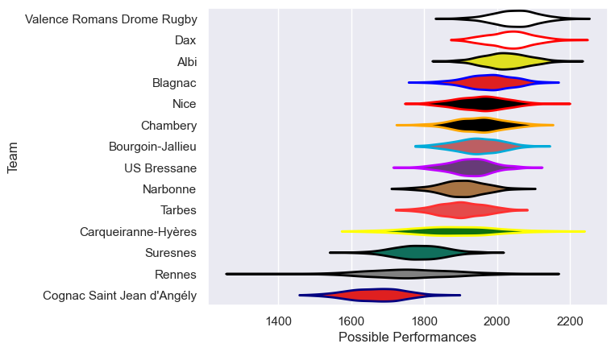

---  
title: "Nationale 22/23 Status"  
date: 2025-07-28 6:00:00 -0500  
categories: model review projection  
layout: article  
aside:  
    toc: true  
---
# Current Team Rankings

# Standings

## Current Standings

| Club                       |   Played |   Wins |   Point Differential |   Losing Bonus Points |   Try Bonus Points |   Competition Points |
|:---------------------------|---------:|-------:|---------------------:|----------------------:|-------------------:|---------------------:|
| Dax                        |       29 |     22 |                  288 |                     4 |                 11 |                  103 |
| Valence Romans Drome Rugby |       29 |     20 |                  316 |                     7 |                  9 |                   98 |
| Albi                       |       29 |     18 |                  216 |                     5 |                  6 |                   89 |
| Blagnac                    |       29 |     19 |                   64 |                     3 |                  4 |                   87 |
| Bourgoin-Jallieu           |       27 |     16 |                   62 |                     3 |                  2 |                   73 |
| US Bressane                |       27 |     14 |                   29 |                     5 |                  6 |                   71 |
| Narbonne                   |       26 |     14 |                   25 |                     5 |                  6 |                   69 |
| Nice                       |       26 |     12 |                   63 |                     9 |                  5 |                   66 |
| Chambery                   |       26 |     13 |                   67 |                     6 |                  5 |                   63 |
| Tarbes                     |       26 |     12 |                   -2 |                     6 |                  4 |                   62 |
| Suresnes                   |       26 |      9 |                 -257 |                     3 |                  3 |                   44 |
| Carqueiranne-Hyères        |       26 |      8 |                 -111 |                     7 |                  4 |                   43 |
| Rennes                     |       26 |      4 |                 -298 |                     6 |                  2 |                   24 |
| Cognac Saint Jean d'Angély |       26 |      0 |                 -462 |                     9 |                    |                    9 |

# Completed Match Review

| Model | Percent Correct Predictions | Spread Error |
| ------ | ------ | ------ |
| Club Level | 70.9% | 10.8 |
| Player Level: Lineup | nan% | nan |
| Player Level: Minutes | nan% | nan |

