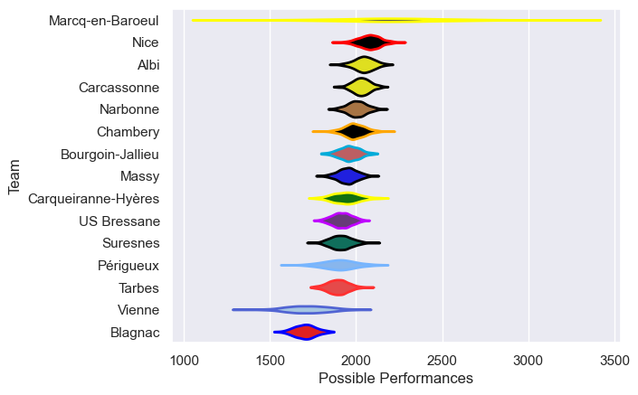

---  
title: "Nationale 23/24 Status"  
date: 2025-07-28 6:00:00 -0500  
categories: model review projection  
layout: article  
aside:  
    toc: true  
---
# Current Team Rankings

# Standings

## Current Standings

| Club                |   Played |   Wins |   Point Differential |   Losing Bonus Points |   Try Bonus Points |   Competition Points |
|:--------------------|---------:|-------:|---------------------:|----------------------:|-------------------:|---------------------:|
| Nice                |       28 |     20 |                  342 |                     4 |                 13 |                   99 |
| Narbonne            |       29 |     20 |                  170 |                     6 |                  8 |                   94 |
| Carcassonne         |       29 |     19 |                  212 |                     5 |                  5 |                   88 |
| Albi                |       27 |     17 |                  229 |                     8 |                  6 |                   82 |
| Suresnes            |       28 |     17 |                   40 |                     3 |                  5 |                   76 |
| Chambery            |       27 |     15 |                  111 |                     5 |                  6 |                   75 |
| Périgueux           |       26 |     14 |                  117 |                     6 |                  6 |                   70 |
| Bourgoin-Jallieu    |       26 |     13 |                   33 |                     6 |                  4 |                   64 |
| US Bressane         |       26 |     11 |                   43 |                    11 |                  4 |                   61 |
| Massy               |       26 |     12 |                   30 |                     9 |                  2 |                   59 |
| Carqueiranne-Hyères |       26 |     13 |                  -68 |                     3 |                  2 |                   59 |
| Tarbes              |       26 |     10 |                 -135 |                     9 |                  1 |                   50 |
| Vienne              |       26 |      3 |                 -561 |                     3 |                    |                   15 |
| Blagnac             |       26 |      0 |                 -563 |                     1 |                  5 |                    6 |
| Marcq-en-Baroeul    |        2 |      1 |                    0 |                     0 |                  1 |                    5 |

# Completed Match Review

| Model | Percent Correct Predictions | Spread Error |
| ------ | ------ | ------ |
| Club Level | 76.7% | 11.8 |
| Player Level: Lineup | nan% | nan |
| Player Level: Minutes | nan% | nan |

