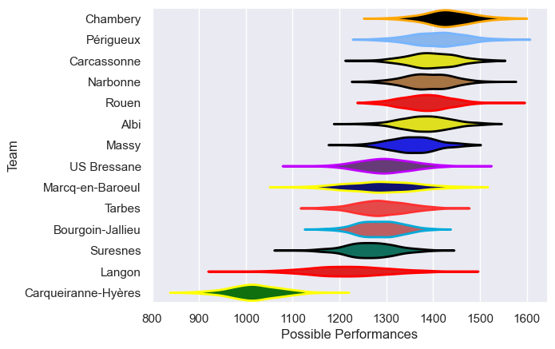

---  
title: "Nationale 24/25 Status"  
date: 2025-04-25 6:00:00 -0500  
categories: model review projection  
layout: article  
aside:  
    toc: true  
---
# Current Team Rankings

# Standings

## Current Standings

| Club                |   Played |   Wins |   Point Differential |   Losing Bonus Points |   Try Bonus Points |   Competition Points |
|:--------------------|---------:|-------:|---------------------:|----------------------:|-------------------:|---------------------:|
| Chambery            |       25 |     18 |                  296 |                     5 |                nan |                   86 |
| Narbonne            |       25 |     18 |                   91 |                     4 |                nan |                   82 |
| Rouen               |       25 |     18 |                  205 |                     1 |                nan |                   79 |
| Périgueux           |       25 |     16 |                  170 |                     7 |                nan |                   77 |
| Carcassonne         |       25 |     17 |                  145 |                     4 |                nan |                   77 |
| Albi                |       25 |     16 |                  105 |                     5 |                nan |                   76 |
| Massy               |       25 |     14 |                   90 |                     7 |                nan |                   69 |
| US Bressane         |       25 |     10 |                  -40 |                     7 |                nan |                   51 |
| Bourgoin-Jallieu    |       26 |     11 |                  -61 |                     4 |                nan |                   50 |
| Tarbes              |       25 |     10 |                  -69 |                     7 |                nan |                   50 |
| Marcq-en-Baroeul    |       25 |      9 |                  -95 |                     7 |                nan |                   48 |
| Suresnes            |       25 |      9 |                  -64 |                     8 |                nan |                   47 |
| Langon              |       25 |      8 |                 -123 |                     6 |                nan |                   41 |
| Carqueiranne-Hyères |       26 |      0 |                 -650 |                     0 |                nan |                    0 |

## Projected Remaining Table

| Club             |   Matches Remaining |   Wins |   Point Differential |   Losing Bonus Points |   Try Bonus Points |   Competition Points |
|:-----------------|--------------------:|-------:|---------------------:|----------------------:|-------------------:|---------------------:|
| Narbonne         |                   1 |    0.9 |             12.7319  |                   0.1 |                0.7 |                  4.4 |
| Carcassonne      |                   1 |    0.9 |             10.6105  |                   0.1 |                0.7 |                  4.3 |
| Massy            |                   1 |    0.9 |              8.85584 |                   0.1 |                0.5 |                  4.1 |
| Chambery         |                   1 |    0.8 |              4.6877  |                   0.2 |                0.6 |                  3.8 |
| Périgueux        |                   1 |    0.8 |              5.12361 |                   0.1 |                0.3 |                  3.6 |
| Albi             |                   1 |    0.6 |              1.69871 |                   0.3 |                0.4 |                  3   |
| US Bressane      |                   1 |    0.4 |             -1.69871 |                   0.4 |                0.1 |                  2.2 |
| Marcq-en-Baroeul |                   1 |    0.2 |             -4.6877  |                   0.4 |                0.4 |                  1.8 |
| Rouen            |                   1 |    0.2 |             -5.12361 |                   0.4 |                0.4 |                  1.7 |
| Tarbes           |                   1 |    0.1 |             -8.85584 |                   0.4 |                0.3 |                  1.1 |
| Suresnes         |                   1 |    0.1 |            -10.6105  |                   0.2 |                0.2 |                  0.9 |
| Langon           |                   1 |    0.1 |            -12.7319  |                   0.2 |                0.3 |                  0.8 |

## Projected Total Table

| Club                |   Total Matches |   Wins |   Point Differential |   Losing Bonus Points |   Try Bonus Points |   Competition Points |
|:--------------------|----------------:|-------:|---------------------:|----------------------:|-------------------:|---------------------:|
| Chambery            |              26 |   18.8 |             300.688  |                   5.2 |                0.6 |                 89.8 |
| Narbonne            |              26 |   18.9 |             103.732  |                   4.1 |                0.7 |                 86.4 |
| Carcassonne         |              26 |   17.9 |             155.61   |                   4.1 |                0.7 |                 81.3 |
| Rouen               |              26 |   18.2 |             199.876  |                   1.4 |                0.4 |                 80.7 |
| Périgueux           |              26 |   16.8 |             175.124  |                   7.1 |                0.3 |                 80.6 |
| Albi                |              26 |   16.6 |             106.699  |                   5.3 |                0.4 |                 79   |
| Massy               |              26 |   14.9 |              98.8558 |                   7.1 |                0.5 |                 73.1 |
| US Bressane         |              26 |   10.4 |             -41.6987 |                   7.4 |                0.1 |                 53.2 |
| Tarbes              |              26 |   10.1 |             -77.8558 |                   7.4 |                0.3 |                 51.1 |
| Bourgoin-Jallieu    |              26 |   11   |             -61      |                   4   |                0   |                 50   |
| Marcq-en-Baroeul    |              26 |    9.2 |             -99.6877 |                   7.4 |                0.4 |                 49.8 |
| Suresnes            |              26 |    9.1 |             -74.6105 |                   8.2 |                0.2 |                 47.9 |
| Langon              |              26 |    8.1 |            -135.732  |                   6.2 |                0.3 |                 41.8 |
| Carqueiranne-Hyères |              26 |    0   |            -650      |                   0   |                0   |                  0   |

# Completed Match Review

| Model | Percent Correct Predictions | Spread Error |
| ------ | ------ | ------ |
| Club Level | 74.4% | 9.5 |
| Player Level: Lineup | 66.3% | 9.0 |
| Player Level: Minutes | 67.3% | 9.2 |

# Future Predictions

## Week 27

### Narbonne V Langon on 2025/04/26

Average Margin: Narbonne by 12.7

Average Scoreline: 30-17

### Marcq-en-Baroeul V Chambery on 2025/04/26

Average Margin: Chambery by 4.7

Average Scoreline: 26-21

### Massy V Tarbes on 2025/04/26

Average Margin: Massy by 8.9

Average Scoreline: 24-15

### Périgueux V Rouen on 2025/04/26

Average Margin: Périgueux by 5.1

Average Scoreline: 28-23

### US Bressane V Albi on 2025/04/26

Average Margin: Albi by 1.7

Average Scoreline: 19-17

### Carcassonne V Suresnes on 2025/04/26

Average Margin: Carcassonne by 10.6

Average Scoreline: 29-18

