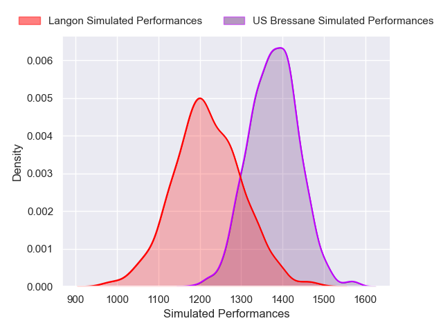
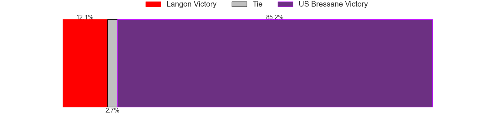
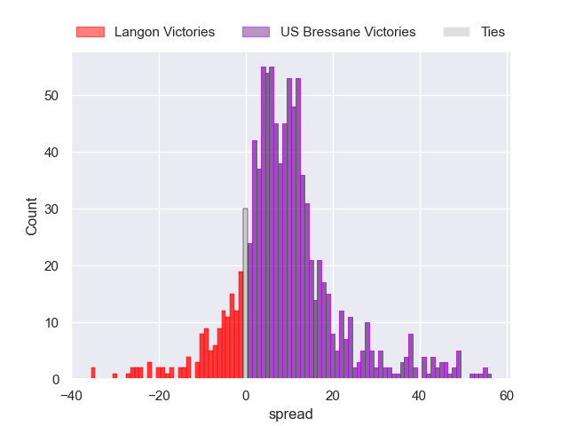

---  
title: "Nationale 24/25 Status"  
date: 2025-03-03 6:00:00 -0500  
categories: model review projection  
layout: article  
aside:  
    toc: true  
---
# Current Team Rankings

# Standings

## Current Standings

| Club                |   Played |   Wins |   Point Differential |   Losing Bonus Points |   Try Bonus Points |   Competition Points |
|:--------------------|---------:|-------:|---------------------:|----------------------:|-------------------:|---------------------:|
| Narbonne            |       21 |     17 |                   82 |                     1 |                nan |                   74 |
| Chambery            |       22 |     15 |                  263 |                     5 |                nan |                   72 |
| Rouen               |       21 |     16 |                  214 |                     0 |                nan |                   69 |
| Carcassonne         |       21 |     14 |                  128 |                     4 |                nan |                   64 |
| Albi                |       21 |     13 |                   85 |                     5 |                nan |                   62 |
| Massy               |       20 |     12 |                  103 |                     6 |                nan |                   60 |
| Périgueux           |       20 |     12 |                  135 |                     6 |                nan |                   58 |
| Tarbes              |       22 |     10 |                  -50 |                     5 |                nan |                   47 |
| US Bressane         |       21 |      9 |                  -12 |                     6 |                nan |                   45 |
| Suresnes            |       21 |      8 |                  -11 |                     8 |                nan |                   43 |
| Langon              |       22 |      8 |                  -91 |                     5 |                nan |                   40 |
| Bourgoin-Jallieu    |       21 |      7 |                 -117 |                     4 |                nan |                   33 |
| Marcq-en-Baroeul    |       21 |      6 |                 -129 |                     6 |                nan |                   33 |
| Carqueiranne-Hyères |       24 |      0 |                 -600 |                     0 |                nan |                    0 |

## Projected Remaining Table

| Club             |   Matches Remaining |   Wins |   Point Differential |   Losing Bonus Points |   Try Bonus Points |   Competition Points |
|:-----------------|--------------------:|-------:|---------------------:|----------------------:|-------------------:|---------------------:|
| Périgueux        |                   6 |    3.6 |             13.908   |                   1.6 |                2.1 |                 18   |
| Massy            |                   6 |    3.2 |              3.85571 |                   1.7 |                1.9 |                 16.4 |
| Carcassonne      |                   5 |    3.3 |             26.9367  |                   1   |                1.9 |                 16.2 |
| Narbonne         |                   5 |    3.1 |             16.6609  |                   1.2 |                1.8 |                 15.5 |
| Chambery         |                   4 |    3.1 |             23.1885  |                   0.6 |                2.2 |                 15.4 |
| Albi             |                   5 |    3.1 |             16.0668  |                   1.2 |                1.3 |                 15.1 |
| Rouen            |                   5 |    2.9 |             12.7195  |                   1.3 |                1.9 |                 14.8 |
| US Bressane      |                   5 |    2.3 |             -2.9808  |                   1.5 |                1.1 |                 11.9 |
| Suresnes         |                   5 |    1.6 |            -22.3601  |                   1.6 |                1.2 |                  9.4 |
| Tarbes           |                   4 |    1.6 |             -8.35964 |                   1.3 |                1   |                  8.8 |
| Bourgoin-Jallieu |                   4 |    1.4 |            -14.7573  |                   1.3 |                1.4 |                  8.2 |
| Marcq-en-Baroeul |                   4 |    1.1 |            -22.7131  |                   1.2 |                1.1 |                  6.9 |
| Langon           |                   4 |    0.5 |            -42.1653  |                   1   |                0.8 |                  3.9 |

## Projected Total Table

| Club                |   Total Matches |   Wins |   Point Differential |   Losing Bonus Points |   Try Bonus Points |   Competition Points |
|:--------------------|----------------:|-------:|---------------------:|----------------------:|-------------------:|---------------------:|
| Narbonne            |              26 |   20.1 |              98.6609 |                   2.2 |                1.8 |                 89.5 |
| Chambery            |              26 |   18.1 |             286.188  |                   5.6 |                2.2 |                 87.4 |
| Rouen               |              26 |   18.9 |             226.72   |                   1.3 |                1.9 |                 83.8 |
| Carcassonne         |              26 |   17.3 |             154.937  |                   5   |                1.9 |                 80.2 |
| Albi                |              26 |   16.1 |             101.067  |                   6.2 |                1.3 |                 77.1 |
| Massy               |              26 |   15.2 |             106.856  |                   7.7 |                1.9 |                 76.4 |
| Périgueux           |              26 |   15.6 |             148.908  |                   7.6 |                2.1 |                 76   |
| US Bressane         |              26 |   11.3 |             -14.9808 |                   7.5 |                1.1 |                 56.9 |
| Tarbes              |              26 |   11.6 |             -58.3596 |                   6.3 |                1   |                 55.8 |
| Suresnes            |              26 |    9.6 |             -33.3601 |                   9.6 |                1.2 |                 52.4 |
| Langon              |              26 |    8.5 |            -133.165  |                   6   |                0.8 |                 43.9 |
| Bourgoin-Jallieu    |              25 |    8.4 |            -131.757  |                   5.3 |                1.4 |                 41.2 |
| Marcq-en-Baroeul    |              25 |    7.1 |            -151.713  |                   7.2 |                1.1 |                 39.9 |
| Carqueiranne-Hyères |              24 |    0   |            -600      |                   0   |                0   |                  0   |

# Completed Match Review

| Model | Percent Correct Predictions | Spread Error |
| ------ | ------ | ------ |
| Club Level | 71.8% | 9.8 |
| Player Level: Lineup | 70.0% | 7.4 |
| Player Level: Minutes | 67.5% | 7.6 |

# Future Predictions

## Week 25

### Chambery V Rouen on 2025/03/07

Average Margin: Chambery by 5.3

Average Scoreline: 22-17

### Périgueux V Carcassonne on 2025/03/08

Average Margin: Périgueux by 3.0

Average Scoreline: 20-17

### US Bressane V Langon on 2025/03/08

Average Margin: US Bressane by 9.2

Average Scoreline: 25-16

### Bourgoin-Jallieu V Suresnes on 2025/03/08

Average Margin: Bourgoin-Jallieu by 3.0

Average Scoreline: 23-20

### Marcq-en-Baroeul V Albi on 2025/03/08

Average Margin: Albi by 4.6

Average Scoreline: 28-24

### Massy V Narbonne on 2025/03/08

Average Margin: Massy by 2.9

Average Scoreline: 20-17

## Week 26

### Albi V Bourgoin-Jallieu on 2025/03/21

Average Margin: Albi by 10.0

Average Scoreline: 26-16

### Tarbes V Chambery on 2025/03/21

Average Margin: Chambery by 3.6

Average Scoreline: 27-23

### Rouen V Marcq-en-Baroeul on 2025/03/21

Average Margin: Rouen by 12.2

Average Scoreline: 27-15

### Carcassonne V US Bressane on 2025/03/21

Average Margin: Carcassonne by 9.6

Average Scoreline: 26-17

### Suresnes V Massy on 2025/03/22

Average Margin: Massy by 1.0

Average Scoreline: 22-21

### Narbonne V Périgueux on 2025/03/22

Average Margin: Narbonne by 3.7

Average Scoreline: 25-21

## Week 27

### Carcassonne V Langon on 2025/03/28

Average Margin: Carcassonne by 13.1

Average Scoreline: 27-14

### US Bressane V Narbonne on 2025/03/28

Average Margin: Narbonne by 0.0

Average Scoreline: 27-27

### Bourgoin-Jallieu V Rouen on 2025/03/28

Average Margin: Rouen by 3.3

Average Scoreline: 25-21

### Massy V Albi on 2025/03/29

Average Margin: Massy by 2.4

Average Scoreline: 20-18

### Périgueux V Suresnes on 2025/03/29

Average Margin: Périgueux by 9.8

Average Scoreline: 25-16

### Marcq-en-Baroeul V Tarbes on 2025/03/29

Average Margin: Marcq-en-Baroeul by 1.0

Average Scoreline: 23-22

## Week 28

### Périgueux V Massy on 2025/04/05

Average Margin: Périgueux by 5.6

Average Scoreline: 22-16

## Week 29

### Tarbes V Bourgoin-Jallieu on 2025/04/11

Average Margin: Tarbes by 4.4

Average Scoreline: 23-19

### Rouen V Massy on 2025/04/11

Average Margin: Rouen by 5.2

Average Scoreline: 26-21

### Albi V Périgueux on 2025/04/11

Average Margin: Albi by 3.3

Average Scoreline: 21-18

### Langon V Chambery on 2025/04/12

Average Margin: Chambery by 7.4

Average Scoreline: 30-23

### Suresnes V US Bressane on 2025/04/12

Average Margin: Suresnes by 1.9

Average Scoreline: 24-22

### Narbonne V Carcassonne on 2025/04/12

Average Margin: Narbonne by 3.4

Average Scoreline: 23-20

## Week 30

### Périgueux V Rouen on 2025/04/26

Average Margin: Périgueux by 2.6

Average Scoreline: 20-17

### US Bressane V Albi on 2025/04/26

Average Margin: Albi by 0.5

Average Scoreline: 22-22

### Narbonne V Langon on 2025/04/26

Average Margin: Narbonne by 12.4

Average Scoreline: 29-17

### Massy V Tarbes on 2025/04/26

Average Margin: Massy by 8.2

Average Scoreline: 25-16

### Carcassonne V Suresnes on 2025/04/26

Average Margin: Carcassonne by 10.5

Average Scoreline: 25-14

### Marcq-en-Baroeul V Chambery on 2025/04/26

Average Margin: Chambery by 6.9

Average Scoreline: 30-23

