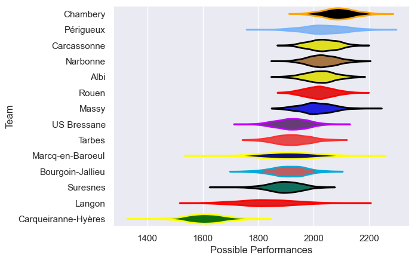

---  
title: "Nationale 24/25"  
date: 2025-07-29 6:00:00 -0500  
categories: model review projection  
layout: article  
aside:  
    toc: true  
---
# Current Team Rankings

# Standings

## Current Standings

| Club                |   Played |   Wins |   Point Differential |   Losing Bonus Points |   Try Bonus Points |   Competition Points |
|:--------------------|---------:|-------:|---------------------:|----------------------:|-------------------:|---------------------:|
| Chambery            |       26 |     18 |                  287 |                     5 |                  8 |                   87 |
| Narbonne            |       26 |     19 |                  121 |                     4 |                  7 |                   87 |
| Carcassonne         |       26 |     18 |                  159 |                     4 |                  6 |                   82 |
| Périgueux           |       26 |     17 |                  173 |                     7 |                  6 |                   81 |
| Rouen               |       26 |     17 |                  202 |                     2 |                  6 |                   80 |
| Albi                |       26 |     16 |                   96 |                     5 |                  6 |                   77 |
| Massy               |       26 |     15 |                  116 |                     7 |                  7 |                   74 |
| US Bressane         |       26 |     11 |                  -31 |                     7 |                  3 |                   56 |
| Marcq-en-Baroeul    |       26 |     10 |                  -86 |                     7 |                  6 |                   53 |
| Bourgoin-Jallieu    |       26 |     11 |                  -61 |                     4 |                  2 |                   50 |
| Tarbes              |       26 |     10 |                  -95 |                     7 |                  3 |                   50 |
| Suresnes            |       26 |      8 |                  -78 |                     8 |                  3 |                   47 |
| Langon              |       26 |      8 |                 -153 |                     6 |                  2 |                   42 |
| Carqueiranne-Hyères |       26 |      0 |                 -650 |                     0 |                    |                    0 |

# Completed Match Review

| Model | Percent Correct Predictions | Spread Error |
| ------ | ------ | ------ |
| Club Level | 73.6% | 9.1 |
| Player Level: Lineup | nan% | nan |
| Player Level: Minutes | nan% | nan |

