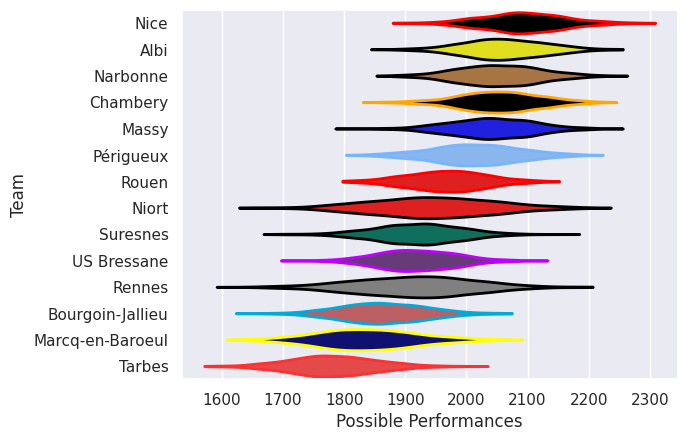

---  
title: "Nationale 25/26"  
date: 2025-09-11 6:00:00 -0500  
categories: model review projection  
layout: article  
aside:  
    toc: true  
---
# Team Rankings

# Standings

## Current Standings

| Club             |   Played |   Wins |   Point Differential |   Losing Bonus Points |   Try Bonus Points |   Competition Points |
|:-----------------|---------:|-------:|---------------------:|----------------------:|-------------------:|---------------------:|
| Chambery         |        3 |      2 |                   40 |                     1 |                  2 |                   11 |
| Nice             |        3 |      2 |                   35 |                     1 |                  1 |                   10 |
| Niort            |        3 |      2 |                   24 |                     1 |                  1 |                   10 |
| Périgueux        |        3 |      2 |                   20 |                     1 |                  1 |                   10 |
| Suresnes         |        3 |      2 |                   13 |                     0 |                    |                   10 |
| Rouen            |        3 |      1 |                   30 |                     1 |                  1 |                    8 |
| Narbonne         |        3 |      2 |                   -4 |                     0 |                    |                    8 |
| Massy            |        3 |      1 |                   11 |                     2 |                  1 |                    7 |
| Bourgoin-Jallieu |        3 |      1 |                    0 |                     2 |                    |                    6 |
| Albi             |        3 |      1 |                  -24 |                     1 |                    |                    5 |
| US Bressane      |        3 |      0 |                  -28 |                     0 |                    |                    4 |
| Rennes           |        3 |      1 |                  -37 |                     0 |                    |                    4 |
| Marcq-en-Baroeul |        3 |      1 |                  -40 |                     0 |                    |                    4 |
| Tarbes           |        3 |      1 |                  -40 |                     0 |                    |                    4 |

## Projected Remaining Table

| Club             |   To Play |   Projected Wins |   Projected Differential |   Projected Losing Bonus Points | Projected Try Bonus Points   |   Projected Competition Points |
|:-----------------|----------:|-----------------:|-------------------------:|--------------------------------:|:-----------------------------|-------------------------------:|
| Chambery         |        23 |           13.182 |                   54.017 |                           4.923 |                              |                         59.707 |
| Narbonne         |        23 |           12.349 |                   30.863 |                           5.277 |                              |                         56.843 |
| Rouen            |        23 |           11.986 |                   26.052 |                           5.5   |                              |                         55.696 |
| Périgueux        |        23 |           11.684 |                   22.343 |                           5.486 |                              |                         54.39  |
| Massy            |        23 |           11.602 |                   17.769 |                           5.549 |                              |                         54.175 |
| Albi             |        23 |           11.604 |                   18.228 |                           5.481 |                              |                         54.121 |
| Nice             |        23 |           11.26  |                    3.626 |                           5.545 |                              |                         52.881 |
| Niort            |        23 |           11.362 |                   22.963 |                           5.028 |                              |                         52.47  |
| Marcq-en-Baroeul |        23 |           10.266 |                  -13.632 |                           5.697 |                              |                         49.017 |
| US Bressane      |        23 |           10.225 |                  -20.046 |                           5.694 |                              |                         48.846 |
| Bourgoin-Jallieu |        23 |           10.124 |                  -21.297 |                           5.64  |                              |                         48.324 |
| Suresnes         |        23 |            9.738 |                  -27.594 |                           6.068 |                              |                         47.312 |
| Tarbes           |        23 |            9.013 |                  -51.122 |                           5.741 |                              |                         43.973 |
| Rennes           |        23 |            8.964 |                  -62.17  |                           5.406 |                              |                         43.28  |

## Projected Total Table

| Club             |   Played |   Wins |   Point Differential |   Losing Bonus Points |   Try Bonus Points |   Competition Points |
|:-----------------|---------:|-------:|---------------------:|----------------------:|-------------------:|---------------------:|
| Chambery         |       26 | 15.182 |               94.017 |                 5.923 |                  2 |               70.707 |
| Narbonne         |       26 | 14.349 |               26.863 |                 5.277 |                    |               64.843 |
| Périgueux        |       26 | 13.684 |               42.343 |                 6.486 |                  1 |               64.39  |
| Rouen            |       26 | 12.986 |               56.052 |                 6.5   |                  1 |               63.696 |
| Nice             |       26 | 13.26  |               38.626 |                 6.545 |                  1 |               62.881 |
| Niort            |       26 | 13.362 |               46.963 |                 6.028 |                  1 |               62.47  |
| Massy            |       26 | 12.602 |               28.769 |                 7.549 |                  1 |               61.175 |
| Albi             |       26 | 12.604 |               -5.772 |                 6.481 |                    |               59.121 |
| Suresnes         |       26 | 11.738 |              -14.594 |                 6.068 |                    |               57.312 |
| Bourgoin-Jallieu |       26 | 11.124 |              -21.297 |                 7.64  |                    |               54.324 |
| Marcq-en-Baroeul |       26 | 11.266 |              -53.632 |                 5.697 |                    |               53.017 |
| US Bressane      |       26 | 10.225 |              -48.046 |                 5.694 |                    |               52.846 |
| Tarbes           |       26 | 10.013 |              -91.122 |                 5.741 |                    |               47.973 |
| Rennes           |       26 |  9.964 |              -99.17  |                 5.406 |                    |               47.28  |

# Completed Match Review

| Model | Percent Correct Predictions | Spread Error |
| ------ | ------ | ------ |
| Club Level | 64.8% | 8.2 |
| Player Level: Lineup | nan% | nan |
| Player Level: Minutes | nan% | nan |

# Future Predictions

## Week 4

### US Bressane V Tarbes on 2025/09/12

Average Margin: US Bressane by 4.7

### Albi V Chambery on 2025/09/12

Average Margin: Albi by 1.5

### Narbonne V Rouen on 2025/09/13

Average Margin: Narbonne by 2.8

### Rennes V Niort on 2025/09/13

Average Margin: Niort by 6.9

### Nice V Massy on 2025/09/13

Average Margin: Nice by 2.5

### Marcq-en-Baroeul V Suresnes on 2025/09/13

Average Margin: Marcq-en-Baroeul by 3.6

### Périgueux V Bourgoin-Jallieu on 2025/09/13

Average Margin: Périgueux by 6.7

## Week 5

### Massy V Périgueux on 2025/09/26

Average Margin: Massy by 3.3

### Chambery V Rennes on 2025/09/26

Average Margin: Chambery by 11.5

### Rouen V Albi on 2025/09/26

Average Margin: Rouen by 3.5

### US Bressane V Marcq-en-Baroeul on 2025/09/26

Average Margin: US Bressane by 2.8

### Tarbes V Bourgoin-Jallieu on 2025/09/26

Average Margin: Tarbes by 2.0

### Suresnes V Narbonne on 2025/09/27

Average Margin: Suresnes by 0.5

### Niort V Nice on 2025/09/27

Average Margin: Niort by 7.2

## Week 6

### Albi V Suresnes on 2025/10/03

Average Margin: Albi by 5.2

### Nice V Chambery on 2025/10/04

Average Margin: Nice by 0.7

### Rennes V Rouen on 2025/10/04

Average Margin: Rouen by 3.0

### Marcq-en-Baroeul V Tarbes on 2025/10/04

Average Margin: Marcq-en-Baroeul by 5.1

### Bourgoin-Jallieu V Massy on 2025/10/04

Average Margin: Bourgoin-Jallieu by 1.7

### Périgueux V Niort on 2025/10/04

Average Margin: Périgueux by 4.2

### Narbonne V US Bressane on 2025/10/04

Average Margin: Narbonne by 5.8

## Week 7

### US Bressane V Albi on 2025/10/10

Average Margin: US Bressane by 1.1

### Tarbes V Massy on 2025/10/10

Average Margin: Tarbes by 0.5

### Chambery V Périgueux on 2025/10/10

Average Margin: Chambery by 4.3

### Rouen V Nice on 2025/10/10

Average Margin: Rouen by 4.0

### Suresnes V Rennes on 2025/10/11

Average Margin: Suresnes by 5.1

### Marcq-en-Baroeul V Narbonne on 2025/10/11

Average Margin: Marcq-en-Baroeul by 0.8

### Niort V Bourgoin-Jallieu on 2025/10/11

Average Margin: Niort by 5.7

## Week 8

### Albi V Marcq-en-Baroeul on 2025/10/17

Average Margin: Albi by 5.4

### Massy V Niort on 2025/10/17

Average Margin: Massy by 2.9

### Narbonne V Tarbes on 2025/10/18

Average Margin: Narbonne by 7.5

### Nice V Suresnes on 2025/10/18

Average Margin: Nice by 4.8

### Bourgoin-Jallieu V Chambery on 2025/10/18

Average Margin: Bourgoin-Jallieu by 0.3

### Rennes V US Bressane on 2025/10/18

Average Margin: US Bressane by 0.5

### Périgueux V Rouen on 2025/10/18

Average Margin: Périgueux by 2.7

## Week 9

### Rouen V Bourgoin-Jallieu on 2025/10/31

Average Margin: Rouen by 4.9

### Chambery V Massy on 2025/10/31

Average Margin: Chambery by 4.8

### US Bressane V Nice on 2025/10/31

Average Margin: US Bressane by 1.2

### Tarbes V Niort on 2025/10/31

Average Margin: Niort by 0.0

### Narbonne V Albi on 2025/11/01

Average Margin: Narbonne by 4.0

### Suresnes V Périgueux on 2025/11/01

Average Margin: Suresnes by 1.2

### Marcq-en-Baroeul V Rennes on 2025/11/01

Average Margin: Marcq-en-Baroeul by 4.5

## Week 10

### Albi V Tarbes on 2025/11/07

Average Margin: Albi by 5.9

### Massy V Rouen on 2025/11/07

Average Margin: Massy by 3.1

### Nice V Marcq-en-Baroeul on 2025/11/08

Average Margin: Nice by 4.0

### Niort V Chambery on 2025/11/08

Average Margin: Niort by 1.5

### Rennes V Narbonne on 2025/11/08

Average Margin: Narbonne by 1.9

### Périgueux V US Bressane on 2025/11/08

Average Margin: Périgueux by 5.4

### Bourgoin-Jallieu V Suresnes on 2025/11/08

Average Margin: Bourgoin-Jallieu by 4.3

## Week 11

### US Bressane V Bourgoin-Jallieu on 2025/11/14

Average Margin: US Bressane by 3.2

### Rouen V Niort on 2025/11/14

Average Margin: Rouen by 3.0

### Tarbes V Chambery on 2025/11/14

Average Margin: Chambery by 1.4

### Albi V Rennes on 2025/11/14

Average Margin: Albi by 6.3

### Narbonne V Nice on 2025/11/15

Average Margin: Narbonne by 3.4

### Suresnes V Massy on 2025/11/15

Average Margin: Suresnes by 0.8

### Marcq-en-Baroeul V Périgueux on 2025/11/15

Average Margin: Marcq-en-Baroeul by 0.9

## Week 12

### Massy V US Bressane on 2025/11/21

Average Margin: Massy by 6.1

### Chambery V Rouen on 2025/11/21

Average Margin: Chambery by 3.9

### Nice V Albi on 2025/11/22

Average Margin: Nice by 2.6

### Bourgoin-Jallieu V Marcq-en-Baroeul on 2025/11/22

Average Margin: Bourgoin-Jallieu by 3.5

### Périgueux V Narbonne on 2025/11/22

Average Margin: Périgueux by 2.9

### Rennes V Tarbes on 2025/11/22

Average Margin: Rennes by 2.2

### Niort V Suresnes on 2025/11/22

Average Margin: Niort by 3.9

## Week 13

### Tarbes V Rouen on 2025/12/05

Average Margin: Rouen by 0.3

### Albi V Périgueux on 2025/12/05

Average Margin: Albi by 3.0

### US Bressane V Niort on 2025/12/05

Average Margin: US Bressane by 2.0

### Marcq-en-Baroeul V Massy on 2025/12/06

Average Margin: Marcq-en-Baroeul by 1.4

### Rennes V Nice on 2025/12/06

Average Margin: Nice by 0.3

### Suresnes V Chambery on 2025/12/06

Average Margin: Chambery by 0.7

### Narbonne V Bourgoin-Jallieu on 2025/12/06

Average Margin: Narbonne by 5.1

## Week 14

### US Bressane V Chambery on 2025/12/12

Average Margin: US Bressane by 0.4

### Albi V Bourgoin-Jallieu on 2025/12/12

Average Margin: Albi by 4.6

### Rennes V Périgueux on 2025/12/13

Average Margin: Rennes by 0.1

### Suresnes V Rouen on 2025/12/13

Average Margin: Suresnes by 0.9

### Nice V Tarbes on 2025/12/13

Average Margin: Nice by 4.3

### Narbonne V Massy on 2025/12/13

Average Margin: Narbonne by 3.1

### Marcq-en-Baroeul V Niort on 2025/12/13

Average Margin: Marcq-en-Baroeul by 1.9

## Week 15

### Rouen V US Bressane on 2026/01/09

Average Margin: Rouen by 5.8

### Chambery V Marcq-en-Baroeul on 2026/01/09

Average Margin: Chambery by 6.1

### Massy V Albi on 2026/01/09

Average Margin: Massy by 3.5

### Tarbes V Suresnes on 2026/01/09

Average Margin: Tarbes by 2.5

### Bourgoin-Jallieu V Rennes on 2026/01/10

Average Margin: Bourgoin-Jallieu by 4.7

### Niort V Narbonne on 2026/01/10

Average Margin: Niort by 3.0

### Périgueux V Nice on 2026/01/10

Average Margin: Périgueux by 3.6

## Week 16

### US Bressane V Suresnes on 2026/01/16

Average Margin: US Bressane by 2.6

### Albi V Niort on 2026/01/16

Average Margin: Albi by 3.0

### Périgueux V Tarbes on 2026/01/17

Average Margin: Périgueux by 6.0

### Marcq-en-Baroeul V Rouen on 2026/01/17

Average Margin: Marcq-en-Baroeul by 0.2

### Nice V Bourgoin-Jallieu on 2026/01/17

Average Margin: Nice by 3.4

### Narbonne V Chambery on 2026/01/17

Average Margin: Narbonne by 1.5

### Rennes V Massy on 2026/01/17

Average Margin: Massy by 0.5

## Week 17

### Tarbes V US Bressane on 2026/01/23

Average Margin: Tarbes by 2.6

### Massy V Nice on 2026/01/23

Average Margin: Massy by 3.4

### Rouen V Narbonne on 2026/01/23

Average Margin: Rouen by 3.5

### Chambery V Albi on 2026/01/23

Average Margin: Chambery by 4.9

### Niort V Rennes on 2026/01/24

Average Margin: Niort by 4.9

### Bourgoin-Jallieu V Périgueux on 2026/01/24

Average Margin: Bourgoin-Jallieu by 1.7

### Suresnes V Marcq-en-Baroeul on 2026/01/24

Average Margin: Suresnes by 3.0

## Week 18

### Albi V Rouen on 2026/01/30

Average Margin: Albi by 2.4

### Périgueux V Massy on 2026/01/31

Average Margin: Périgueux by 3.0

### Narbonne V Suresnes on 2026/01/31

Average Margin: Narbonne by 4.4

### Bourgoin-Jallieu V Tarbes on 2026/01/31

Average Margin: Bourgoin-Jallieu by 5.1

### Marcq-en-Baroeul V US Bressane on 2026/01/31

Average Margin: Marcq-en-Baroeul by 3.0

### Nice V Niort on 2026/01/31

Average Margin: Nice by 2.9

### Rennes V Chambery on 2026/01/31

Average Margin: Chambery by 1.9

## Week 19

### Massy V Bourgoin-Jallieu on 2026/02/13

Average Margin: Massy by 5.3

### US Bressane V Narbonne on 2026/02/13

Average Margin: US Bressane by 1.1

### Tarbes V Marcq-en-Baroeul on 2026/02/13

Average Margin: Tarbes by 2.4

### Rouen V Rennes on 2026/02/13

Average Margin: Rouen by 4.9

### Chambery V Nice on 2026/02/13

Average Margin: Chambery by 4.2

### Niort V Périgueux on 2026/02/14

Average Margin: Niort by 3.9

### Suresnes V Albi on 2026/02/14

Average Margin: Suresnes by 2.0

## Week 20

### Massy V Tarbes on 2026/02/20

Average Margin: Massy by 5.5

### Albi V US Bressane on 2026/02/20

Average Margin: Albi by 4.7

### Périgueux V Chambery on 2026/02/21

Average Margin: Périgueux by 2.0

### Rennes V Suresnes on 2026/02/21

Average Margin: Rennes by 1.6

### Nice V Rouen on 2026/02/21

Average Margin: Nice by 1.5

### Narbonne V Marcq-en-Baroeul on 2026/02/21

Average Margin: Narbonne by 4.5

### Bourgoin-Jallieu V Niort on 2026/02/21

Average Margin: Bourgoin-Jallieu by 2.4

## Week 21

### Tarbes V Narbonne on 2026/02/27

Average Margin: Tarbes by 1.4

### Chambery V Bourgoin-Jallieu on 2026/02/27

Average Margin: Chambery by 5.6

### US Bressane V Rennes on 2026/02/27

Average Margin: US Bressane by 3.1

### Rouen V Périgueux on 2026/02/27

Average Margin: Rouen by 3.4

### Niort V Massy on 2026/02/28

Average Margin: Niort by 3.1

### Marcq-en-Baroeul V Albi on 2026/02/28

Average Margin: Marcq-en-Baroeul by 2.0

### Suresnes V Nice on 2026/02/28

Average Margin: Suresnes by 2.1

## Week 22

### Albi V Narbonne on 2026/03/06

Average Margin: Albi by 2.8

### Massy V Chambery on 2026/03/06

Average Margin: Massy by 1.4

### Périgueux V Suresnes on 2026/03/07

Average Margin: Périgueux by 4.5

### Bourgoin-Jallieu V Rouen on 2026/03/07

Average Margin: Bourgoin-Jallieu by 1.6

### Rennes V Marcq-en-Baroeul on 2026/03/07

Average Margin: Rennes by 2.1

### Niort V Tarbes on 2026/03/07

Average Margin: Niort by 5.4

### Nice V US Bressane on 2026/03/07

Average Margin: Nice by 4.5

## Week 23

### Tarbes V Albi on 2026/03/20

Average Margin: Tarbes by 1.0

### Rouen V Massy on 2026/03/20

Average Margin: Rouen by 3.5

### Chambery V Niort on 2026/03/20

Average Margin: Chambery by 4.8

### US Bressane V Périgueux on 2026/03/20

Average Margin: US Bressane by 1.7

### Marcq-en-Baroeul V Nice on 2026/03/21

Average Margin: Marcq-en-Baroeul by 2.1

### Narbonne V Rennes on 2026/03/21

Average Margin: Narbonne by 4.1

### Suresnes V Bourgoin-Jallieu on 2026/03/21

Average Margin: Suresnes by 2.6

## Week 24

### Massy V Suresnes on 2026/03/27

Average Margin: Massy by 5.1

### Chambery V Tarbes on 2026/03/27

Average Margin: Chambery by 6.8

### Niort V Rouen on 2026/03/28

Average Margin: Niort by 1.9

### Bourgoin-Jallieu V US Bressane on 2026/03/28

Average Margin: Bourgoin-Jallieu by 3.8

### Périgueux V Marcq-en-Baroeul on 2026/03/28

Average Margin: Périgueux by 4.9

### Nice V Narbonne on 2026/03/28

Average Margin: Nice by 2.5

### Rennes V Albi on 2026/03/28

Average Margin: Rennes by 1.2

## Week 25

### Tarbes V Rennes on 2026/04/10

Average Margin: Tarbes by 2.0

### US Bressane V Massy on 2026/04/10

Average Margin: US Bressane by 1.7

### Rouen V Chambery on 2026/04/10

Average Margin: Rouen by 2.3

### Albi V Nice on 2026/04/10

Average Margin: Albi by 2.5

### Marcq-en-Baroeul V Bourgoin-Jallieu on 2026/04/11

Average Margin: Marcq-en-Baroeul by 3.4

### Narbonne V Périgueux on 2026/04/11

Average Margin: Narbonne by 3.3

### Suresnes V Niort on 2026/04/11

Average Margin: Suresnes by 1.8

## Week 26

### Périgueux V Albi on 2026/04/25

Average Margin: Périgueux by 3.1

### Massy V Marcq-en-Baroeul on 2026/04/25

Average Margin: Massy by 3.9

### Chambery V Suresnes on 2026/04/25

Average Margin: Chambery by 4.6

### Rouen V Tarbes on 2026/04/25

Average Margin: Rouen by 5.0

### Niort V US Bressane on 2026/04/25

Average Margin: Niort by 4.4

### Nice V Rennes on 2026/04/25

Average Margin: Nice by 3.3

### Bourgoin-Jallieu V Narbonne on 2026/04/25

Average Margin: Bourgoin-Jallieu by 2.2

