# Team Rankings

# Standings

## Current Standings

| Club             |   Played |   Wins |   Point Differential |   Losing Bonus Points |   Try Bonus Points |   Competition Points |
|:-----------------|---------:|-------:|---------------------:|----------------------:|-------------------:|---------------------:|
| Nice             |       18 |     12 |                  202 |                     4 |                  8 |                   60 |
| Narbonne         |       18 |     12 |                  124 |                     4 |                  4 |                   58 |
| Albi             |       18 |     13 |                   62 |                     2 |                  4 |                   58 |
| Périgueux        |       18 |     12 |                   78 |                     3 |                  4 |                   55 |
| Massy            |       18 |     12 |                   61 |                     3 |                  4 |                   55 |
| Chambery         |       17 |     11 |                  102 |                     5 |                  5 |                   54 |
| Niort            |       18 |      7 |                   14 |                     5 |                  6 |                   41 |
| US Bressane      |       17 |      7 |                  -28 |                     4 |                  2 |                   40 |
| Rouen            |       17 |      7 |                   -4 |                     5 |                  1 |                   36 |
| Suresnes         |       18 |      7 |                  -47 |                     2 |                  1 |                   35 |
| Bourgoin-Jallieu |       18 |      7 |                 -112 |                     5 |                    |                   33 |
| Rennes           |       17 |      5 |                 -103 |                     6 |                  1 |                   29 |
| Marcq-en-Baroeul |       18 |      5 |                 -104 |                     4 |                  2 |                   28 |
| Tarbes           |       18 |      2 |                 -245 |                     7 |                    |                   15 |

## Projected Remaining Table

| Club             |   To Play |   Projected Wins |   Projected Differential |   Projected Losing Bonus Points | Projected Try Bonus Points   |   Projected Competition Points |
|:-----------------|----------:|-----------------:|-------------------------:|--------------------------------:|:-----------------------------|-------------------------------:|
| Chambery         |         9 |            5.205 |                   27.659 |                           1.761 |                              |                         23.435 |
| Rouen            |         9 |            4.809 |                   13.451 |                           1.969 |                              |                         22.101 |
| Massy            |         8 |            4.715 |                   26.477 |                           1.544 |                              |                         21.134 |
| Nice             |         8 |            4.611 |                   19.665 |                           1.67  |                              |                         20.876 |
| Albi             |         8 |            4.407 |                   13.523 |                           1.807 |                              |                         20.223 |
| Narbonne         |         8 |            4.29  |                   13.897 |                           1.801 |                              |                         19.711 |
| Périgueux        |         8 |            4.091 |                    8.254 |                           1.798 |                              |                         18.962 |
| US Bressane      |         9 |            3.782 |                  -12.702 |                           2.253 |                              |                         18.277 |
| Niort            |         8 |            3.793 |                    1.479 |                           1.809 |                              |                         17.779 |
| Rennes           |         9 |            3.495 |                  -21.441 |                           2.228 |                              |                         16.974 |
| Suresnes         |         8 |            3.276 |                  -12.868 |                           1.97  |                              |                         15.868 |
| Bourgoin-Jallieu |         8 |            3.215 |                  -18.686 |                           1.901 |                              |                         15.459 |
| Marcq-en-Baroeul |         8 |            2.971 |                  -22.149 |                           1.979 |                              |                         14.635 |
| Tarbes           |         8 |            2.602 |                  -36.559 |                           1.884 |                              |                         12.94  |

## Projected Total Table

| Club             |   Played |   Wins |   Point Differential |   Losing Bonus Points |   Try Bonus Points |   Competition Points |
|:-----------------|---------:|-------:|---------------------:|----------------------:|-------------------:|---------------------:|
| Nice             |       26 | 16.611 |              221.665 |                 5.67  |                  8 |               80.876 |
| Albi             |       26 | 17.407 |               75.523 |                 3.807 |                  4 |               78.223 |
| Narbonne         |       26 | 16.29  |              137.897 |                 5.801 |                  4 |               77.711 |
| Chambery         |       26 | 16.205 |              129.659 |                 6.761 |                  5 |               77.435 |
| Massy            |       26 | 16.715 |               87.477 |                 4.544 |                  4 |               76.134 |
| Périgueux        |       26 | 16.091 |               86.254 |                 4.798 |                  4 |               73.962 |
| Niort            |       26 | 10.793 |               15.479 |                 6.809 |                  6 |               58.779 |
| US Bressane      |       26 | 10.782 |              -40.702 |                 6.253 |                  2 |               58.277 |
| Rouen            |       26 | 11.809 |                9.451 |                 6.969 |                  1 |               58.101 |
| Suresnes         |       26 | 10.276 |              -59.868 |                 3.97  |                  1 |               50.868 |
| Bourgoin-Jallieu |       26 | 10.215 |             -130.686 |                 6.901 |                    |               48.459 |
| Rennes           |       26 |  8.495 |             -124.441 |                 8.228 |                  1 |               45.974 |
| Marcq-en-Baroeul |       26 |  7.971 |             -126.149 |                 5.979 |                  2 |               42.635 |
| Tarbes           |       26 |  4.602 |             -281.559 |                 8.884 |                    |               27.94  |

# Completed Match Review

| Model | Percent Correct Predictions | Spread Error |
| ------ | ------ | ------ |
| Club Level | 70.3% | 7.9 |
| Player Level: Lineup | nan% | nan |
| Player Level: Minutes | nan% | nan |

# Future Predictions

## Week 19

### Rennes V Chambery on 2026/01/31

Average Margin: Chambery by 2.0

## Week 20

### Tarbes V Marcq-en-Baroeul on 2026/02/13

Average Margin: Tarbes by 1.1

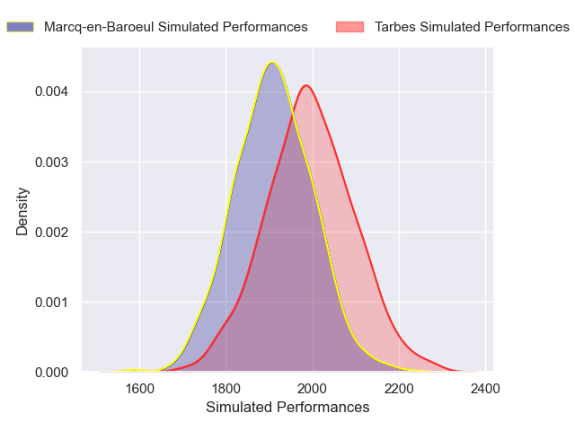

### Chambery V Nice on 2026/02/13

Average Margin: Chambery by 2.7

### Massy V Bourgoin-Jallieu on 2026/02/13

Average Margin: Massy by 8.2

### Rouen V Rennes on 2026/02/13

Average Margin: Rouen by 5.4

### US Bressane V Narbonne on 2026/02/13

Average Margin: US Bressane by 0.6

### Suresnes V Albi on 2026/02/14

Average Margin: Albi by 0.6

### Niort V Périgueux on 2026/02/14

Average Margin: Niort by 1.2

## Week 21

### Albi V US Bressane on 2026/02/20

Average Margin: Albi by 5.7

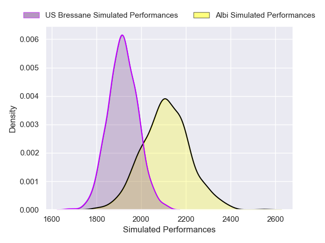

### Massy V Tarbes on 2026/02/20

Average Margin: Massy by 8.5

### Périgueux V Chambery on 2026/02/21

Average Margin: Périgueux by 2.6

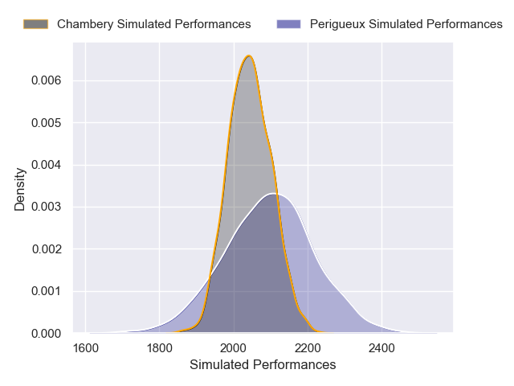

### Bourgoin-Jallieu V Niort on 2026/02/21

Average Margin: Bourgoin-Jallieu by 2.1

### Rennes V Suresnes on 2026/02/21

Average Margin: Rennes by 1.6

### Narbonne V Marcq-en-Baroeul on 2026/02/21

Average Margin: Narbonne by 7.1

### Nice V Rouen on 2026/02/21

Average Margin: Nice by 5.2

## Week 22

### Rouen V Périgueux on 2026/02/27

Average Margin: Rouen by 2.7

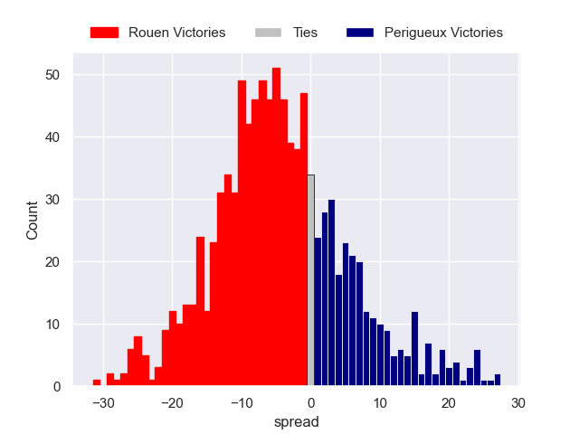

### US Bressane V Rennes on 2026/02/27

Average Margin: US Bressane by 4.9

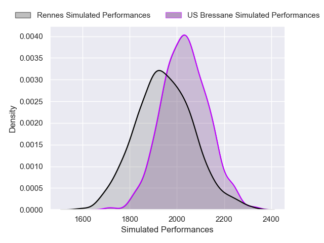

### Chambery V Bourgoin-Jallieu on 2026/02/27

Average Margin: Chambery by 7.9

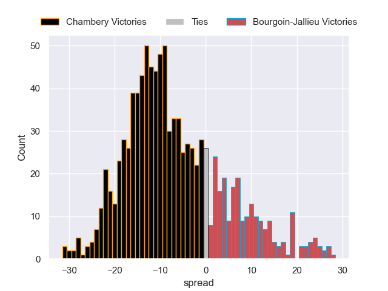

### Tarbes V Narbonne on 2026/02/27

Average Margin: Narbonne by 4.0

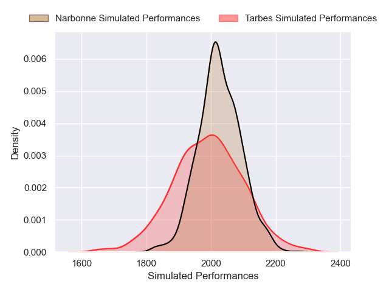

### Suresnes V Nice on 2026/02/28

Average Margin: Nice by 1.5

### Marcq-en-Baroeul V Albi on 2026/02/28

Average Margin: Albi by 1.1

### Niort V Massy on 2026/02/28

Average Margin: Niort by 0.1

## Week 23

### Albi V Narbonne on 2026/03/06

Average Margin: Albi by 2.8

### Massy V Chambery on 2026/03/06

Average Margin: Massy by 2.1

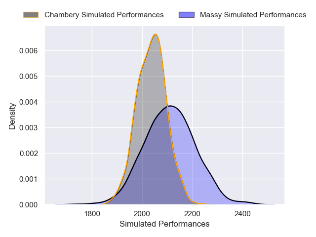

### Nice V US Bressane on 2026/03/07

Average Margin: Nice by 6.3

### Niort V Tarbes on 2026/03/07

Average Margin: Niort by 6.4

### Rennes V Marcq-en-Baroeul on 2026/03/07

Average Margin: Rennes by 3.0

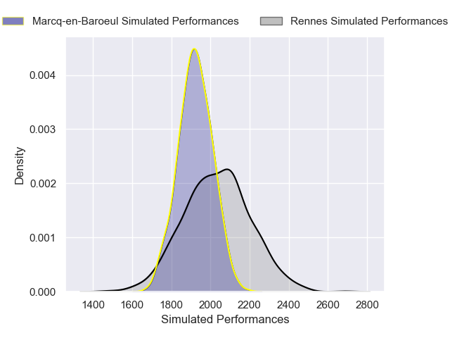

### Périgueux V Suresnes on 2026/03/07

Average Margin: Périgueux by 5.5

### Bourgoin-Jallieu V Rouen on 2026/03/07

Average Margin: Bourgoin-Jallieu by 1.0

## Week 24

### Rouen V Massy on 2026/03/20

Average Margin: Rouen by 1.8

### US Bressane V Périgueux on 2026/03/20

Average Margin: US Bressane by 1.1

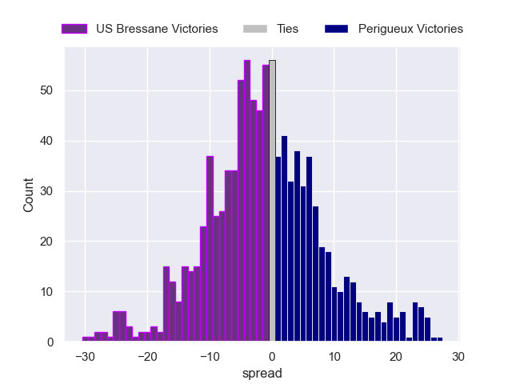

### Chambery V Niort on 2026/03/20

Average Margin: Chambery by 6.4

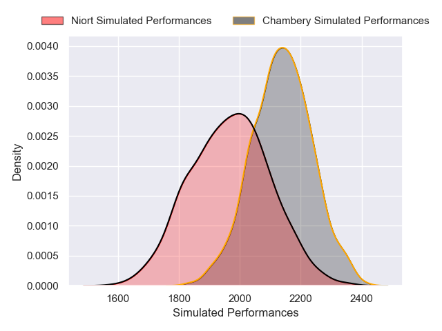

### Tarbes V Albi on 2026/03/20

Average Margin: Albi by 3.1

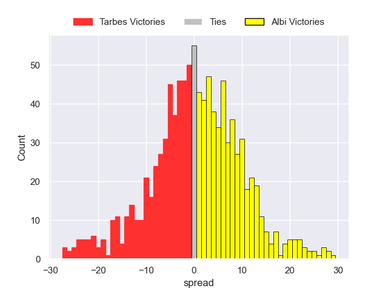

### Marcq-en-Baroeul V Nice on 2026/03/21

Average Margin: Nice by 1.6

### Suresnes V Bourgoin-Jallieu on 2026/03/21

Average Margin: Suresnes by 4.3

### Narbonne V Rennes on 2026/03/21

Average Margin: Narbonne by 5.9

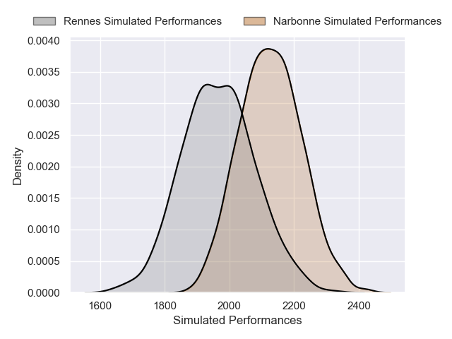
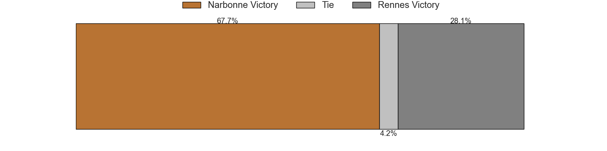

## Week 25

### Massy V Suresnes on 2026/03/27

Average Margin: Massy by 5.2

### Chambery V Tarbes on 2026/03/27

Average Margin: Chambery by 9.3

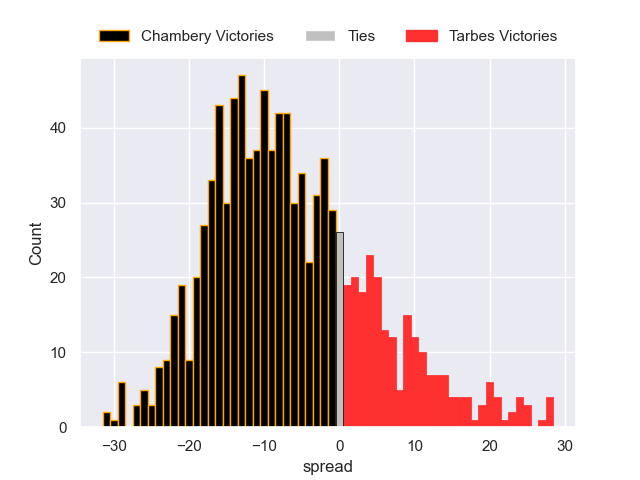

### Rennes V Albi on 2026/03/28

Average Margin: Albi by 0.9

### Bourgoin-Jallieu V US Bressane on 2026/03/28

Average Margin: Bourgoin-Jallieu by 2.4

### Nice V Narbonne on 2026/03/28

Average Margin: Nice by 3.7

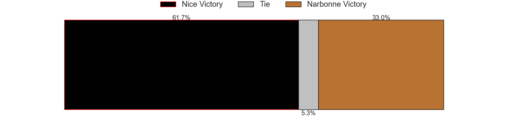

### Niort V Rouen on 2026/03/28

Average Margin: Niort by 2.6

### Périgueux V Marcq-en-Baroeul on 2026/03/28

Average Margin: Périgueux by 5.9

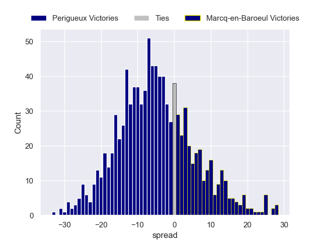

## Week 26

### Rouen V US Bressane on 2026/04/03

Average Margin: Rouen by 4.2

## Week 27

### Rouen V Chambery on 2026/04/10

Average Margin: Rouen by 1.4

### Albi V Nice on 2026/04/10

Average Margin: Albi by 2.4

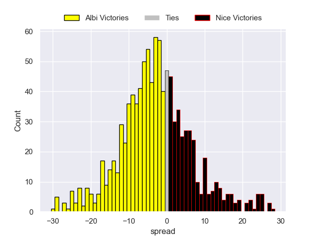

### US Bressane V Massy on 2026/04/10

Average Margin: US Bressane by 1.7

### Tarbes V Rennes on 2026/04/10

Average Margin: Tarbes by 0.5

### Suresnes V Niort on 2026/04/11

Average Margin: Suresnes by 2.7

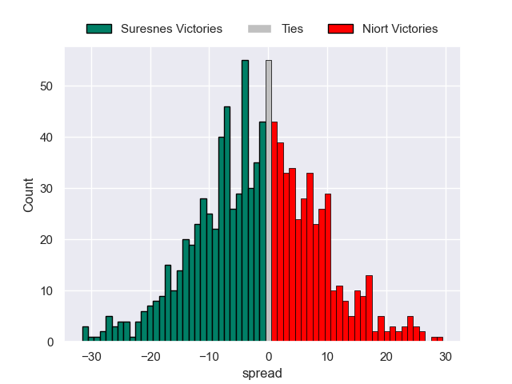

### Marcq-en-Baroeul V Bourgoin-Jallieu on 2026/04/11

Average Margin: Marcq-en-Baroeul by 3.6

### Narbonne V Périgueux on 2026/04/11

Average Margin: Narbonne by 4.0

## Week 28

### Rouen V Tarbes on 2026/04/25

Average Margin: Rouen by 6.8

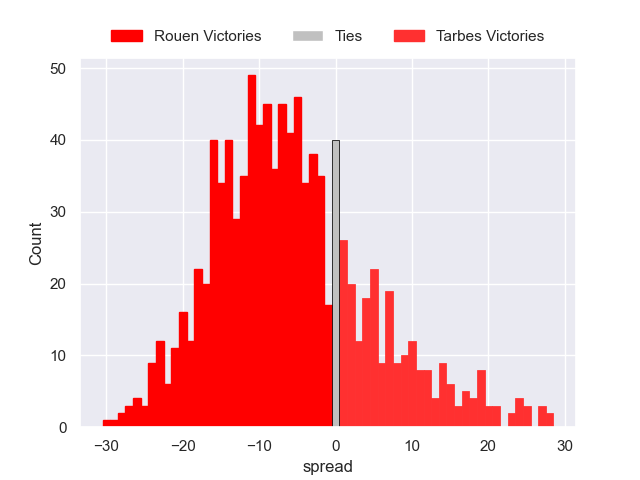

### Nice V Rennes on 2026/04/25

Average Margin: Nice by 6.4

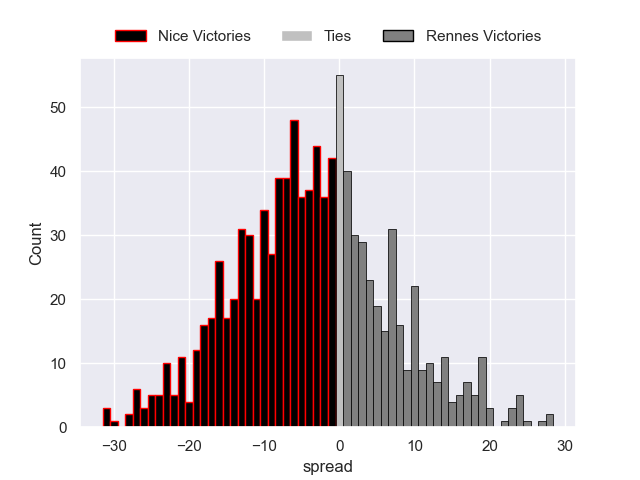

### Bourgoin-Jallieu V Narbonne on 2026/04/25

Average Margin: Narbonne by 0.1

### Périgueux V Albi on 2026/04/25

Average Margin: Périgueux by 3.1

### Niort V US Bressane on 2026/04/25

Average Margin: Niort by 2.4

### Chambery V Suresnes on 2026/04/25

Average Margin: Chambery by 5.5

### Massy V Marcq-en-Baroeul on 2026/04/25

Average Margin: Massy by 5.9

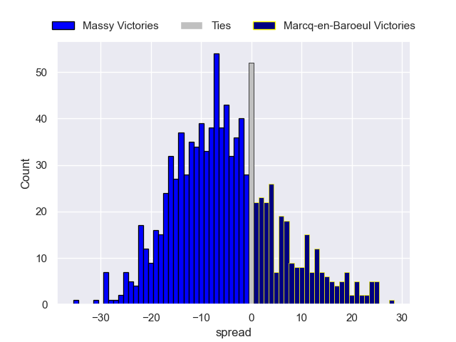

