# Team Rankings

# Standings

## Current Standings

| Club             |   Played |   Wins |   Point Differential |   Losing Bonus Points |   Try Bonus Points |   Competition Points |
|:-----------------|---------:|-------:|---------------------:|----------------------:|-------------------:|---------------------:|
| Nice             |       16 |     11 |                  198 |                     3 |                  8 |                   55 |
| Albi             |       16 |     12 |                   62 |                     2 |                  4 |                   54 |
| Narbonne         |       16 |     11 |                  110 |                     3 |                  4 |                   53 |
| Massy            |       16 |     11 |                   73 |                     3 |                  4 |                   51 |
| Chambery         |       16 |     10 |                   89 |                     5 |                  5 |                   50 |
| Périgueux        |       16 |     11 |                   69 |                     2 |                  4 |                   50 |
| Niort            |       16 |      6 |                    8 |                     4 |                  5 |                   35 |
| US Bressane      |       15 |      6 |                  -40 |                     3 |                  2 |                   35 |
| Rouen            |       15 |      6 |                    8 |                     5 |                  1 |                   32 |
| Suresnes         |       16 |      6 |                  -49 |                     2 |                    |                   30 |
| Rennes           |       16 |      5 |                  -90 |                     6 |                  1 |                   29 |
| Bourgoin-Jallieu |       16 |      5 |                 -123 |                     5 |                    |                   25 |
| Marcq-en-Baroeul |       16 |      4 |                  -91 |                     4 |                  2 |                   24 |
| Tarbes           |       16 |      2 |                 -224 |                     6 |                    |                   14 |

## Projected Remaining Table

| Club             |   To Play |   Projected Wins |   Projected Differential |   Projected Losing Bonus Points | Projected Try Bonus Points   |   Projected Competition Points |
|:-----------------|----------:|-----------------:|-------------------------:|--------------------------------:|:-----------------------------|-------------------------------:|
| Rouen            |        11 |            5.979 |                   17.219 |                           2.444 |                              |                         27.494 |
| Chambery         |        10 |            5.882 |                   31.25  |                           2.037 |                              |                         26.559 |
| Massy            |        10 |            5.684 |                   25.953 |                           2.18  |                              |                         25.86  |
| Albi             |        10 |            5.394 |                   13.658 |                           2.335 |                              |                         24.987 |
| Narbonne         |        10 |            5.365 |                   18.258 |                           2.405 |                              |                         24.855 |
| Nice             |        10 |            5.324 |                   14.144 |                           2.34  |                              |                         24.586 |
| Périgueux        |        10 |            5.171 |                    9.268 |                           2.372 |                              |                         24.032 |
| US Bressane      |        11 |            4.513 |                  -17.129 |                           2.984 |                              |                         22.128 |
| Niort            |        10 |            4.552 |                   -2.579 |                           2.348 |                              |                         21.486 |
| Bourgoin-Jallieu |        10 |            4.495 |                   -8.797 |                           2.427 |                              |                         21.377 |
| Suresnes         |        10 |            4.055 |                  -18.73  |                           2.471 |                              |                         19.641 |
| Marcq-en-Baroeul |        10 |            3.923 |                  -21.25  |                           2.634 |                              |                         19.224 |
| Rennes           |        10 |            3.822 |                  -23.654 |                           2.494 |                              |                         18.754 |
| Tarbes           |        10 |            3.393 |                  -37.611 |                           2.478 |                              |                         16.966 |

## Projected Total Table

| Club             |   Played |   Wins |   Point Differential |   Losing Bonus Points |   Try Bonus Points |   Competition Points |
|:-----------------|---------:|-------:|---------------------:|----------------------:|-------------------:|---------------------:|
| Nice             |       26 | 16.324 |              212.144 |                 5.34  |                  8 |               79.586 |
| Albi             |       26 | 17.394 |               75.658 |                 4.335 |                  4 |               78.987 |
| Narbonne         |       26 | 16.365 |              128.258 |                 5.405 |                  4 |               77.855 |
| Massy            |       26 | 16.684 |               98.953 |                 5.18  |                  4 |               76.86  |
| Chambery         |       26 | 15.882 |              120.25  |                 7.037 |                  5 |               76.559 |
| Périgueux        |       26 | 16.171 |               78.268 |                 4.372 |                  4 |               74.032 |
| Rouen            |       26 | 11.979 |               25.219 |                 7.444 |                  1 |               59.494 |
| US Bressane      |       26 | 10.513 |              -57.129 |                 5.984 |                  2 |               57.128 |
| Niort            |       26 | 10.552 |                5.421 |                 6.348 |                  5 |               56.486 |
| Suresnes         |       26 | 10.055 |              -67.73  |                 4.471 |                    |               49.641 |
| Rennes           |       26 |  8.822 |             -113.654 |                 8.494 |                  1 |               47.754 |
| Bourgoin-Jallieu |       26 |  9.495 |             -131.797 |                 7.427 |                    |               46.377 |
| Marcq-en-Baroeul |       26 |  7.923 |             -112.25  |                 6.634 |                  2 |               43.224 |
| Tarbes           |       26 |  5.393 |             -261.611 |                 8.478 |                    |               30.966 |

# Completed Match Review

| Model | Percent Correct Predictions | Spread Error |
| ------ | ------ | ------ |
| Club Level | 60.4% | 8.5 |
| Player Level: Lineup | nan% | nan |
| Player Level: Minutes | nan% | nan |

# Future Predictions

## Week 17

### Rouen V Narbonne on 2026/01/23

Average Margin: Rouen by 1.2

### Chambery V Albi on 2026/01/23

Average Margin: Chambery by 3.4

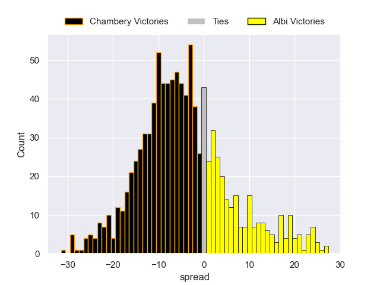

### Massy V Nice on 2026/01/23

Average Margin: Massy by 3.4

### Tarbes V US Bressane on 2026/01/23

Average Margin: Tarbes by 0.7

### Suresnes V Marcq-en-Baroeul on 2026/01/24

Average Margin: Suresnes by 3.3

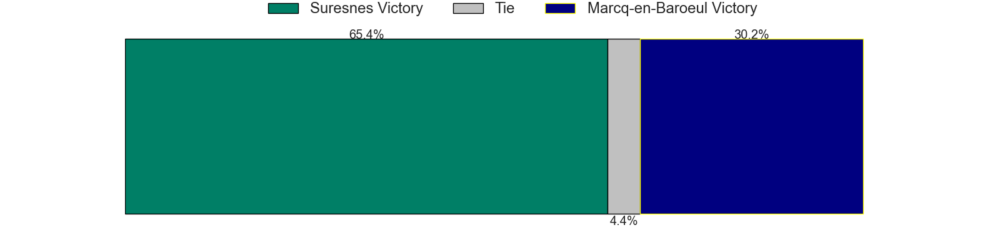

### Bourgoin-Jallieu V Périgueux on 2026/01/24

Average Margin: Bourgoin-Jallieu by 1.0

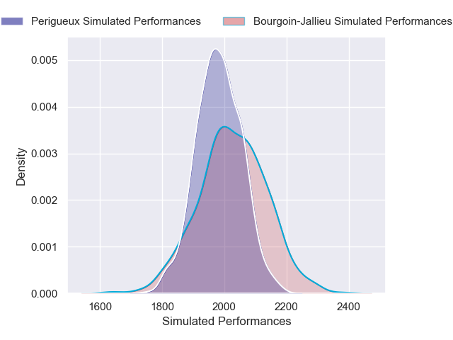

### Niort V Rennes on 2026/01/24

Average Margin: Niort by 3.9

## Week 18

### Albi V Rouen on 2026/01/30

Average Margin: Albi by 4.1

### Bourgoin-Jallieu V Tarbes on 2026/01/31

Average Margin: Bourgoin-Jallieu by 5.8

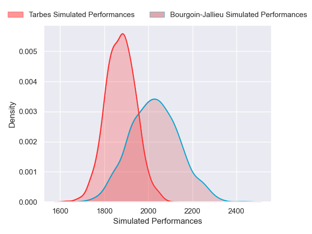

### Périgueux V Massy on 2026/01/31

Average Margin: Périgueux by 3.5

### Narbonne V Suresnes on 2026/01/31

Average Margin: Narbonne by 6.6

### Rennes V Chambery on 2026/01/31

Average Margin: Chambery by 2.8

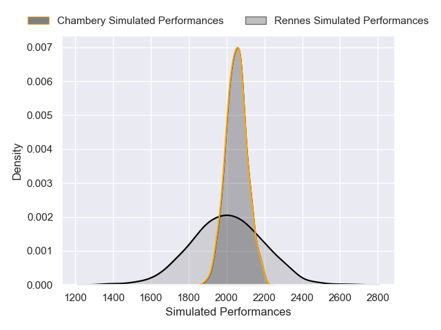

### Nice V Niort on 2026/01/31

Average Margin: Nice by 6.0

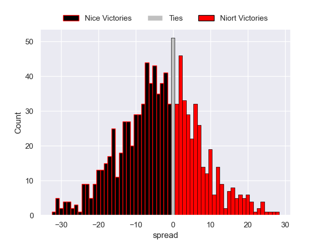

### Marcq-en-Baroeul V US Bressane on 2026/01/31

Average Margin: Marcq-en-Baroeul by 2.5

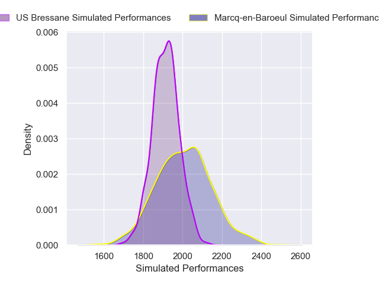

## Week 19

### Chambery V Nice on 2026/02/13

Average Margin: Chambery by 3.8

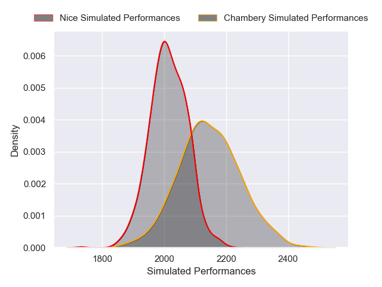

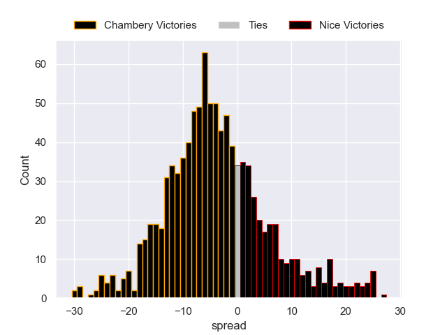

### Rouen V Rennes on 2026/02/13

Average Margin: Rouen by 5.4

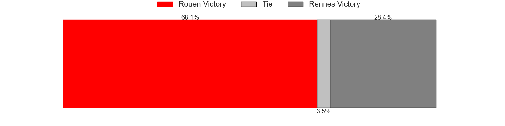

### US Bressane V Narbonne on 2026/02/13

Average Margin: US Bressane by 0.8

### Tarbes V Marcq-en-Baroeul on 2026/02/13

Average Margin: Tarbes by 1.5

### Massy V Bourgoin-Jallieu on 2026/02/13

Average Margin: Massy by 7.1

### Niort V Périgueux on 2026/02/14

Average Margin: Niort by 1.6

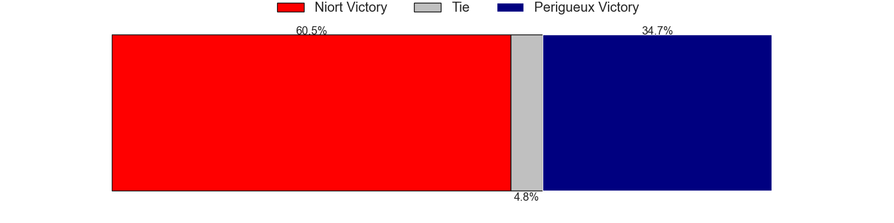

### Suresnes V Albi on 2026/02/14

Average Margin: Albi by 0.8

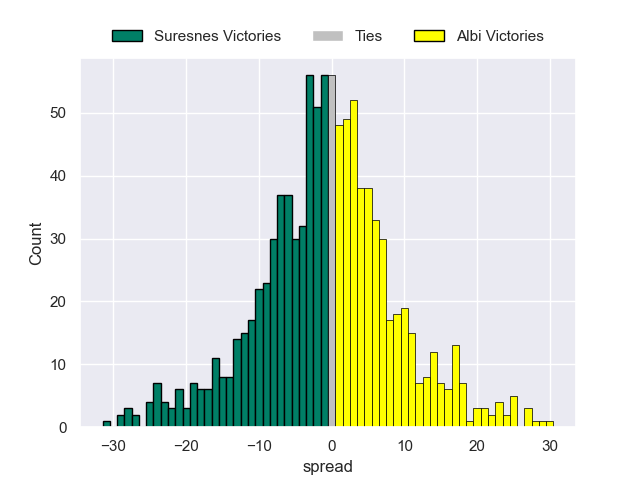

## Week 20

### Albi V US Bressane on 2026/02/20

Average Margin: Albi by 5.6

### Massy V Tarbes on 2026/02/20

Average Margin: Massy by 8.7

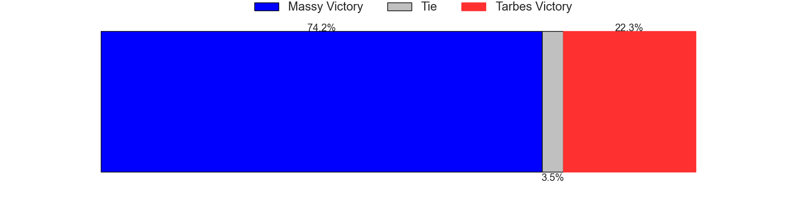
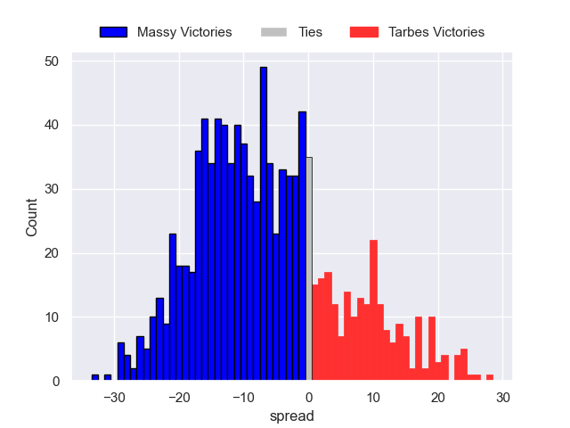

### Périgueux V Chambery on 2026/02/21

Average Margin: Périgueux by 2.2

### Narbonne V Marcq-en-Baroeul on 2026/02/21

Average Margin: Narbonne by 7.2

### Bourgoin-Jallieu V Niort on 2026/02/21

Average Margin: Bourgoin-Jallieu by 2.2

### Nice V Rouen on 2026/02/21

Average Margin: Nice by 3.6

### Rennes V Suresnes on 2026/02/21

Average Margin: Rennes by 1.9

## Week 21

### Rouen V Périgueux on 2026/02/27

Average Margin: Rouen by 3.3

### Chambery V Bourgoin-Jallieu on 2026/02/27

Average Margin: Chambery by 7.4

### US Bressane V Rennes on 2026/02/27

Average Margin: US Bressane by 3.7

### Tarbes V Narbonne on 2026/02/27

Average Margin: Narbonne by 3.0

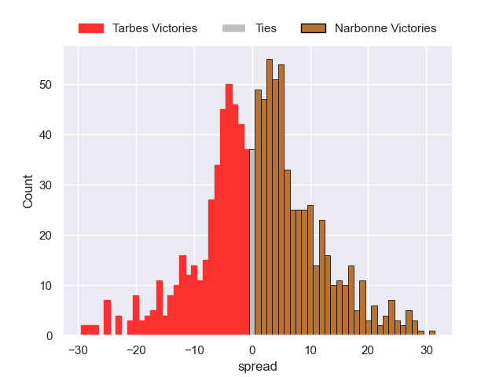

### Niort V Massy on 2026/02/28

Average Margin: Niort by 0.4

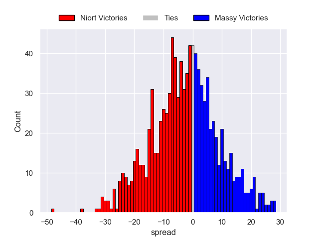

### Marcq-en-Baroeul V Albi on 2026/02/28

Average Margin: Albi by 0.6

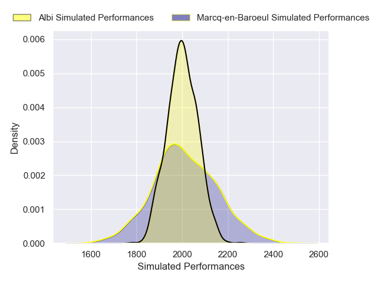

### Suresnes V Nice on 2026/02/28

Average Margin: Nice by 0.5

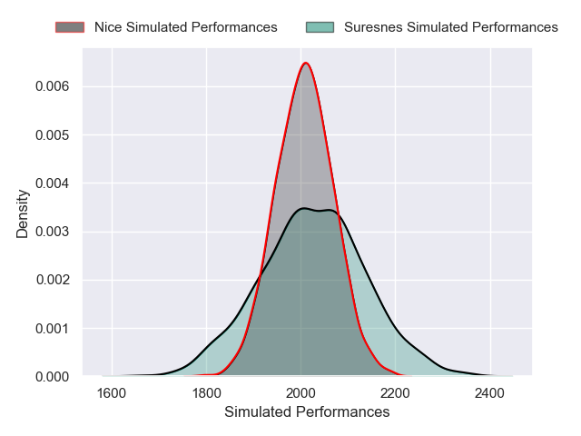

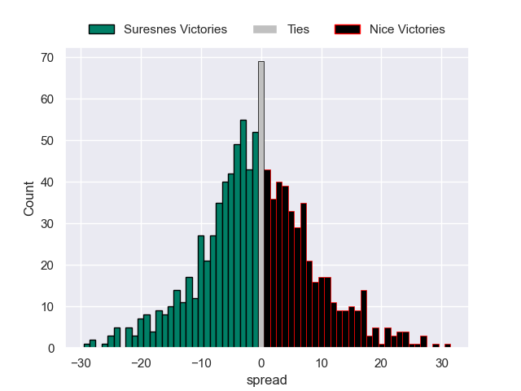

## Week 22

### Albi V Narbonne on 2026/03/06

Average Margin: Albi by 3.4

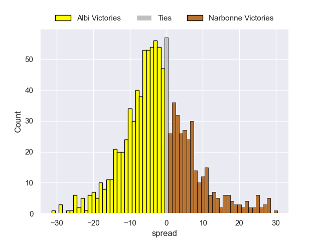

### Massy V Chambery on 2026/03/06

Average Margin: Massy by 2.3

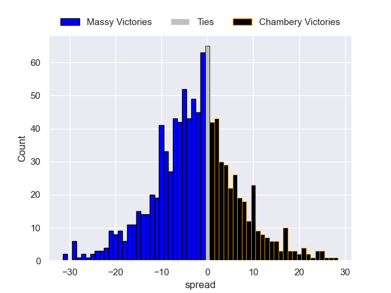

### Niort V Tarbes on 2026/03/07

Average Margin: Niort by 5.5

### Bourgoin-Jallieu V Rouen on 2026/03/07

Average Margin: Bourgoin-Jallieu by 0.6

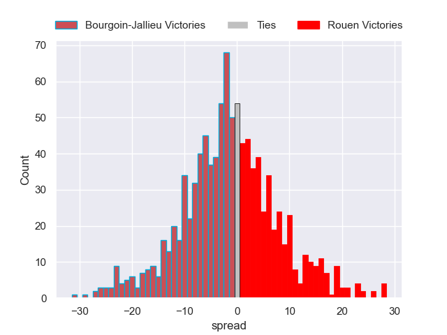

### Périgueux V Suresnes on 2026/03/07

Average Margin: Périgueux by 6.4

### Rennes V Marcq-en-Baroeul on 2026/03/07

Average Margin: Rennes by 2.4

### Nice V US Bressane on 2026/03/07

Average Margin: Nice by 5.6

## Week 23

### Tarbes V Albi on 2026/03/20

Average Margin: Albi by 2.1

### Chambery V Niort on 2026/03/20

Average Margin: Chambery by 6.1

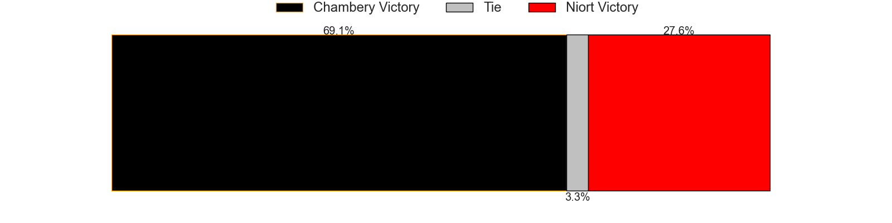

### US Bressane V Périgueux on 2026/03/20

Average Margin: US Bressane by 1.7

### Rouen V Massy on 2026/03/20

Average Margin: Rouen by 2.0

### Narbonne V Rennes on 2026/03/21

Average Margin: Narbonne by 5.9

### Marcq-en-Baroeul V Nice on 2026/03/21

Average Margin: Nice by 1.0

### Suresnes V Bourgoin-Jallieu on 2026/03/21

Average Margin: Suresnes by 2.9

## Week 24

### Chambery V Tarbes on 2026/03/27

Average Margin: Chambery by 8.0

### Massy V Suresnes on 2026/03/27

Average Margin: Massy by 5.6

### Périgueux V Marcq-en-Baroeul on 2026/03/28

Average Margin: Périgueux by 6.4

### Rennes V Albi on 2026/03/28

Average Margin: Albi by 0.2

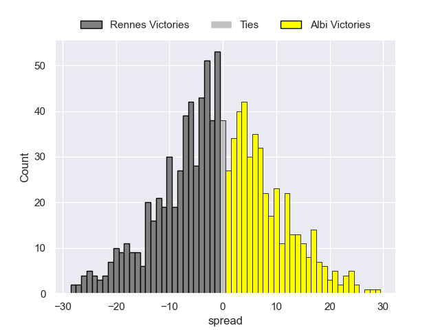

### Nice V Narbonne on 2026/03/28

Average Margin: Nice by 2.6

### Niort V Rouen on 2026/03/28

Average Margin: Niort by 0.7

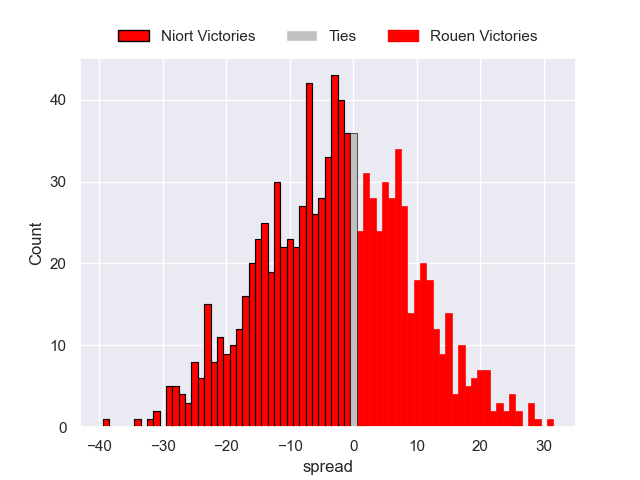

### Bourgoin-Jallieu V US Bressane on 2026/03/28

Average Margin: Bourgoin-Jallieu by 2.7

## Week 25

### Rouen V US Bressane on 2026/04/03

Average Margin: Rouen by 4.3

## Week 26

### Albi V Nice on 2026/04/10

Average Margin: Albi by 3.0

### Tarbes V Rennes on 2026/04/10

Average Margin: Tarbes by 1.0

### Rouen V Chambery on 2026/04/10

Average Margin: Rouen by 2.1

### US Bressane V Massy on 2026/04/10

Average Margin: US Bressane by 0.7

### Marcq-en-Baroeul V Bourgoin-Jallieu on 2026/04/11

Average Margin: Marcq-en-Baroeul by 4.0

### Suresnes V Niort on 2026/04/11

Average Margin: Suresnes by 3.1

### Narbonne V Périgueux on 2026/04/11

Average Margin: Narbonne by 4.2

## Week 27

### Niort V US Bressane on 2026/04/25

Average Margin: Niort by 2.7

### Bourgoin-Jallieu V Narbonne on 2026/04/25

Average Margin: Bourgoin-Jallieu by 0.5

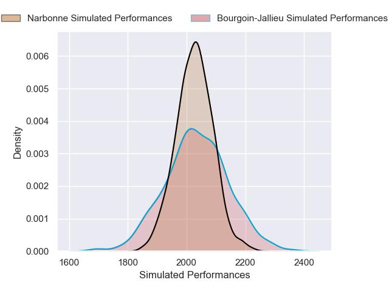

### Périgueux V Albi on 2026/04/25

Average Margin: Périgueux by 2.6

### Nice V Rennes on 2026/04/25

Average Margin: Nice by 5.1

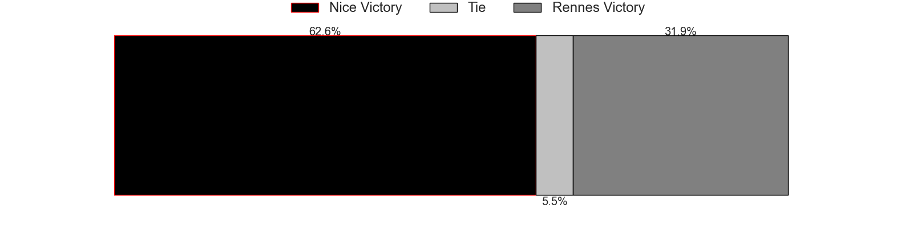

### Chambery V Suresnes on 2026/04/25

Average Margin: Chambery by 6.3

### Rouen V Tarbes on 2026/04/25

Average Margin: Rouen by 7.8

### Massy V Marcq-en-Baroeul on 2026/04/25

Average Margin: Massy by 5.4

