# Team Rankings

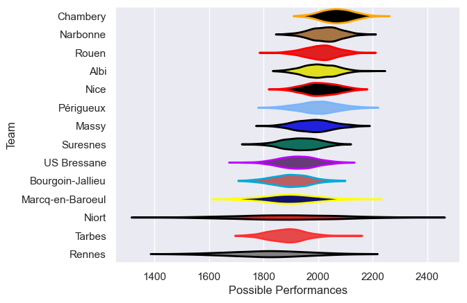
# Standings

## Current Standings

| Club             |   Played |   Wins |   Point Differential |   Losing Bonus Points |   Try Bonus Points |   Competition Points |
|:-----------------|---------:|-------:|---------------------:|----------------------:|-------------------:|---------------------:|
| Narbonne         |       15 |     11 |                  115 |                     2 |                  4 |                   52 |
| Nice             |       15 |     10 |                  158 |                     3 |                  7 |                   50 |
| Albi             |       15 |     11 |                   45 |                     2 |                  3 |                   49 |
| Massy            |       15 |     10 |                   69 |                     3 |                  4 |                   47 |
| Chambery         |       15 |      9 |                   84 |                     5 |                  5 |                   46 |
| Périgueux        |       15 |     10 |                   30 |                     2 |                  3 |                   45 |
| Niort            |       15 |      6 |                   25 |                     4 |                  5 |                   35 |
| US Bressane      |       14 |      6 |                  -35 |                     2 |                  2 |                   34 |
| Rouen            |       14 |      6 |                   13 |                     4 |                  1 |                   31 |
| Rennes           |       15 |      5 |                  -86 |                     5 |                  1 |                   28 |
| Suresnes         |       15 |      5 |                  -54 |                     2 |                    |                   26 |
| Bourgoin-Jallieu |       15 |      5 |                  -83 |                     5 |                    |                   25 |
| Marcq-en-Baroeul |       15 |      3 |                  -96 |                     4 |                  2 |                   20 |
| Tarbes           |       15 |      2 |                 -185 |                     6 |                    |                   14 |

## Projected Remaining Table

| Club             |   To Play |   Projected Wins |   Projected Differential |   Projected Losing Bonus Points | Projected Try Bonus Points   |   Projected Competition Points |
|:-----------------|----------:|-----------------:|-------------------------:|--------------------------------:|:-----------------------------|-------------------------------:|
| Rouen            |        12 |            6.498 |                   16.874 |                           2.698 |                              |                         29.872 |
| Massy            |        11 |            6.298 |                   28.627 |                           2.366 |                              |                         28.534 |
| Chambery         |        11 |            6.182 |                   26.312 |                           2.382 |                              |                         28.108 |
| Albi             |        11 |            6.088 |                   17.701 |                           2.449 |                              |                         27.969 |
| Narbonne         |        11 |            6.021 |                   21.925 |                           2.607 |                              |                         27.823 |
| Nice             |        11 |            6.026 |                   18.448 |                           2.487 |                              |                         27.609 |
| Périgueux        |        11 |            5.748 |                   16.377 |                           2.563 |                              |                         26.621 |
| US Bressane      |        12 |            5.242 |                  -10.446 |                           3.09  |                              |                         25.35  |
| Niort            |        11 |            4.95  |                   -4.257 |                           2.637 |                              |                         23.455 |
| Bourgoin-Jallieu |        11 |            4.731 |                  -13.683 |                           2.667 |                              |                         22.691 |
| Suresnes         |        11 |            4.345 |                  -23.843 |                           2.635 |                              |                         21.031 |
| Rennes           |        11 |            4.244 |                  -24.45  |                           2.794 |                              |                         20.886 |
| Marcq-en-Baroeul |        11 |            4.17  |                  -25.633 |                           2.913 |                              |                         20.671 |
| Tarbes           |        11 |            3.678 |                  -43.952 |                           2.642 |                              |                         18.31  |

## Projected Total Table

| Club             |   Played |   Wins |   Point Differential |   Losing Bonus Points |   Try Bonus Points |   Competition Points |
|:-----------------|---------:|-------:|---------------------:|----------------------:|-------------------:|---------------------:|
| Narbonne         |       26 | 17.021 |              136.925 |                 4.607 |                  4 |               79.823 |
| Nice             |       26 | 16.026 |              176.448 |                 5.487 |                  7 |               77.609 |
| Albi             |       26 | 17.088 |               62.701 |                 4.449 |                  3 |               76.969 |
| Massy            |       26 | 16.298 |               97.627 |                 5.366 |                  4 |               75.534 |
| Chambery         |       26 | 15.182 |              110.312 |                 7.382 |                  5 |               74.108 |
| Périgueux        |       26 | 15.748 |               46.377 |                 4.563 |                  3 |               71.621 |
| Rouen            |       26 | 12.498 |               29.874 |                 6.698 |                  1 |               60.872 |
| US Bressane      |       26 | 11.242 |              -45.446 |                 5.09  |                  2 |               59.35  |
| Niort            |       26 | 10.95  |               20.743 |                 6.637 |                  5 |               58.455 |
| Rennes           |       26 |  9.244 |             -110.45  |                 7.794 |                  1 |               48.886 |
| Bourgoin-Jallieu |       26 |  9.731 |              -96.683 |                 7.667 |                    |               47.691 |
| Suresnes         |       26 |  9.345 |              -77.843 |                 4.635 |                    |               47.031 |
| Marcq-en-Baroeul |       26 |  7.17  |             -121.633 |                 6.913 |                  2 |               40.671 |
| Tarbes           |       26 |  5.678 |             -228.952 |                 8.642 |                    |               32.31  |

# Completed Match Review

| Model | Percent Correct Predictions | Spread Error |
| ------ | ------ | ------ |
| Club Level | 62.6% | 8.7 |
| Player Level: Lineup | nan% | nan |
| Player Level: Minutes | nan% | nan |

# Future Predictions

## Week 16

### Albi V Niort on 2026/01/16

Average Margin: Albi by 5.9

### US Bressane V Suresnes on 2026/01/16

Average Margin: US Bressane by 4.4

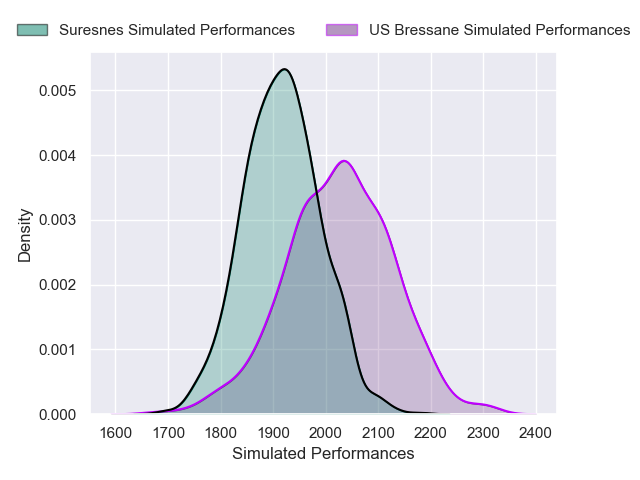

### Narbonne V Chambery on 2026/01/17

Average Margin: Narbonne by 3.5

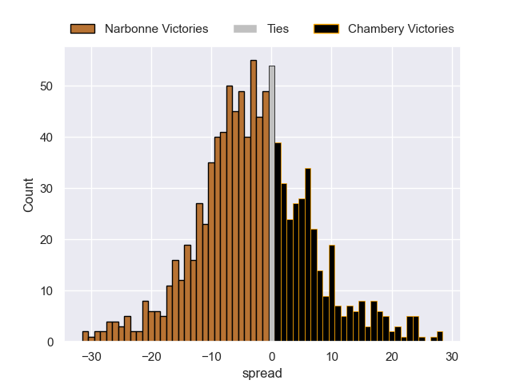

### Rennes V Massy on 2026/01/17

Average Margin: Massy by 1.8

### Nice V Bourgoin-Jallieu on 2026/01/17

Average Margin: Nice by 6.0

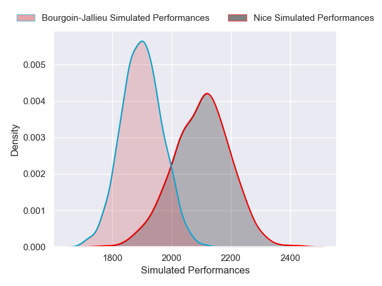

### Marcq-en-Baroeul V Rouen on 2026/01/17

Average Margin: Rouen by 0.7

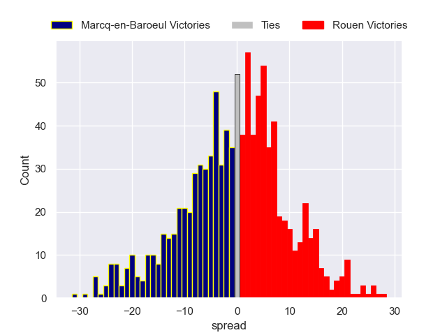

### Périgueux V Tarbes on 2026/01/17

Average Margin: Périgueux by 7.9

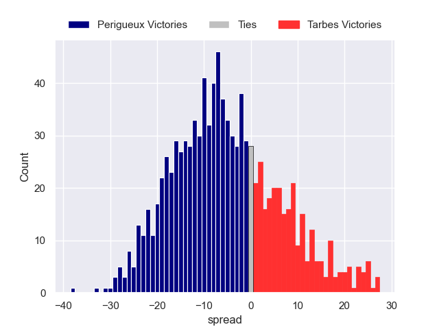

## Week 17

### Tarbes V US Bressane on 2026/01/23

Average Margin: Tarbes by 0.4

### Chambery V Albi on 2026/01/23

Average Margin: Chambery by 3.3

### Rouen V Narbonne on 2026/01/23

Average Margin: Rouen by 2.1

### Massy V Nice on 2026/01/23

Average Margin: Massy by 3.3

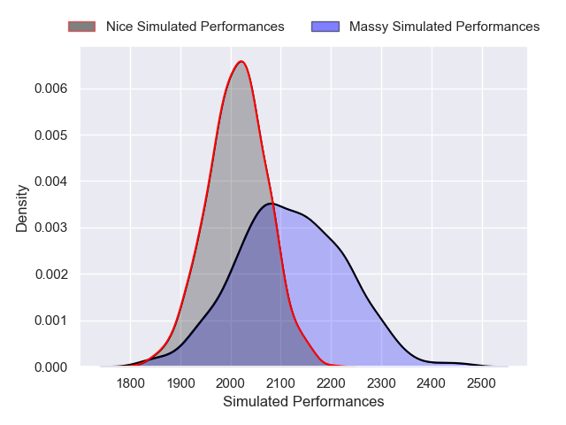

### Suresnes V Marcq-en-Baroeul on 2026/01/24

Average Margin: Suresnes by 3.5

### Bourgoin-Jallieu V Périgueux on 2026/01/24

Average Margin: Bourgoin-Jallieu by 0.5

### Niort V Rennes on 2026/01/24

Average Margin: Niort by 4.5

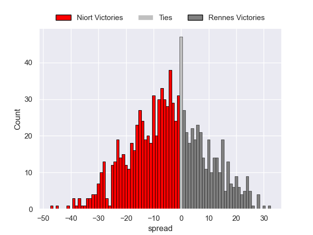

## Week 18

### Albi V Rouen on 2026/01/30

Average Margin: Albi by 3.9

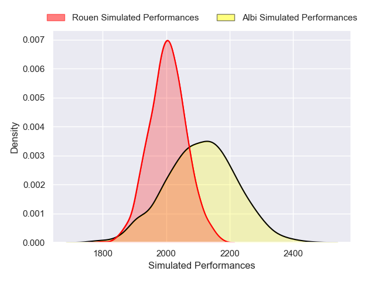

### Narbonne V Suresnes on 2026/01/31

Average Margin: Narbonne by 7.0

### Rennes V Chambery on 2026/01/31

Average Margin: Chambery by 2.0

### Marcq-en-Baroeul V US Bressane on 2026/01/31

Average Margin: Marcq-en-Baroeul by 1.3

### Nice V Niort on 2026/01/31

Average Margin: Nice by 6.1

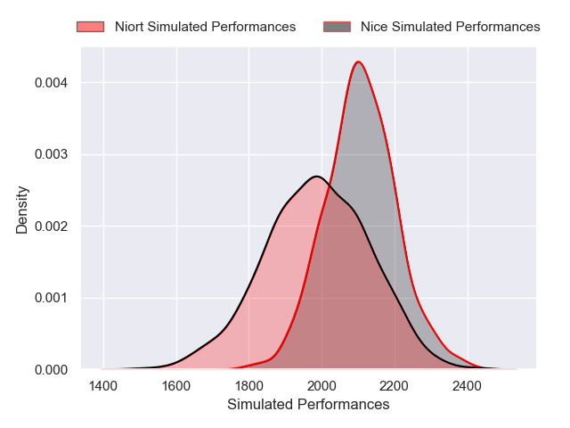

### Bourgoin-Jallieu V Tarbes on 2026/01/31

Average Margin: Bourgoin-Jallieu by 5.7

### Périgueux V Massy on 2026/01/31

Average Margin: Périgueux by 2.7

## Week 19

### Massy V Bourgoin-Jallieu on 2026/02/13

Average Margin: Massy by 6.9

### US Bressane V Narbonne on 2026/02/13

Average Margin: US Bressane by 0.9

### Chambery V Nice on 2026/02/13

Average Margin: Chambery by 4.0

### Rouen V Rennes on 2026/02/13

Average Margin: Rouen by 5.3

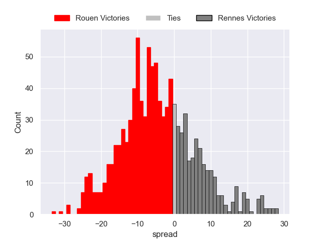

### Tarbes V Marcq-en-Baroeul on 2026/02/13

Average Margin: Tarbes by 1.8

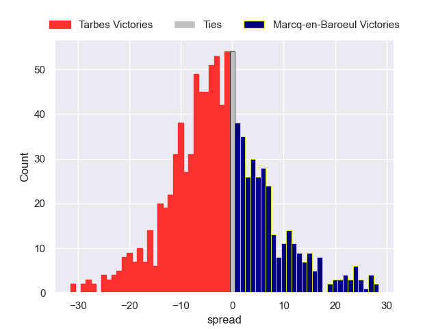

### Suresnes V Albi on 2026/02/14

Average Margin: Albi by 0.1

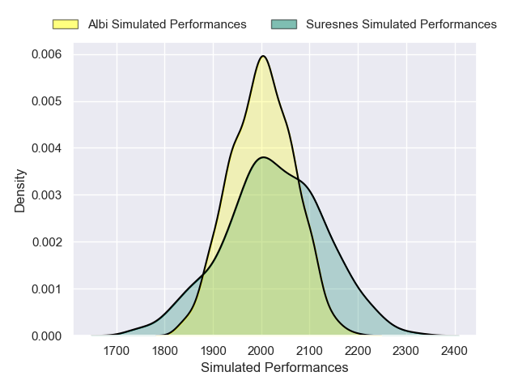

### Niort V Périgueux on 2026/02/14

Average Margin: Niort by 1.9

## Week 20

### Massy V Tarbes on 2026/02/20

Average Margin: Massy by 8.2

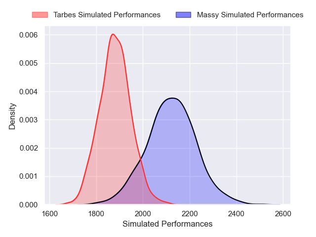

### Albi V US Bressane on 2026/02/20

Average Margin: Albi by 5.2

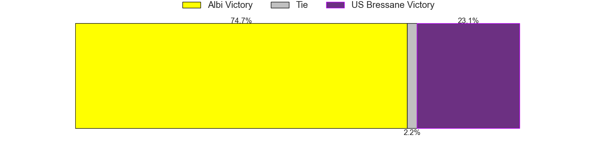

### Périgueux V Chambery on 2026/02/21

Average Margin: Périgueux by 2.0

### Narbonne V Marcq-en-Baroeul on 2026/02/21

Average Margin: Narbonne by 7.3

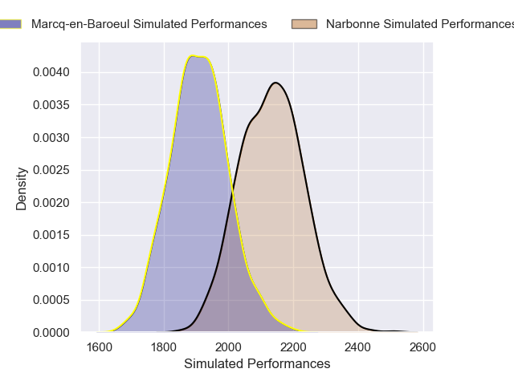

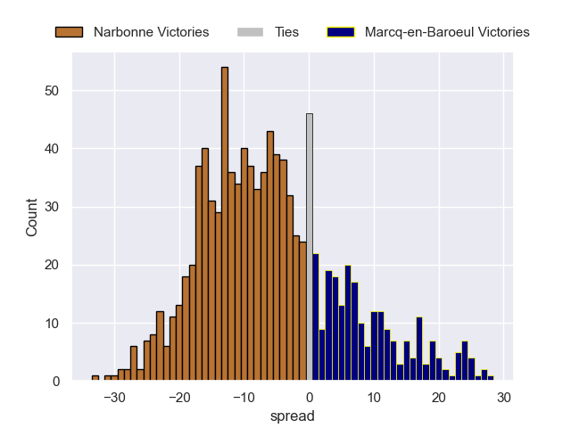

### Rennes V Suresnes on 2026/02/21

Average Margin: Rennes by 2.4

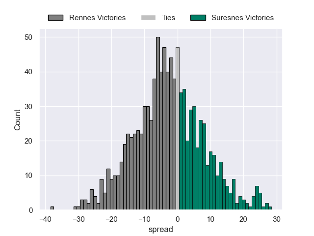

### Nice V Rouen on 2026/02/21

Average Margin: Nice by 3.4

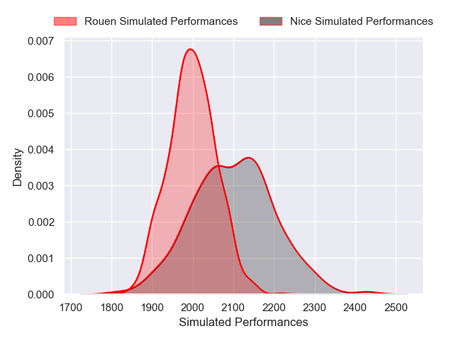

### Bourgoin-Jallieu V Niort on 2026/02/21

Average Margin: Bourgoin-Jallieu by 2.2

## Week 21

### Rouen V Périgueux on 2026/02/27

Average Margin: Rouen by 3.2

### Chambery V Bourgoin-Jallieu on 2026/02/27

Average Margin: Chambery by 6.9

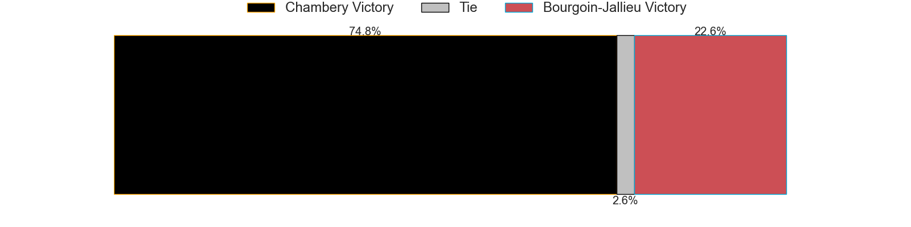

### US Bressane V Rennes on 2026/02/27

Average Margin: US Bressane by 3.9

### Tarbes V Narbonne on 2026/02/27

Average Margin: Narbonne by 2.4

### Suresnes V Nice on 2026/02/28

Average Margin: Nice by 0.3

### Niort V Massy on 2026/02/28

Average Margin: Niort by 0.7

### Marcq-en-Baroeul V Albi on 2026/02/28

Average Margin: Albi by 1.0

## Week 22

### Albi V Narbonne on 2026/03/06

Average Margin: Albi by 2.8

### Massy V Chambery on 2026/03/06

Average Margin: Massy by 2.7

### Rennes V Marcq-en-Baroeul on 2026/03/07

Average Margin: Rennes by 3.0

### Nice V US Bressane on 2026/03/07

Average Margin: Nice by 4.9

### Bourgoin-Jallieu V Rouen on 2026/03/07

Average Margin: Bourgoin-Jallieu by 0.7

### Niort V Tarbes on 2026/03/07

Average Margin: Niort by 6.3

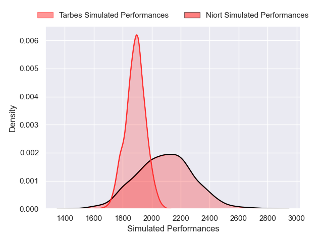
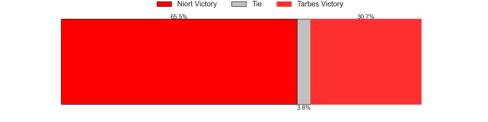
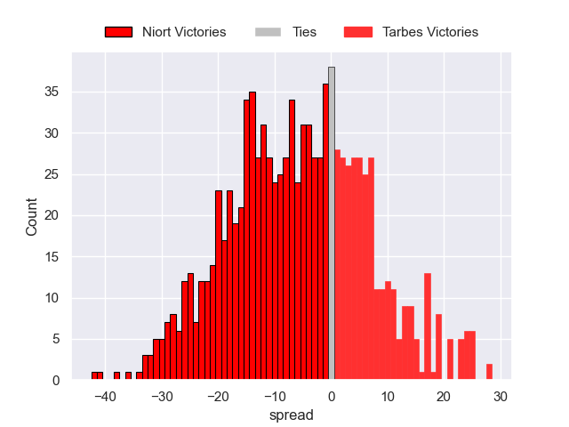

### Périgueux V Suresnes on 2026/03/07

Average Margin: Périgueux by 6.3

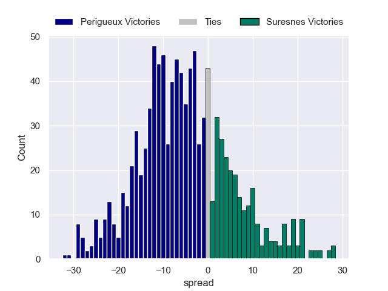

## Week 23

### Chambery V Niort on 2026/03/20

Average Margin: Chambery by 6.0

### US Bressane V Périgueux on 2026/03/20

Average Margin: US Bressane by 1.9

### Tarbes V Albi on 2026/03/20

Average Margin: Albi by 1.7

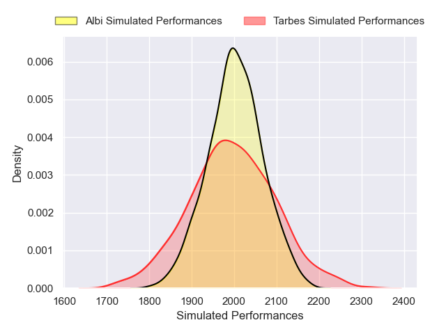

### Rouen V Massy on 2026/03/20

Average Margin: Rouen by 2.1

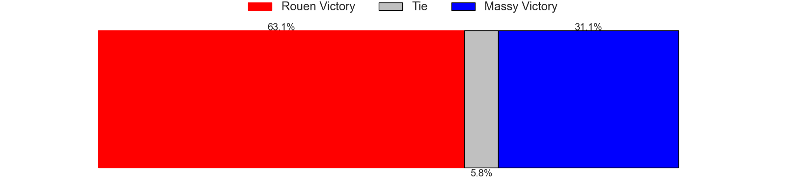

### Marcq-en-Baroeul V Nice on 2026/03/21

Average Margin: Nice by 0.8

### Suresnes V Bourgoin-Jallieu on 2026/03/21

Average Margin: Suresnes by 3.0

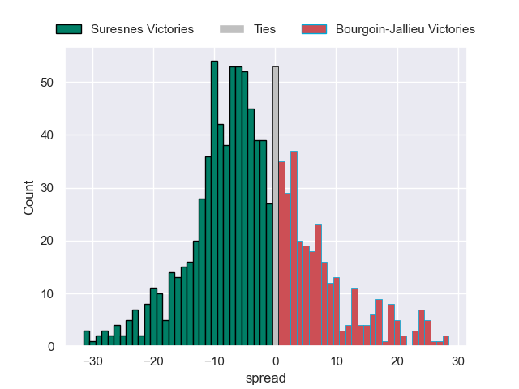

### Narbonne V Rennes on 2026/03/21

Average Margin: Narbonne by 5.8

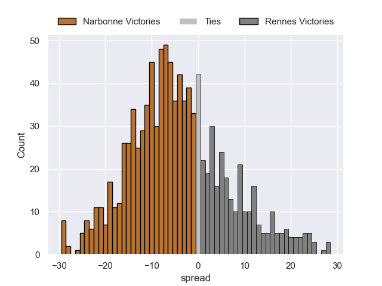

## Week 24

### Chambery V Tarbes on 2026/03/27

Average Margin: Chambery by 8.2

### Massy V Suresnes on 2026/03/27

Average Margin: Massy by 6.5

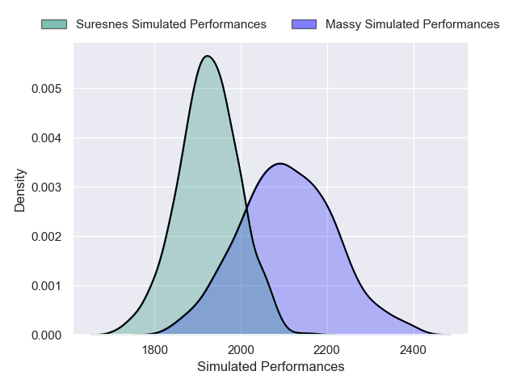

### Rennes V Albi on 2026/03/28

Average Margin: Albi by 0.4

### Périgueux V Marcq-en-Baroeul on 2026/03/28

Average Margin: Périgueux by 6.1

### Bourgoin-Jallieu V US Bressane on 2026/03/28

Average Margin: Bourgoin-Jallieu by 2.9

### Niort V Rouen on 2026/03/28

Average Margin: Niort by 2.4

### Nice V Narbonne on 2026/03/28

Average Margin: Nice by 2.1

## Week 25

### Rouen V US Bressane on 2026/04/03

Average Margin: Rouen by 4.9

## Week 26

### Tarbes V Rennes on 2026/04/10

Average Margin: Tarbes by 1.1

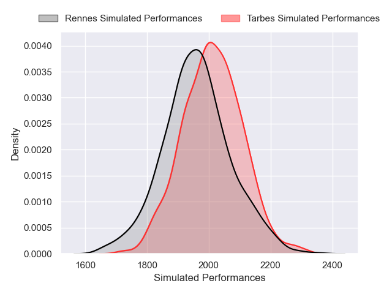

### Rouen V Chambery on 2026/04/10

Average Margin: Rouen by 2.1

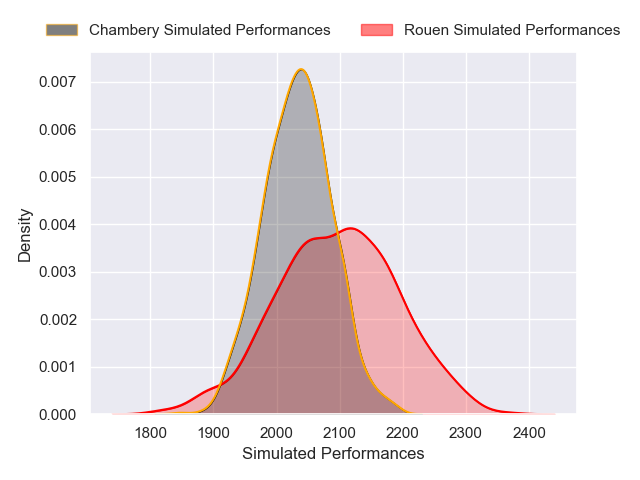

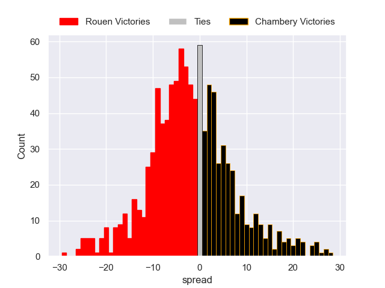

### US Bressane V Massy on 2026/04/10

Average Margin: US Bressane by 1.3

### Albi V Nice on 2026/04/10

Average Margin: Albi by 2.9

### Suresnes V Niort on 2026/04/11

Average Margin: Suresnes by 2.9

### Marcq-en-Baroeul V Bourgoin-Jallieu on 2026/04/11

Average Margin: Marcq-en-Baroeul by 3.3

### Narbonne V Périgueux on 2026/04/11

Average Margin: Narbonne by 4.1

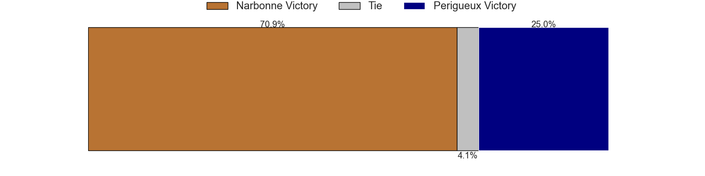

## Week 27

### Bourgoin-Jallieu V Narbonne on 2026/04/25

Average Margin: Bourgoin-Jallieu by 0.3

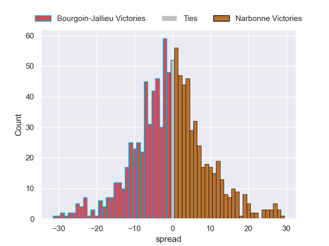

### Nice V Rennes on 2026/04/25

Average Margin: Nice by 5.0

### Massy V Marcq-en-Baroeul on 2026/04/25

Average Margin: Massy by 6.0

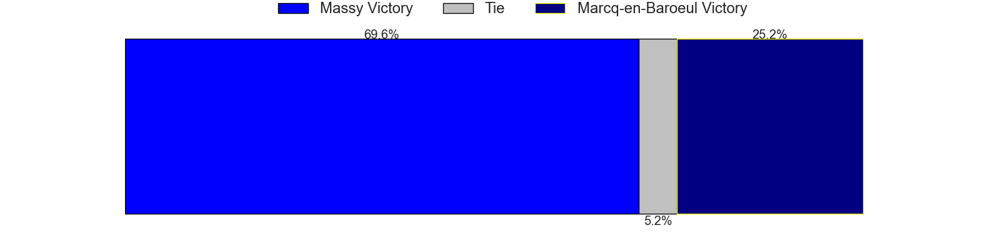

### Rouen V Tarbes on 2026/04/25

Average Margin: Rouen by 6.8

### Chambery V Suresnes on 2026/04/25

Average Margin: Chambery by 6.2

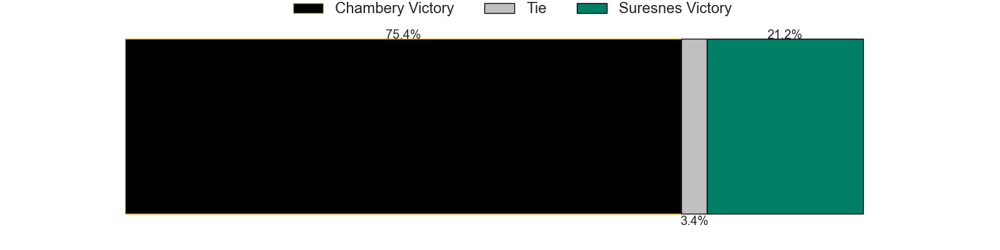

### Niort V US Bressane on 2026/04/25

Average Margin: Niort by 3.2

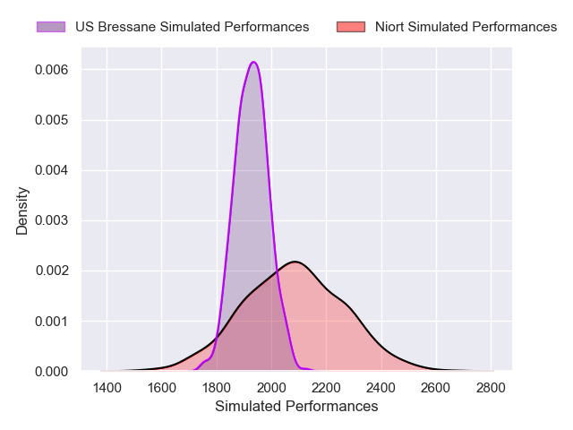

### Périgueux V Albi on 2026/04/25

Average Margin: Périgueux by 2.9

