# Team Rankings

# Standings

## Current Standings

| Club             |   Played |   Wins |   Point Differential |   Losing Bonus Points |   Try Bonus Points |   Competition Points |
|:-----------------|---------:|-------:|---------------------:|----------------------:|-------------------:|---------------------:|
| Nice             |       17 |     11 |                  195 |                     4 |                  8 |                   56 |
| Massy            |       17 |     12 |                   76 |                     3 |                  4 |                   55 |
| Narbonne         |       17 |     11 |                  109 |                     4 |                  4 |                   54 |
| Chambery         |       17 |     11 |                  102 |                     5 |                  5 |                   54 |
| Albi             |       17 |     12 |                   49 |                     2 |                  4 |                   54 |
| Périgueux        |       17 |     11 |                   63 |                     3 |                  4 |                   51 |
| Niort            |       17 |      7 |                   21 |                     4 |                  6 |                   40 |
| US Bressane      |       16 |      7 |                  -24 |                     3 |                  2 |                   39 |
| Rouen            |       16 |      7 |                    9 |                     5 |                  1 |                   36 |
| Suresnes         |       17 |      7 |                  -32 |                     2 |                  1 |                   35 |
| Rennes           |       17 |      5 |                 -103 |                     6 |                  1 |                   29 |
| Bourgoin-Jallieu |       17 |      6 |                 -117 |                     5 |                    |                   29 |
| Marcq-en-Baroeul |       17 |      4 |                 -108 |                     4 |                  2 |                   24 |
| Tarbes           |       17 |      2 |                 -240 |                     6 |                    |                   14 |

## Projected Remaining Table

| Club             |   To Play |   Projected Wins |   Projected Differential |   Projected Losing Bonus Points | Projected Try Bonus Points   |   Projected Competition Points |
|:-----------------|----------:|-----------------:|-------------------------:|--------------------------------:|:-----------------------------|-------------------------------:|
| Rouen            |        10 |            5.37  |                   13.679 |                           2.233 |                              |                         24.629 |
| Chambery         |         9 |            5.299 |                   29.317 |                           1.858 |                              |                         23.866 |
| Nice             |         9 |            5.132 |                   19.353 |                           1.964 |                              |                         23.378 |
| Narbonne         |         9 |            5.118 |                   22.024 |                           1.96  |                              |                         23.338 |
| Albi             |         9 |            5.091 |                   15.352 |                           2.012 |                              |                         23.334 |
| Massy            |         9 |            5.103 |                   23.648 |                           1.889 |                              |                         23.067 |
| Périgueux        |         9 |            4.606 |                    8.821 |                           2.11  |                              |                         21.376 |
| US Bressane      |        10 |            4.133 |                  -13.169 |                           2.695 |                              |                         20.183 |
| Niort            |         9 |            4.149 |                   -1.618 |                           2.083 |                              |                         19.499 |
| Bourgoin-Jallieu |         9 |            3.921 |                  -11.066 |                           2.165 |                              |                         18.651 |
| Suresnes         |         9 |            3.5   |                  -19.109 |                           2.255 |                              |                         17.125 |
| Marcq-en-Baroeul |         9 |            3.441 |                  -21.87  |                           2.258 |                              |                         16.874 |
| Rennes           |         9 |            3.302 |                  -23.844 |                           2.257 |                              |                         16.339 |
| Tarbes           |         9 |            2.829 |                  -41.518 |                           2.165 |                              |                         14.245 |

## Projected Total Table

| Club             |   Played |   Wins |   Point Differential |   Losing Bonus Points |   Try Bonus Points |   Competition Points |
|:-----------------|---------:|-------:|---------------------:|----------------------:|-------------------:|---------------------:|
| Nice             |       26 | 16.132 |              214.353 |                 5.964 |                  8 |               79.378 |
| Massy            |       26 | 17.103 |               99.648 |                 4.889 |                  4 |               78.067 |
| Chambery         |       26 | 16.299 |              131.317 |                 6.858 |                  5 |               77.866 |
| Narbonne         |       26 | 16.118 |              131.024 |                 5.96  |                  4 |               77.338 |
| Albi             |       26 | 17.091 |               64.352 |                 4.012 |                  4 |               77.334 |
| Périgueux        |       26 | 15.606 |               71.821 |                 5.11  |                  4 |               72.376 |
| Rouen            |       26 | 12.37  |               22.679 |                 7.233 |                  1 |               60.629 |
| Niort            |       26 | 11.149 |               19.382 |                 6.083 |                  6 |               59.499 |
| US Bressane      |       26 | 11.133 |              -37.169 |                 5.695 |                  2 |               59.183 |
| Suresnes         |       26 | 10.5   |              -51.109 |                 4.255 |                  1 |               52.125 |
| Bourgoin-Jallieu |       26 |  9.921 |             -128.066 |                 7.165 |                    |               47.651 |
| Rennes           |       26 |  8.302 |             -126.844 |                 8.257 |                  1 |               45.339 |
| Marcq-en-Baroeul |       26 |  7.441 |             -129.87  |                 6.258 |                  2 |               40.874 |
| Tarbes           |       26 |  4.829 |             -281.518 |                 8.165 |                    |               28.245 |

# Completed Match Review

| Model | Percent Correct Predictions | Spread Error |
| ------ | ------ | ------ |
| Club Level | 67.6% | 8.0 |
| Player Level: Lineup | nan% | nan |
| Player Level: Minutes | nan% | nan |

# Future Predictions

## Week 18

### Albi V Rouen on 2026/01/30

Average Margin: Albi by 3.6

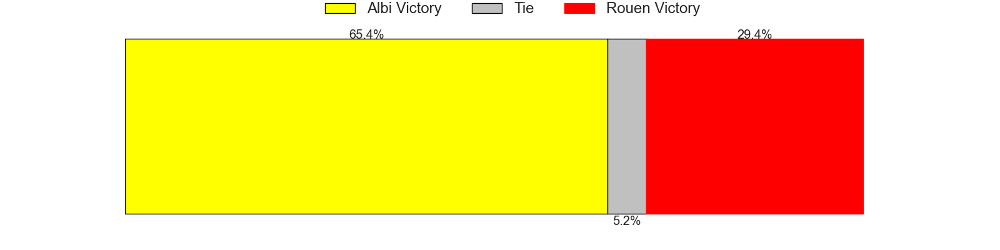

### Nice V Niort on 2026/01/31

Average Margin: Nice by 5.9

### Marcq-en-Baroeul V US Bressane on 2026/01/31

Average Margin: Marcq-en-Baroeul by 1.2

### Narbonne V Suresnes on 2026/01/31

Average Margin: Narbonne by 6.2

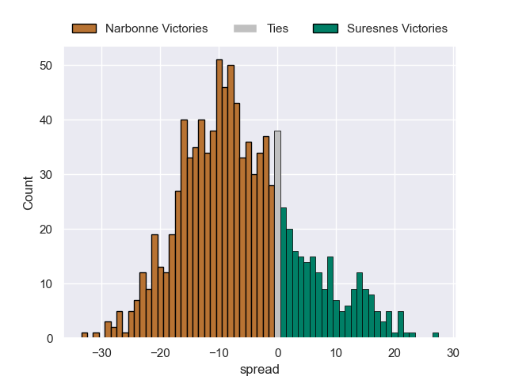

### Rennes V Chambery on 2026/01/31

Average Margin: Chambery by 2.9

### Périgueux V Massy on 2026/01/31

Average Margin: Périgueux by 2.7

### Bourgoin-Jallieu V Tarbes on 2026/01/31

Average Margin: Bourgoin-Jallieu by 5.8

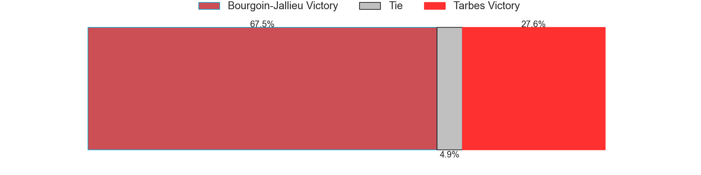

## Week 19

### Rouen V Rennes on 2026/02/13

Average Margin: Rouen by 6.3

### Massy V Bourgoin-Jallieu on 2026/02/13

Average Margin: Massy by 7.2

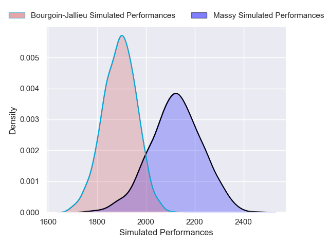

### Tarbes V Marcq-en-Baroeul on 2026/02/13

Average Margin: Tarbes by 1.5

### US Bressane V Narbonne on 2026/02/13

Average Margin: US Bressane by 0.3

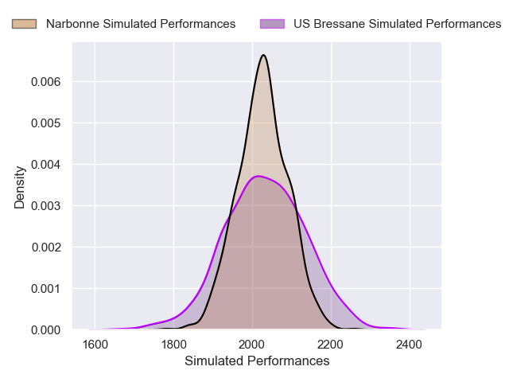

### Chambery V Nice on 2026/02/13

Average Margin: Chambery by 3.8

### Niort V Périgueux on 2026/02/14

Average Margin: Niort by 1.6

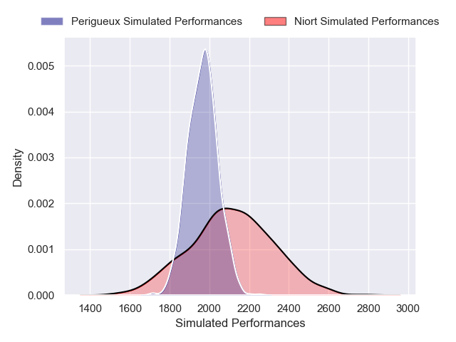

### Suresnes V Albi on 2026/02/14

Average Margin: Albi by 0.1

## Week 20

### Albi V US Bressane on 2026/02/20

Average Margin: Albi by 5.7

### Massy V Tarbes on 2026/02/20

Average Margin: Massy by 8.8

### Nice V Rouen on 2026/02/21

Average Margin: Nice by 3.8

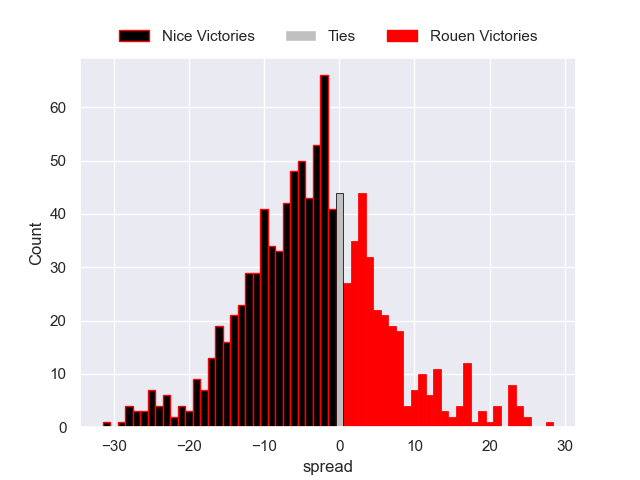

### Rennes V Suresnes on 2026/02/21

Average Margin: Rennes by 1.6

### Bourgoin-Jallieu V Niort on 2026/02/21

Average Margin: Bourgoin-Jallieu by 2.0

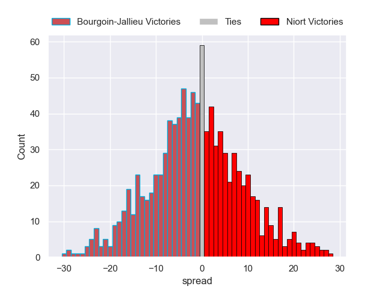

### Périgueux V Chambery on 2026/02/21

Average Margin: Périgueux by 1.8

### Narbonne V Marcq-en-Baroeul on 2026/02/21

Average Margin: Narbonne by 7.7

## Week 21

### Chambery V Bourgoin-Jallieu on 2026/02/27

Average Margin: Chambery by 8.3

### US Bressane V Rennes on 2026/02/27

Average Margin: US Bressane by 4.8

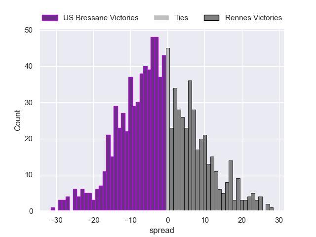

### Tarbes V Narbonne on 2026/02/27

Average Margin: Narbonne by 3.4

### Rouen V Périgueux on 2026/02/27

Average Margin: Rouen by 2.9

### Suresnes V Nice on 2026/02/28

Average Margin: Nice by 0.0

### Marcq-en-Baroeul V Albi on 2026/02/28

Average Margin: Albi by 0.3

### Niort V Massy on 2026/02/28

Average Margin: Niort by 0.8

## Week 22

### Massy V Chambery on 2026/03/06

Average Margin: Massy by 2.6

### Albi V Narbonne on 2026/03/06

Average Margin: Albi by 3.2

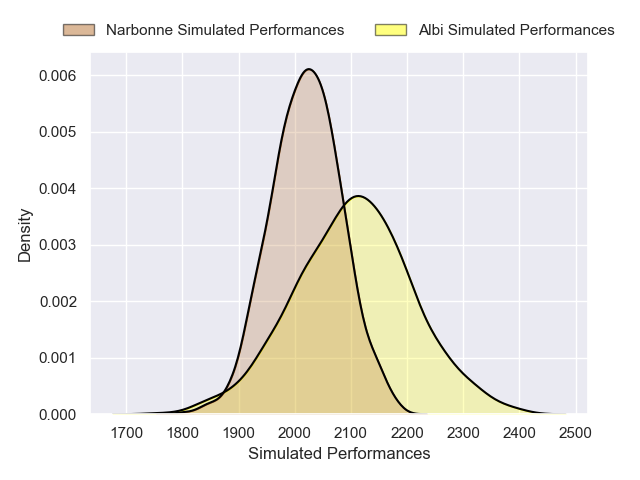

### Niort V Tarbes on 2026/03/07

Average Margin: Niort by 6.7

### Nice V US Bressane on 2026/03/07

Average Margin: Nice by 5.5

### Bourgoin-Jallieu V Rouen on 2026/03/07

Average Margin: Bourgoin-Jallieu by 0.9

### Rennes V Marcq-en-Baroeul on 2026/03/07

Average Margin: Rennes by 2.6

### Périgueux V Suresnes on 2026/03/07

Average Margin: Périgueux by 5.8

## Week 23

### Rouen V Massy on 2026/03/20

Average Margin: Rouen by 2.3

### US Bressane V Périgueux on 2026/03/20

Average Margin: US Bressane by 1.8

### Tarbes V Albi on 2026/03/20

Average Margin: Albi by 2.5

### Chambery V Niort on 2026/03/20

Average Margin: Chambery by 5.7

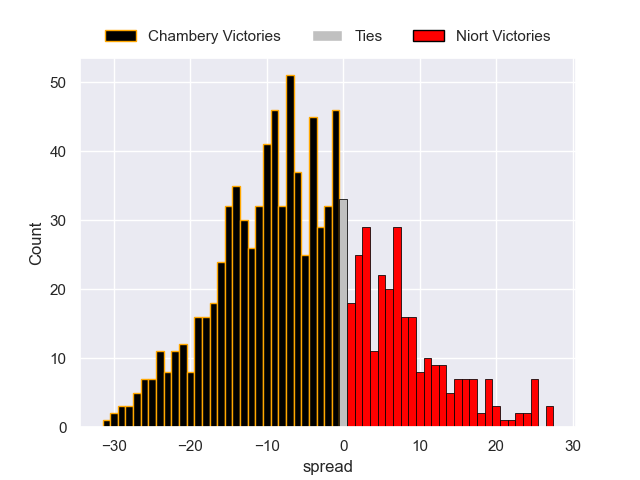

### Marcq-en-Baroeul V Nice on 2026/03/21

Average Margin: Nice by 1.5

### Suresnes V Bourgoin-Jallieu on 2026/03/21

Average Margin: Suresnes by 3.4

### Narbonne V Rennes on 2026/03/21

Average Margin: Narbonne by 6.8

## Week 24

### Massy V Suresnes on 2026/03/27

Average Margin: Massy by 5.6

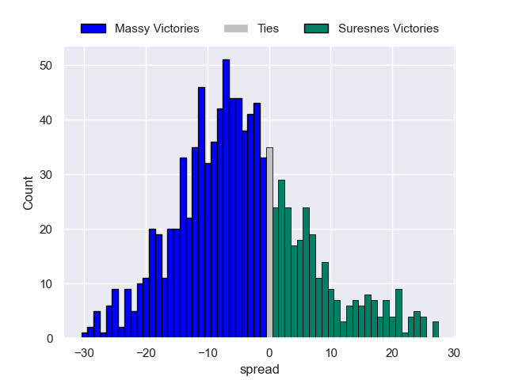

### Chambery V Tarbes on 2026/03/27

Average Margin: Chambery by 9.7

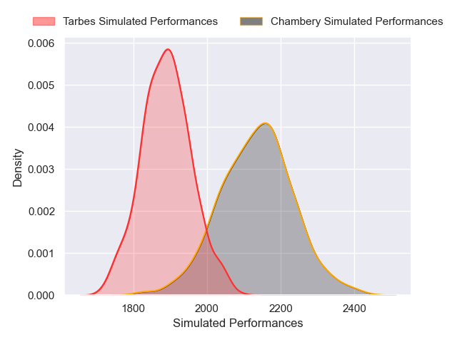

### Nice V Narbonne on 2026/03/28

Average Margin: Nice by 3.0

### Niort V Rouen on 2026/03/28

Average Margin: Niort by 2.6

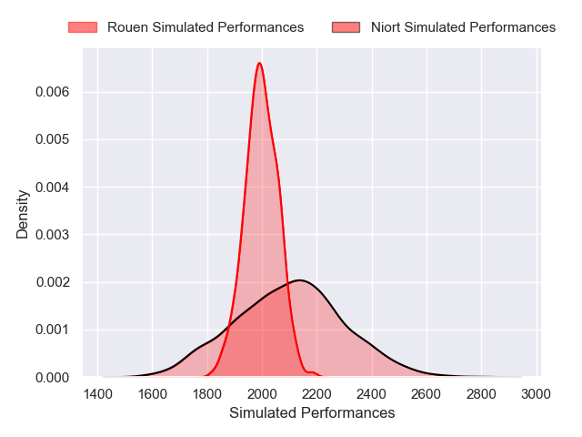

### Bourgoin-Jallieu V US Bressane on 2026/03/28

Average Margin: Bourgoin-Jallieu by 2.4

### Périgueux V Marcq-en-Baroeul on 2026/03/28

Average Margin: Périgueux by 6.4

### Rennes V Albi on 2026/03/28

Average Margin: Albi by 0.7

## Week 25

### Rouen V US Bressane on 2026/04/03

Average Margin: Rouen by 4.0

## Week 26

### US Bressane V Massy on 2026/04/10

Average Margin: US Bressane by 1.6

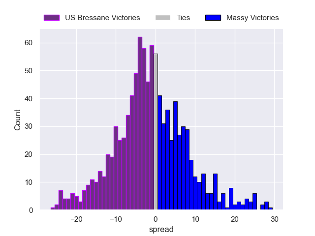

### Tarbes V Rennes on 2026/04/10

Average Margin: Tarbes by 0.6

### Rouen V Chambery on 2026/04/10

Average Margin: Rouen by 2.3

### Albi V Nice on 2026/04/10

Average Margin: Albi by 2.5

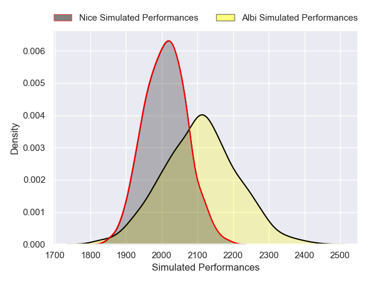

### Suresnes V Niort on 2026/04/11

Average Margin: Suresnes by 2.5

### Narbonne V Périgueux on 2026/04/11

Average Margin: Narbonne by 4.8

### Marcq-en-Baroeul V Bourgoin-Jallieu on 2026/04/11

Average Margin: Marcq-en-Baroeul by 3.6

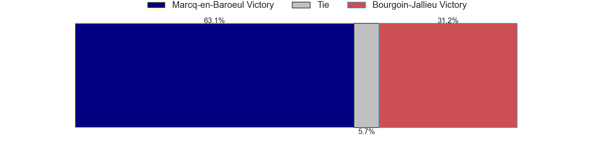

## Week 27

### Périgueux V Albi on 2026/04/25

Average Margin: Périgueux by 3.2

### Nice V Rennes on 2026/04/25

Average Margin: Nice by 5.9

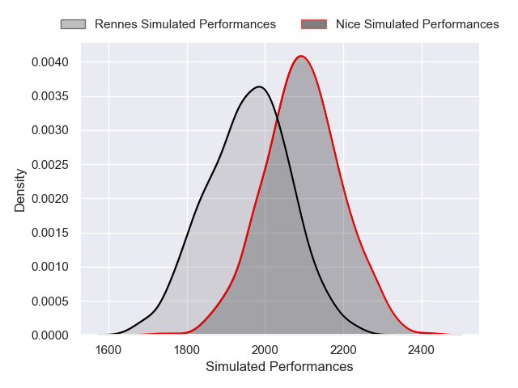

### Chambery V Suresnes on 2026/04/25

Average Margin: Chambery by 5.8

### Massy V Marcq-en-Baroeul on 2026/04/25

Average Margin: Massy by 6.8

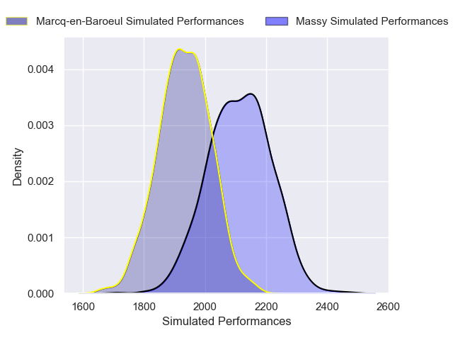

### Rouen V Tarbes on 2026/04/25

Average Margin: Rouen by 6.8

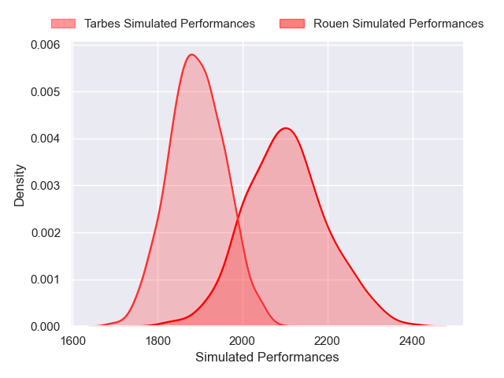

### Bourgoin-Jallieu V Narbonne on 2026/04/25

Average Margin: Bourgoin-Jallieu by 0.3

### Niort V US Bressane on 2026/04/25

Average Margin: Niort by 2.8

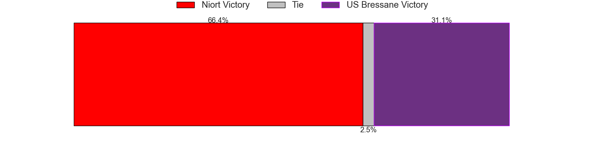

