# Team Rankings

# Standings

## Current Standings

| Club             |   Played |   Wins |   Point Differential |   Losing Bonus Points |   Try Bonus Points |   Competition Points |
|:-----------------|---------:|-------:|---------------------:|----------------------:|-------------------:|---------------------:|
| Nice             |       18 |     12 |                  202 |                     4 |                  8 |                   60 |
| Narbonne         |       18 |     12 |                  124 |                     4 |                  4 |                   58 |
| Albi             |       18 |     13 |                   62 |                     2 |                  4 |                   58 |
| Périgueux        |       18 |     12 |                   78 |                     3 |                  4 |                   55 |
| Massy            |       18 |     12 |                   61 |                     3 |                  4 |                   55 |
| Chambery         |       17 |     11 |                  102 |                     5 |                  5 |                   54 |
| Niort            |       18 |      7 |                   14 |                     5 |                  6 |                   41 |
| US Bressane      |       17 |      7 |                  -28 |                     4 |                  2 |                   40 |
| Rouen            |       17 |      7 |                   -4 |                     5 |                  1 |                   36 |
| Suresnes         |       18 |      7 |                  -47 |                     2 |                  1 |                   35 |
| Bourgoin-Jallieu |       18 |      7 |                 -112 |                     5 |                    |                   33 |
| Rennes           |       17 |      5 |                 -103 |                     6 |                  1 |                   29 |
| Marcq-en-Baroeul |       18 |      5 |                 -104 |                     4 |                  2 |                   28 |
| Tarbes           |       18 |      2 |                 -245 |                     7 |                    |                   15 |

## Projected Remaining Table

| Club             |   To Play |   Projected Wins |   Projected Differential |   Projected Losing Bonus Points | Projected Try Bonus Points   |   Projected Competition Points |
|:-----------------|----------:|-----------------:|-------------------------:|--------------------------------:|:-----------------------------|-------------------------------:|
| Chambery         |         9 |            5.219 |                   27.227 |                           1.762 |                              |                         23.45  |
| Rouen            |         9 |            4.799 |                   12.7   |                           2.004 |                              |                         22.068 |
| Massy            |         8 |            4.683 |                   26.84  |                           1.597 |                              |                         20.997 |
| Nice             |         8 |            4.631 |                   18.963 |                           1.674 |                              |                         20.902 |
| Albi             |         8 |            4.326 |                   11.335 |                           1.847 |                              |                         19.949 |
| Narbonne         |         8 |            4.35  |                   15.4   |                           1.747 |                              |                         19.891 |
| Périgueux        |         8 |            4.146 |                   10.564 |                           1.851 |                              |                         19.207 |
| US Bressane      |         9 |            3.844 |                  -12.522 |                           2.235 |                              |                         18.399 |
| Niort            |         8 |            3.818 |                    2.064 |                           1.826 |                              |                         17.856 |
| Rennes           |         9 |            3.428 |                  -20.727 |                           2.305 |                              |                         16.853 |
| Suresnes         |         8 |            3.376 |                  -12.065 |                           1.905 |                              |                         16.213 |
| Bourgoin-Jallieu |         8 |            3.215 |                  -17.232 |                           1.971 |                              |                         15.579 |
| Marcq-en-Baroeul |         8 |            2.933 |                  -23.25  |                           2.01  |                              |                         14.508 |
| Tarbes           |         8 |            2.561 |                  -39.297 |                           1.891 |                              |                         12.753 |

## Projected Total Table

| Club             |   Played |   Wins |   Point Differential |   Losing Bonus Points |   Try Bonus Points |   Competition Points |
|:-----------------|---------:|-------:|---------------------:|----------------------:|-------------------:|---------------------:|
| Nice             |       26 | 16.631 |              220.963 |                 5.674 |                  8 |               80.902 |
| Albi             |       26 | 17.326 |               73.335 |                 3.847 |                  4 |               77.949 |
| Narbonne         |       26 | 16.35  |              139.4   |                 5.747 |                  4 |               77.891 |
| Chambery         |       26 | 16.219 |              129.227 |                 6.762 |                  5 |               77.45  |
| Massy            |       26 | 16.683 |               87.84  |                 4.597 |                  4 |               75.997 |
| Périgueux        |       26 | 16.146 |               88.564 |                 4.851 |                  4 |               74.207 |
| Niort            |       26 | 10.818 |               16.064 |                 6.826 |                  6 |               58.856 |
| US Bressane      |       26 | 10.844 |              -40.522 |                 6.235 |                  2 |               58.399 |
| Rouen            |       26 | 11.799 |                8.7   |                 7.004 |                  1 |               58.068 |
| Suresnes         |       26 | 10.376 |              -59.065 |                 3.905 |                  1 |               51.213 |
| Bourgoin-Jallieu |       26 | 10.215 |             -129.232 |                 6.971 |                    |               48.579 |
| Rennes           |       26 |  8.428 |             -123.727 |                 8.305 |                  1 |               45.853 |
| Marcq-en-Baroeul |       26 |  7.933 |             -127.25  |                 6.01  |                  2 |               42.508 |
| Tarbes           |       26 |  4.561 |             -284.297 |                 8.891 |                    |               27.753 |

# Completed Match Review

| Model | Percent Correct Predictions | Spread Error |
| ------ | ------ | ------ |
| Club Level | 68.1% | 8.5 |
| Player Level: Lineup | nan% | nan |
| Player Level: Minutes | nan% | nan |

# Future Predictions

## Week 19

### Rennes V Chambery on 2026/01/31

Average Margin: Chambery by 1.8

## Week 20

### US Bressane V Narbonne on 2026/02/13

Average Margin: Narbonne by 0.1

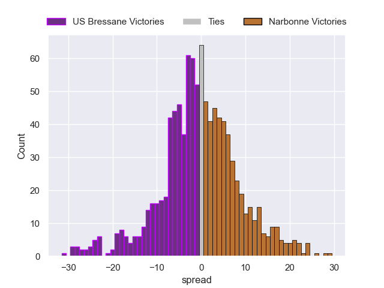

### Tarbes V Marcq-en-Baroeul on 2026/02/13

Average Margin: Tarbes by 0.6

### Chambery V Nice on 2026/02/13

Average Margin: Chambery by 2.7

### Massy V Bourgoin-Jallieu on 2026/02/13

Average Margin: Massy by 7.7

### Rouen V Rennes on 2026/02/13

Average Margin: Rouen by 5.0

### Suresnes V Albi on 2026/02/14

Average Margin: Suresnes by 0.1

### Niort V Périgueux on 2026/02/14

Average Margin: Niort by 1.0

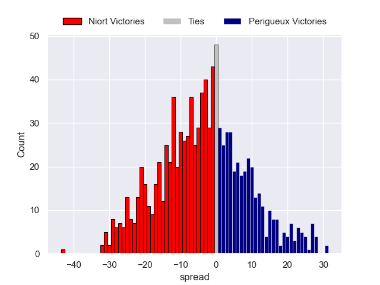

## Week 21

### Massy V Tarbes on 2026/02/20

Average Margin: Massy by 9.8

### Albi V US Bressane on 2026/02/20

Average Margin: Albi by 5.7

### Périgueux V Chambery on 2026/02/21

Average Margin: Périgueux by 2.2

### Bourgoin-Jallieu V Niort on 2026/02/21

Average Margin: Bourgoin-Jallieu by 2.7

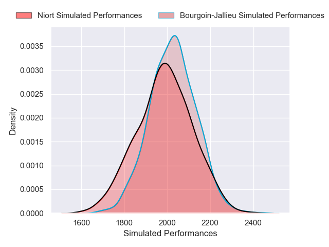

### Rennes V Suresnes on 2026/02/21

Average Margin: Rennes by 1.5

### Narbonne V Marcq-en-Baroeul on 2026/02/21

Average Margin: Narbonne by 7.4

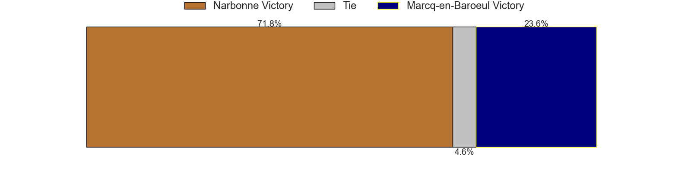

### Nice V Rouen on 2026/02/21

Average Margin: Nice by 4.9

## Week 22

### Chambery V Bourgoin-Jallieu on 2026/02/27

Average Margin: Chambery by 7.8

### US Bressane V Rennes on 2026/02/27

Average Margin: US Bressane by 4.9

### Tarbes V Narbonne on 2026/02/27

Average Margin: Narbonne by 4.2

### Rouen V Périgueux on 2026/02/27

Average Margin: Rouen by 2.0

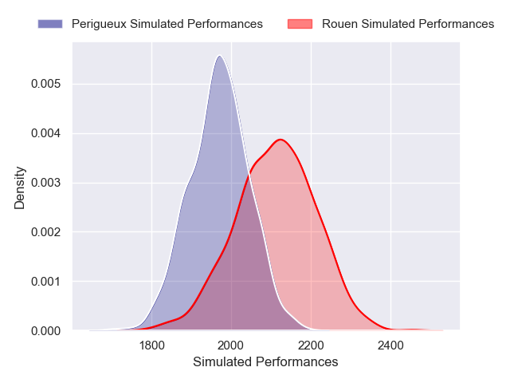

### Suresnes V Nice on 2026/02/28

Average Margin: Nice by 1.1

### Marcq-en-Baroeul V Albi on 2026/02/28

Average Margin: Albi by 0.8

### Niort V Massy on 2026/02/28

Average Margin: Niort by 0.8

## Week 23

### Albi V Narbonne on 2026/03/06

Average Margin: Albi by 2.9

### Massy V Chambery on 2026/03/06

Average Margin: Massy by 2.8

### Niort V Tarbes on 2026/03/07

Average Margin: Niort by 7.3

### Bourgoin-Jallieu V Rouen on 2026/03/07

Average Margin: Bourgoin-Jallieu by 1.2

### Nice V US Bressane on 2026/03/07

Average Margin: Nice by 5.9

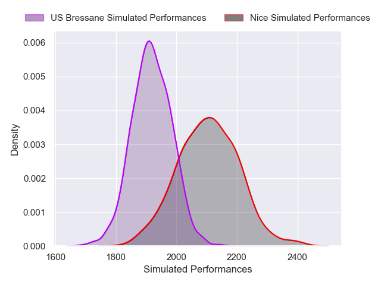

### Périgueux V Suresnes on 2026/03/07

Average Margin: Périgueux by 6.4

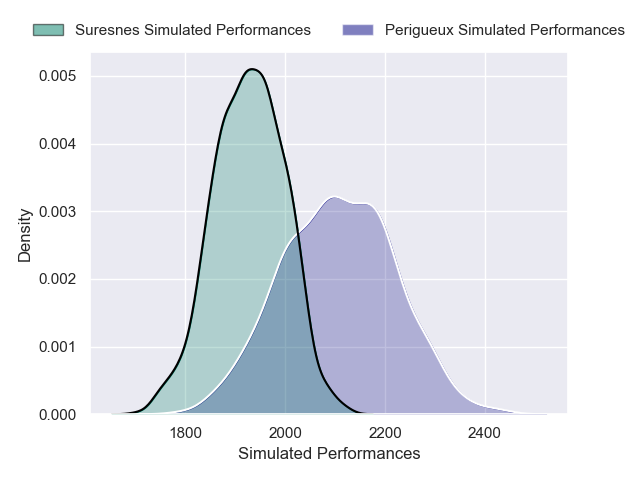

### Rennes V Marcq-en-Baroeul on 2026/03/07

Average Margin: Rennes by 3.1

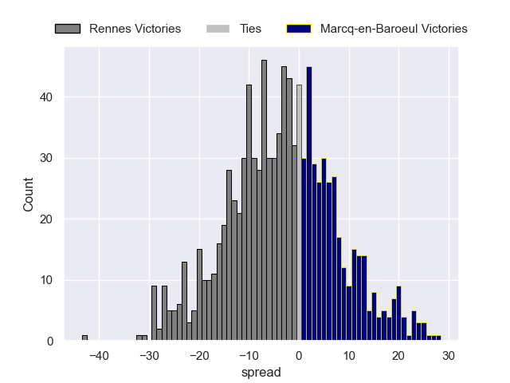

## Week 24

### Rouen V Massy on 2026/03/20

Average Margin: Rouen by 2.7

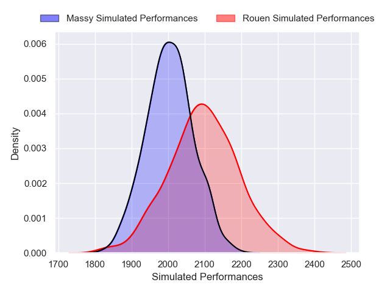

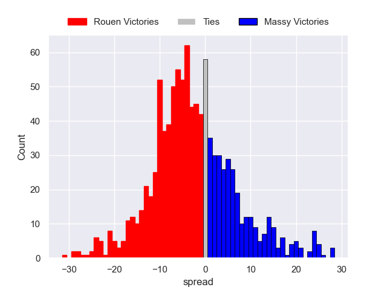

### Chambery V Niort on 2026/03/20

Average Margin: Chambery by 6.8

### Tarbes V Albi on 2026/03/20

Average Margin: Albi by 2.7

### US Bressane V Périgueux on 2026/03/20

Average Margin: US Bressane by 1.2

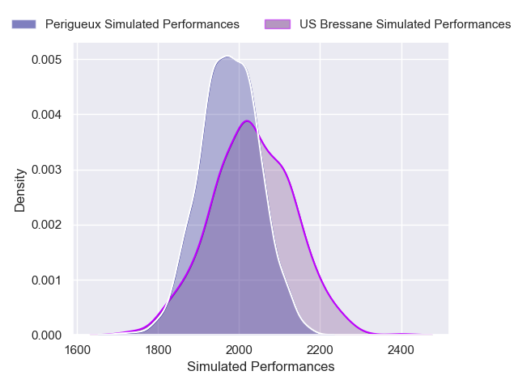

### Marcq-en-Baroeul V Nice on 2026/03/21

Average Margin: Nice by 2.0

### Suresnes V Bourgoin-Jallieu on 2026/03/21

Average Margin: Suresnes by 4.4

### Narbonne V Rennes on 2026/03/21

Average Margin: Narbonne by 6.4

## Week 25

### Massy V Suresnes on 2026/03/27

Average Margin: Massy by 5.5

### Chambery V Tarbes on 2026/03/27

Average Margin: Chambery by 9.3

### Nice V Narbonne on 2026/03/28

Average Margin: Nice by 3.8

### Niort V Rouen on 2026/03/28

Average Margin: Niort by 2.4

### Rennes V Albi on 2026/03/28

Average Margin: Albi by 0.8

### Bourgoin-Jallieu V US Bressane on 2026/03/28

Average Margin: Bourgoin-Jallieu by 2.4

### Périgueux V Marcq-en-Baroeul on 2026/03/28

Average Margin: Périgueux by 6.4

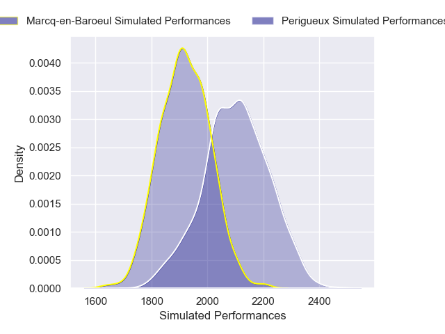

## Week 26

### Rouen V US Bressane on 2026/04/03

Average Margin: Rouen by 3.1

## Week 27

### US Bressane V Massy on 2026/04/10

Average Margin: US Bressane by 1.6

### Albi V Nice on 2026/04/10

Average Margin: Albi by 2.1

### Rouen V Chambery on 2026/04/10

Average Margin: Rouen by 1.2

### Tarbes V Rennes on 2026/04/10

Average Margin: Tarbes by 0.4

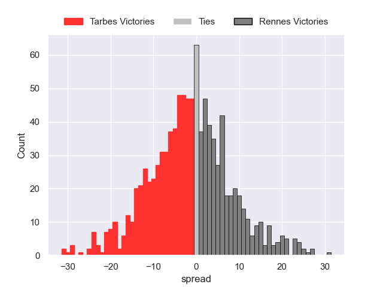

### Marcq-en-Baroeul V Bourgoin-Jallieu on 2026/04/11

Average Margin: Marcq-en-Baroeul by 3.4

### Suresnes V Niort on 2026/04/11

Average Margin: Suresnes by 2.8

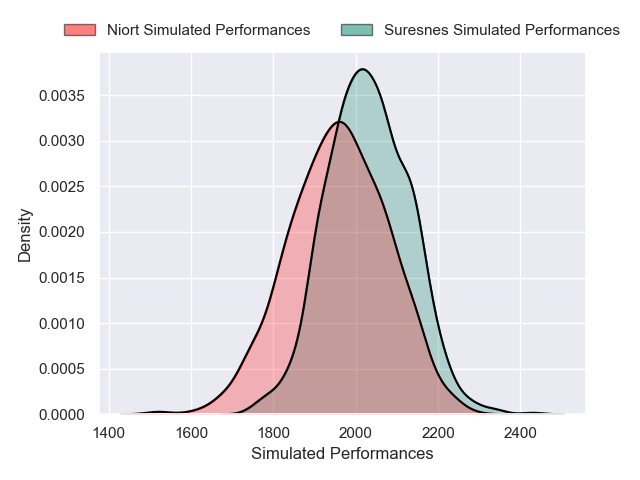

### Narbonne V Périgueux on 2026/04/11

Average Margin: Narbonne by 3.9

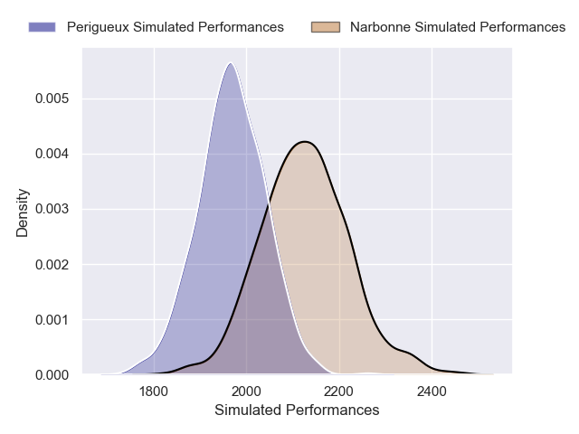

## Week 28

### Chambery V Suresnes on 2026/04/25

Average Margin: Chambery by 4.9

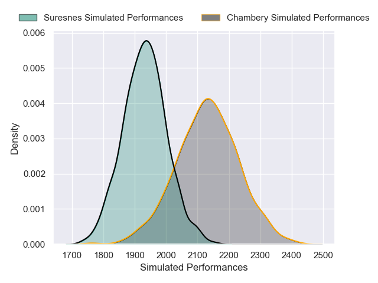

### Massy V Marcq-en-Baroeul on 2026/04/25

Average Margin: Massy by 6.2

### Bourgoin-Jallieu V Narbonne on 2026/04/25

Average Margin: Narbonne by 0.1

### Nice V Rennes on 2026/04/25

Average Margin: Nice by 6.1

### Périgueux V Albi on 2026/04/25

Average Margin: Périgueux by 3.5

### Niort V US Bressane on 2026/04/25

Average Margin: Niort by 2.9

### Rouen V Tarbes on 2026/04/25

Average Margin: Rouen by 7.1

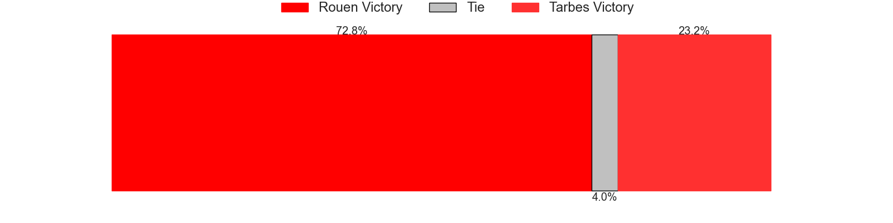

