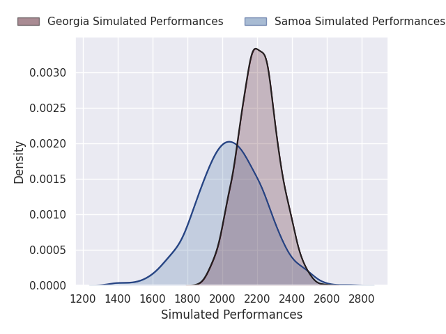
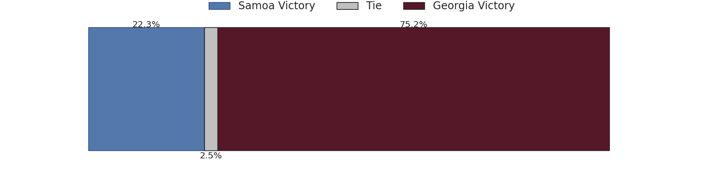
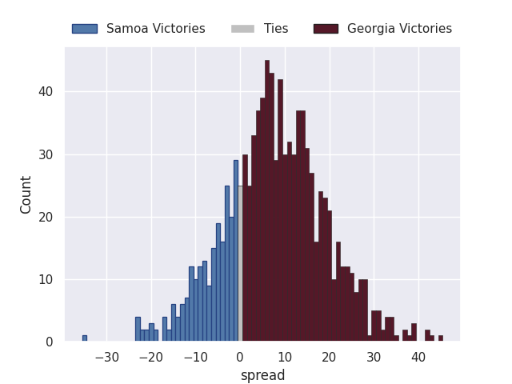
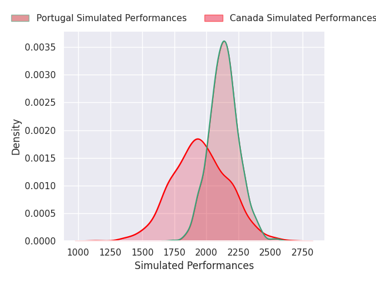
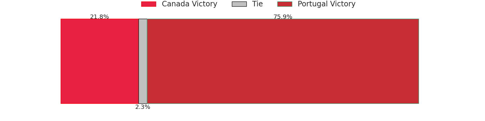
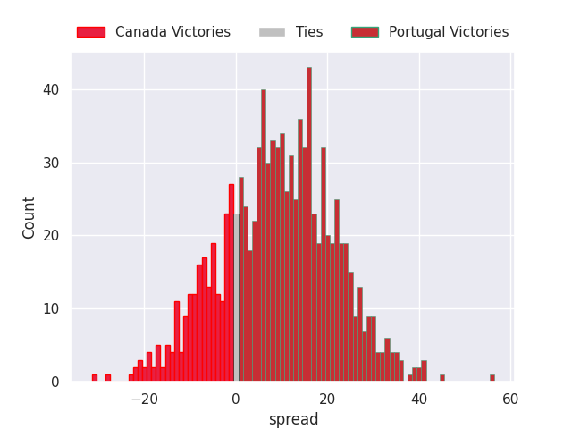

# Team Rankings

# Standings

## Current Standings

| Club                     |   Played |   Wins |   Point Differential |   Losing Bonus Points |   Try Bonus Points |   Competition Points |
|:-------------------------|---------:|-------:|---------------------:|----------------------:|-------------------:|---------------------:|
| South Africa             |        1 |      1 |                   24 |                     0 |                  1 |                    5 |
| Wales                    |        1 |      1 |                   15 |                     0 |                  1 |                    5 |
| Scotland                 |        1 |      1 |                    9 |                     0 |                  1 |                    5 |
| Ireland                  |        1 |      1 |                    2 |                     0 |                  1 |                    5 |
| New Zealand              |        1 |      1 |                    2 |                     0 |                  1 |                    5 |
| Samoa                    |        1 |      1 |                   47 |                     0 |                    |                    4 |
| Chile                    |        1 |      1 |                   17 |                     0 |                    |                    4 |
| Japan                    |        1 |      1 |                   17 |                     0 |                    |                    4 |
| Tonga                    |        1 |      1 |                   10 |                     0 |                    |                    4 |
| Georgia                  |        1 |      1 |                    7 |                     0 |                    |                    4 |
| United States of America |        1 |      1 |                    1 |                     0 |                    |                    4 |
| Canada                   |        1 |      0 |                    0 |                     0 |                    |                    2 |
| Spain                    |        1 |      0 |                    0 |                     0 |                    |                    2 |
| Australia                |        1 |      0 |                   -2 |                     1 |                  1 |                    2 |
| France                   |        1 |      0 |                   -2 |                     1 |                  1 |                    2 |
| Portugal                 |        1 |      0 |                   -1 |                     1 |                    |                    1 |
| Uruguay                  |        1 |      0 |                   -7 |                     1 |                    |                    1 |
| Argentina                |        1 |      0 |                   -9 |                     0 |                  1 |                    1 |
| Zimbabwe                 |        1 |      0 |                  -10 |                     0 |                    |                    0 |
| Fiji                     |        1 |      0 |                  -15 |                     0 |                    |                    0 |
| Italy                    |        1 |      0 |                  -17 |                     0 |                    |                    0 |
| Romania                  |        1 |      0 |                  -17 |                     0 |                    |                    0 |
| England                  |        1 |      0 |                  -24 |                     0 |                    |                    0 |
| Hong Kong                |        1 |      0 |                  -47 |                     0 |                    |                    0 |

## Projected Remaining Table

| Club                     |   To Play |   Projected Wins |   Projected Differential |   Projected Losing Bonus Points | Projected Try Bonus Points   |   Projected Competition Points |
|:-------------------------|----------:|-----------------:|-------------------------:|--------------------------------:|:-----------------------------|-------------------------------:|
| South Africa             |         2 |            1.929 |                   43.348 |                           0.05  |                              |                          7.79  |
| New Zealand              |         2 |            1.733 |                   27.804 |                           0.167 |                              |                          7.169 |
| Argentina                |         2 |            1.418 |                   12.309 |                           0.284 |                              |                          6.068 |
| France                   |         2 |            1.392 |                   12.343 |                           0.353 |                              |                          6.031 |
| Australia                |         2 |            1.109 |                    4.385 |                           0.384 |                              |                          4.936 |
| England                  |         2 |            0.932 |                   -0.168 |                           0.468 |                              |                          4.35  |
| Ireland                  |         2 |            0.908 |                   -1.767 |                           0.38  |                              |                          4.13  |
| Chile                    |         1 |            0.959 |                   22.154 |                           0.026 |                              |                          3.876 |
| Uruguay                  |         1 |            0.943 |                   18.854 |                           0.038 |                              |                          3.822 |
| Fiji                     |         2 |            0.77  |                   -5.594 |                           0.452 |                              |                          3.676 |
| Portugal                 |         1 |            0.759 |                    9.218 |                           0.122 |                              |                          3.204 |
| Georgia                  |         1 |            0.752 |                    7.814 |                           0.133 |                              |                          3.191 |
| Scotland                 |         2 |            0.649 |                  -14.034 |                           0.318 |                              |                          2.996 |
| United States of America |         1 |            0.59  |                    3.457 |                           0.169 |                              |                          2.601 |
| Japan                    |         2 |            0.501 |                  -14.376 |                           0.441 |                              |                          2.555 |
| Tonga                    |         1 |            0.553 |                    2.395 |                           0.207 |                              |                          2.477 |
| Spain                    |         1 |            0.418 |                   -2.395 |                           0.223 |                              |                          1.953 |
| Zimbabwe                 |         1 |            0.374 |                   -3.457 |                           0.212 |                              |                          1.78  |
| Italy                    |         2 |            0.209 |                  -28.389 |                           0.348 |                              |                          1.252 |
| Samoa                    |         1 |            0.223 |                   -7.814 |                           0.252 |                              |                          1.194 |
| Canada                   |         1 |            0.218 |                   -9.218 |                           0.194 |                              |                          1.112 |
| Wales                    |         2 |            0.162 |                  -35.861 |                           0.268 |                              |                          0.96  |
| Romania                  |         1 |            0.051 |                  -18.854 |                           0.114 |                              |                          0.33  |
| Hong Kong                |         1 |            0.034 |                  -22.154 |                           0.086 |                              |                          0.236 |

## Projected Total Table

| Club                     |   Played |   Wins |   Point Differential |   Losing Bonus Points |   Try Bonus Points |   Competition Points |
|:-------------------------|---------:|-------:|---------------------:|----------------------:|-------------------:|---------------------:|
| South Africa             |        3 |  2.929 |               67.348 |                 0.05  |                  1 |               12.79  |
| New Zealand              |        3 |  2.733 |               29.804 |                 0.167 |                  1 |               12.169 |
| Ireland                  |        3 |  1.908 |                0.233 |                 0.38  |                  1 |                9.13  |
| France                   |        3 |  1.392 |               10.343 |                 1.353 |                  1 |                8.031 |
| Scotland                 |        3 |  1.649 |               -5.034 |                 0.318 |                  1 |                7.996 |
| Chile                    |        2 |  1.959 |               39.154 |                 0.026 |                    |                7.876 |
| Georgia                  |        2 |  1.752 |               14.814 |                 0.133 |                    |                7.191 |
| Argentina                |        3 |  1.418 |                3.309 |                 0.284 |                  1 |                7.068 |
| Australia                |        3 |  1.109 |                2.385 |                 1.384 |                  1 |                6.936 |
| United States of America |        2 |  1.59  |                4.457 |                 0.169 |                    |                6.601 |
| Japan                    |        3 |  1.501 |                2.624 |                 0.441 |                    |                6.555 |
| Tonga                    |        2 |  1.553 |               12.395 |                 0.207 |                    |                6.477 |
| Wales                    |        3 |  1.162 |              -20.861 |                 0.268 |                  1 |                5.96  |
| Samoa                    |        2 |  1.223 |               39.186 |                 0.252 |                    |                5.194 |
| Uruguay                  |        2 |  0.943 |               11.854 |                 1.038 |                    |                4.822 |
| England                  |        3 |  0.932 |              -24.168 |                 0.468 |                    |                4.35  |
| Portugal                 |        2 |  0.759 |                8.218 |                 1.122 |                    |                4.204 |
| Spain                    |        2 |  0.418 |               -2.395 |                 0.223 |                    |                3.953 |
| Fiji                     |        3 |  0.77  |              -20.594 |                 0.452 |                    |                3.676 |
| Canada                   |        2 |  0.218 |               -9.218 |                 0.194 |                    |                3.112 |
| Zimbabwe                 |        2 |  0.374 |              -13.457 |                 0.212 |                    |                1.78  |
| Italy                    |        3 |  0.209 |              -45.389 |                 0.348 |                    |                1.252 |
| Romania                  |        2 |  0.051 |              -35.854 |                 0.114 |                    |                0.33  |
| Hong Kong                |        2 |  0.034 |              -69.154 |                 0.086 |                    |                0.236 |

# Completed Match Review

| Model | Percent Correct Predictions | Spread Error |
| ------ | ------ | ------ |
| Club Level | 63.3% | 11.3 |
| Player Level: Lineup | nan% | nan |
| Player Level: Minutes | nan% | nan |

# Future Predictions

## Week 2

### Uruguay V Romania on 2026/07/11

Average Margin: Uruguay by 18.9

### Japan V Ireland on 2026/07/11

Average Margin: Ireland by 6.5

### New Zealand V Italy on 2026/07/11

Average Margin: New Zealand by 19.5

### Argentina V Wales on 2026/07/11

Average Margin: Argentina by 9.9

### South Africa V Scotland on 2026/07/11

Average Margin: South Africa by 17.4

### Samoa V Georgia on 2026/07/11

Average Margin: Georgia by 7.8

### Australia V France on 2026/07/11

Average Margin: France by 4.5

### Chile V Hong Kong on 2026/07/11

Average Margin: Chile by 22.2

### Tonga V Spain on 2026/07/11

Average Margin: Tonga by 2.4

### Fiji V England on 2026/07/11

Average Margin: England by 2.2

### United States of America V Zimbabwe on 2026/07/12

Average Margin: United States of America by 3.5

### Canada V Portugal on 2026/07/12

Average Margin: Portugal by 9.2

## Week 3

### Argentina V England on 2026/07/18

Average Margin: Argentina by 2.4

### New Zealand V Ireland on 2026/07/18

Average Margin: New Zealand by 8.3

### Australia V Italy on 2026/07/18

Average Margin: Australia by 8.8

### South Africa V Wales on 2026/07/18

Average Margin: South Africa by 26.0

### Japan V France on 2026/07/18

Average Margin: France by 7.9

### Fiji V Scotland on 2026/07/18

Average Margin: Scotland by 3.4

