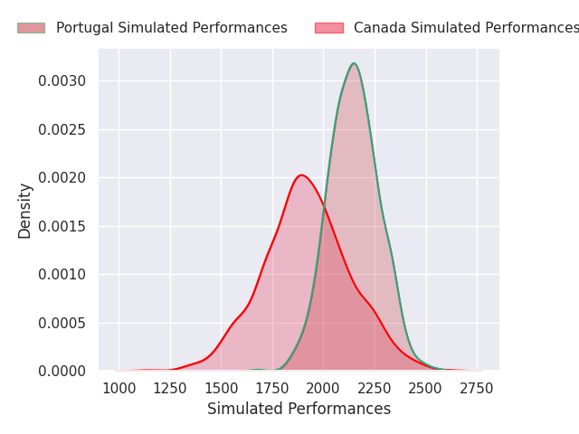
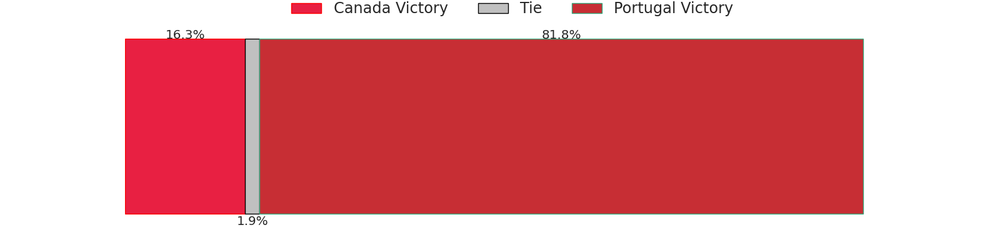
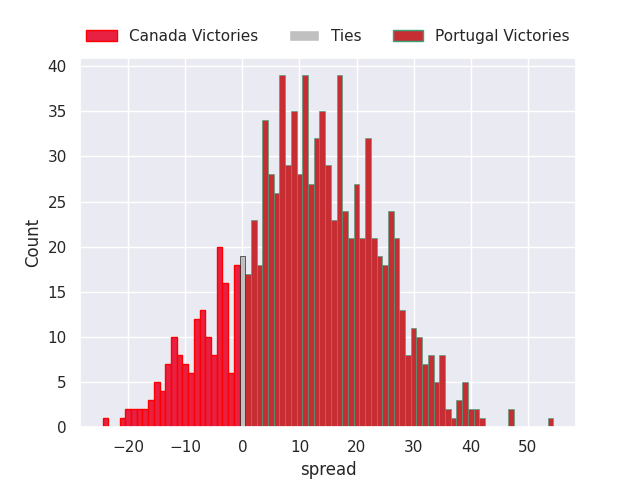
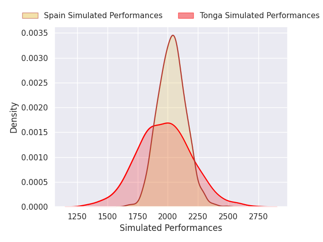
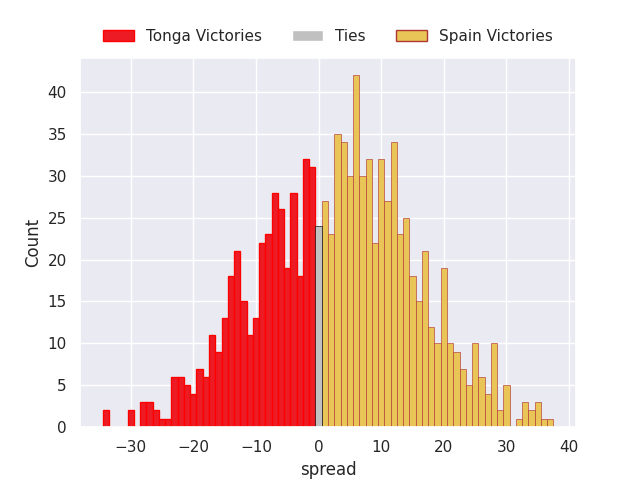

# Team Rankings

# Standings

## Current Standings

| Club                     |   Played |   Wins |   Point Differential |   Losing Bonus Points |   Try Bonus Points |   Competition Points |
|:-------------------------|---------:|-------:|---------------------:|----------------------:|-------------------:|---------------------:|
| South Africa             |        2 |      2 |                   38 |                     0 |                  2 |                   10 |
| New Zealand              |        2 |      2 |                   32 |                     0 |                  2 |                   10 |
| Ireland                  |        2 |      2 |                   18 |                     0 |                  2 |                   10 |
| Chile                    |        2 |      2 |                   38 |                     0 |                    |                    8 |
| Georgia                  |        2 |      2 |                   28 |                     0 |                    |                    8 |
| France                   |        2 |      1 |                   14 |                     1 |                  2 |                    7 |
| Argentina                |        2 |      1 |                    5 |                     0 |                  2 |                    6 |
| United States of America |        2 |      1 |                    1 |                     0 |                    |                    6 |
| Scotland                 |        2 |      1 |                   -5 |                     0 |                  2 |                    6 |
| England                  |        2 |      1 |                   41 |                     0 |                  1 |                    5 |
| Wales                    |        2 |      1 |                    1 |                     0 |                  1 |                    5 |
| Samoa                    |        2 |      1 |                   26 |                     0 |                    |                    4 |
| Tonga                    |        1 |      1 |                   10 |                     0 |                    |                    4 |
| Japan                    |        2 |      1 |                    1 |                     0 |                    |                    4 |
| Uruguay                  |        2 |      0 |                   -7 |                     1 |                    |                    3 |
| Australia                |        2 |      0 |                  -18 |                     1 |                  2 |                    3 |
| Canada                   |        1 |      0 |                    0 |                     0 |                    |                    2 |
| Spain                    |        1 |      0 |                    0 |                     0 |                    |                    2 |
| Zimbabwe                 |        2 |      0 |                  -10 |                     0 |                    |                    2 |
| Romania                  |        2 |      0 |                  -17 |                     0 |                    |                    2 |
| Portugal                 |        1 |      0 |                   -1 |                     1 |                    |                    1 |
| Italy                    |        2 |      0 |                  -47 |                     0 |                    |                    0 |
| Hong Kong                |        2 |      0 |                  -68 |                     0 |                    |                    0 |
| Fiji                     |        2 |      0 |                  -80 |                     0 |                    |                    0 |

## Projected Remaining Table

| Club         |   To Play |   Projected Wins |   Projected Differential |   Projected Losing Bonus Points | Projected Try Bonus Points   |   Projected Competition Points |
|:-------------|----------:|-----------------:|-------------------------:|--------------------------------:|:-----------------------------|-------------------------------:|
| Portugal     |         2 |            1.448 |                   15.544 |                           0.272 |                              |                          6.168 |
| South Africa |         1 |            0.989 |                   24.964 |                           0.008 |                              |                          3.97  |
| Uruguay      |         1 |            0.941 |                   20.097 |                           0.036 |                              |                          3.82  |
| Tonga        |         2 |            0.723 |                   -7.083 |                           0.483 |                              |                          3.489 |
| France       |         1 |            0.809 |                    9.726 |                           0.106 |                              |                          3.392 |
| Australia    |         1 |            0.787 |                    8.174 |                           0.14  |                              |                          3.332 |
| New Zealand  |         1 |            0.761 |                    7.422 |                           0.135 |                              |                          3.253 |
| Scotland     |         1 |            0.734 |                    8.144 |                           0.151 |                              |                          3.153 |
| Samoa        |         1 |            0.727 |                    7.218 |                           0.146 |                              |                          3.136 |
| Georgia      |         1 |            0.619 |                    3.888 |                           0.184 |                              |                          2.722 |
| Spain        |         1 |            0.59  |                    3.113 |                           0.182 |                              |                          2.59  |
| England      |         1 |            0.506 |                    0.597 |                           0.236 |                              |                          2.342 |
| Argentina    |         1 |            0.453 |                   -0.597 |                           0.247 |                              |                          2.141 |
| Chile        |         1 |            0.35  |                   -3.888 |                           0.236 |                              |                          1.698 |
| Romania      |         1 |            0.232 |                   -7.218 |                           0.259 |                              |                          1.269 |
| Fiji         |         1 |            0.233 |                   -8.144 |                           0.195 |                              |                          1.193 |
| Ireland      |         1 |            0.202 |                   -7.422 |                           0.271 |                              |                          1.153 |
| Italy        |         1 |            0.191 |                   -8.174 |                           0.257 |                              |                          1.065 |
| Japan        |         1 |            0.166 |                   -9.726 |                           0.192 |                              |                          0.906 |
| Canada       |         1 |            0.163 |                  -11.574 |                           0.185 |                              |                          0.875 |
| Hong Kong    |         1 |            0.049 |                  -20.097 |                           0.083 |                              |                          0.299 |
| Wales        |         1 |            0.008 |                  -24.964 |                           0.043 |                              |                          0.081 |

## Projected Total Table

| Club                     |   Played |   Wins |   Point Differential |   Losing Bonus Points |   Try Bonus Points |   Competition Points |
|:-------------------------|---------:|-------:|---------------------:|----------------------:|-------------------:|---------------------:|
| South Africa             |        3 |  2.989 |               62.964 |                 0.008 |                  2 |               13.97  |
| New Zealand              |        3 |  2.761 |               39.422 |                 0.135 |                  2 |               13.253 |
| Ireland                  |        3 |  2.202 |               10.578 |                 0.271 |                  2 |               11.153 |
| Georgia                  |        3 |  2.619 |               31.888 |                 0.184 |                    |               10.722 |
| France                   |        3 |  1.809 |               23.726 |                 1.106 |                  2 |               10.392 |
| Chile                    |        3 |  2.35  |               34.112 |                 0.236 |                    |                9.698 |
| Scotland                 |        3 |  1.734 |                3.144 |                 0.151 |                  2 |                9.153 |
| Argentina                |        3 |  1.453 |                4.403 |                 0.247 |                  2 |                8.141 |
| Tonga                    |        3 |  1.723 |                2.917 |                 0.483 |                    |                7.489 |
| England                  |        3 |  1.506 |               41.597 |                 0.236 |                  1 |                7.342 |
| Portugal                 |        3 |  1.448 |               14.544 |                 1.272 |                    |                7.168 |
| Samoa                    |        3 |  1.727 |               33.218 |                 0.146 |                    |                7.136 |
| Uruguay                  |        3 |  0.941 |               13.097 |                 1.036 |                    |                6.82  |
| Australia                |        3 |  0.787 |               -9.826 |                 1.14  |                  2 |                6.332 |
| United States of America |        2 |  1     |                1     |                 0     |                    |                6     |
| Wales                    |        3 |  1.008 |              -23.964 |                 0.043 |                  1 |                5.081 |
| Japan                    |        3 |  1.166 |               -8.726 |                 0.192 |                    |                4.906 |
| Spain                    |        2 |  0.59  |                3.113 |                 0.182 |                    |                4.59  |
| Romania                  |        3 |  0.232 |              -24.218 |                 0.259 |                    |                3.269 |
| Canada                   |        2 |  0.163 |              -11.574 |                 0.185 |                    |                2.875 |
| Zimbabwe                 |        2 |  0     |              -10     |                 0     |                    |                2     |
| Fiji                     |        3 |  0.233 |              -88.144 |                 0.195 |                    |                1.193 |
| Italy                    |        3 |  0.191 |              -55.174 |                 0.257 |                    |                1.065 |
| Hong Kong                |        3 |  0.049 |              -88.097 |                 0.083 |                    |                0.299 |

# Completed Match Review

| Model | Percent Correct Predictions | Spread Error |
| ------ | ------ | ------ |
| Club Level | 67.6% | 10.3 |
| Player Level: Lineup | nan% | nan |
| Player Level: Minutes | nan% | nan |

# Future Predictions

## Week 3

### Canada V Portugal on 2026/07/11

Average Margin: Portugal by 11.6

### Tonga V Spain on 2026/07/11

Average Margin: Spain by 3.1

## Week 4

### Chile V Georgia on 2026/07/18

Average Margin: Georgia by 3.9

### Argentina V England on 2026/07/18

Average Margin: England by 0.6

### Samoa V Romania on 2026/07/18

Average Margin: Samoa by 7.2

### Fiji V Scotland on 2026/07/18

Average Margin: Scotland by 8.1

### Uruguay V Hong Kong on 2026/07/18

Average Margin: Uruguay by 20.1

### New Zealand V Ireland on 2026/07/18

Average Margin: New Zealand by 7.4

### Australia V Italy on 2026/07/18

Average Margin: Australia by 8.2

### South Africa V Wales on 2026/07/18

Average Margin: South Africa by 25.0

### Tonga V Portugal on 2026/07/18

Average Margin: Portugal by 4.0

### Japan V France on 2026/07/18

Average Margin: France by 9.7

