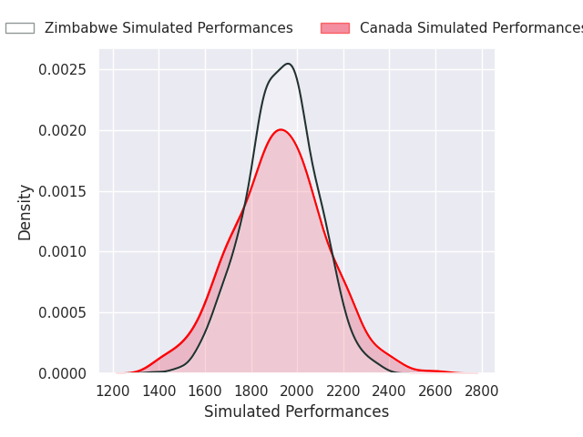
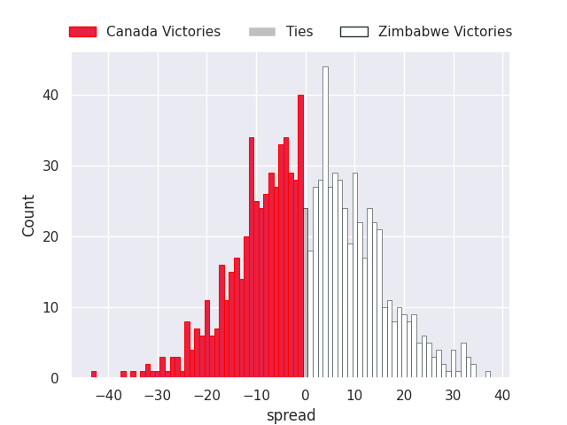

# Team Rankings

# Standings

## Current Standings

| Club                     |   Played |   Wins |   Point Differential |   Losing Bonus Points |   Try Bonus Points |   Competition Points |
|:-------------------------|---------:|-------:|---------------------:|----------------------:|-------------------:|---------------------:|
| South Africa             |        2 |      2 |                   38 |                     0 |                  2 |                   10 |
| New Zealand              |        2 |      2 |                   32 |                     0 |                  2 |                   10 |
| Ireland                  |        2 |      2 |                   18 |                     0 |                  2 |                   10 |
| Chile                    |        2 |      2 |                   38 |                     0 |                  1 |                    9 |
| United States of America |        2 |      2 |                   17 |                     0 |                  1 |                    9 |
| Georgia                  |        2 |      2 |                   28 |                     0 |                    |                    8 |
| France                   |        2 |      1 |                   14 |                     1 |                  2 |                    7 |
| Spain                    |        2 |      1 |                   13 |                     0 |                  1 |                    7 |
| Portugal                 |        2 |      1 |                   23 |                     1 |                  1 |                    6 |
| Argentina                |        2 |      1 |                    5 |                     0 |                  2 |                    6 |
| Scotland                 |        2 |      1 |                   -5 |                     0 |                  2 |                    6 |
| England                  |        2 |      1 |                   41 |                     0 |                  1 |                    5 |
| Wales                    |        2 |      1 |                    1 |                     0 |                  1 |                    5 |
| Samoa                    |        2 |      1 |                   26 |                     0 |                    |                    4 |
| Japan                    |        2 |      1 |                    1 |                     0 |                    |                    4 |
| Tonga                    |        2 |      1 |                   -3 |                     0 |                    |                    4 |
| Uruguay                  |        2 |      0 |                   -7 |                     1 |                  1 |                    4 |
| Romania                  |        2 |      0 |                  -17 |                     0 |                  1 |                    3 |
| Australia                |        2 |      0 |                  -18 |                     1 |                  2 |                    3 |
| Canada                   |        2 |      0 |                  -24 |                     0 |                    |                    2 |
| Zimbabwe                 |        2 |      0 |                  -26 |                     0 |                    |                    0 |
| Italy                    |        2 |      0 |                  -47 |                     0 |                    |                    0 |
| Hong Kong                |        2 |      0 |                  -68 |                     0 |                    |                    0 |
| Fiji                     |        2 |      0 |                  -80 |                     0 |                    |                    0 |

## Projected Remaining Table

| Club                     |   To Play |   Projected Wins |   Projected Differential |   Projected Losing Bonus Points | Projected Try Bonus Points   |   Projected Competition Points |
|:-------------------------|----------:|-----------------:|-------------------------:|--------------------------------:|:-----------------------------|-------------------------------:|
| South Africa             |         1 |            0.995 |                   25.016 |                           0.003 |                              |                          3.985 |
| Uruguay                  |         1 |            0.95  |                   20.422 |                           0.038 |                              |                          3.846 |
| France                   |         1 |            0.837 |                   10.677 |                           0.095 |                              |                          3.497 |
| Australia                |         1 |            0.771 |                    7.863 |                           0.14  |                              |                          3.286 |
| New Zealand              |         1 |            0.765 |                    7.677 |                           0.137 |                              |                          3.265 |
| Portugal                 |         1 |            0.753 |                    8.59  |                           0.137 |                              |                          3.201 |
| Scotland                 |         1 |            0.744 |                    8.259 |                           0.154 |                              |                          3.18  |
| Samoa                    |         1 |            0.691 |                    6.218 |                           0.165 |                              |                          3.003 |
| United States of America |         1 |            0.659 |                    5.567 |                           0.188 |                              |                          2.894 |
| Georgia                  |         1 |            0.616 |                    3.991 |                           0.178 |                              |                          2.712 |
| England                  |         1 |            0.512 |                    0.573 |                           0.224 |                              |                          2.374 |
| Zimbabwe                 |         1 |            0.486 |                    0.442 |                           0.22  |                              |                          2.212 |
| Canada                   |         1 |            0.49  |                   -0.442 |                           0.201 |                              |                          2.209 |
| Argentina                |         1 |            0.437 |                   -0.573 |                           0.266 |                              |                          2.116 |
| Chile                    |         1 |            0.349 |                   -3.991 |                           0.247 |                              |                          1.713 |
| Spain                    |         1 |            0.306 |                   -5.567 |                           0.22  |                              |                          1.514 |
| Romania                  |         1 |            0.272 |                   -6.218 |                           0.241 |                              |                          1.403 |
| Fiji                     |         1 |            0.231 |                   -8.259 |                           0.227 |                              |                          1.201 |
| Tonga                    |         1 |            0.221 |                   -8.59  |                           0.209 |                              |                          1.145 |
| Ireland                  |         1 |            0.201 |                   -7.677 |                           0.254 |                              |                          1.126 |
| Italy                    |         1 |            0.198 |                   -7.863 |                           0.265 |                              |                          1.119 |
| Japan                    |         1 |            0.136 |                  -10.677 |                           0.213 |                              |                          0.811 |
| Hong Kong                |         1 |            0.046 |                  -20.422 |                           0.095 |                              |                          0.287 |
| Wales                    |         1 |            0.004 |                  -25.016 |                           0.042 |                              |                          0.06  |

## Projected Total Table

| Club                     |   Played |   Wins |   Point Differential |   Losing Bonus Points |   Try Bonus Points |   Competition Points |
|:-------------------------|---------:|-------:|---------------------:|----------------------:|-------------------:|---------------------:|
| South Africa             |        3 |  2.995 |               63.016 |                 0.003 |                  2 |               13.985 |
| New Zealand              |        3 |  2.765 |               39.677 |                 0.137 |                  2 |               13.265 |
| United States of America |        3 |  2.659 |               22.567 |                 0.188 |                  1 |               11.894 |
| Ireland                  |        3 |  2.201 |               10.323 |                 0.254 |                  2 |               11.126 |
| Chile                    |        3 |  2.349 |               34.009 |                 0.247 |                  1 |               10.713 |
| Georgia                  |        3 |  2.616 |               31.991 |                 0.178 |                    |               10.712 |
| France                   |        3 |  1.837 |               24.677 |                 1.095 |                  2 |               10.497 |
| Portugal                 |        3 |  1.753 |               31.59  |                 1.137 |                  1 |                9.201 |
| Scotland                 |        3 |  1.744 |                3.259 |                 0.154 |                  2 |                9.18  |
| Spain                    |        3 |  1.306 |                7.433 |                 0.22  |                  1 |                8.514 |
| Argentina                |        3 |  1.437 |                4.427 |                 0.266 |                  2 |                8.116 |
| Uruguay                  |        3 |  0.95  |               13.422 |                 1.038 |                  1 |                7.846 |
| England                  |        3 |  1.512 |               41.573 |                 0.224 |                  1 |                7.374 |
| Samoa                    |        3 |  1.691 |               32.218 |                 0.165 |                    |                7.003 |
| Australia                |        3 |  0.771 |              -10.137 |                 1.14  |                  2 |                6.286 |
| Tonga                    |        3 |  1.221 |              -11.59  |                 0.209 |                    |                5.145 |
| Wales                    |        3 |  1.004 |              -24.016 |                 0.042 |                  1 |                5.06  |
| Japan                    |        3 |  1.136 |               -9.677 |                 0.213 |                    |                4.811 |
| Romania                  |        3 |  0.272 |              -23.218 |                 0.241 |                  1 |                4.403 |
| Canada                   |        3 |  0.49  |              -24.442 |                 0.201 |                    |                4.209 |
| Zimbabwe                 |        3 |  0.486 |              -25.558 |                 0.22  |                    |                2.212 |
| Fiji                     |        3 |  0.231 |              -88.259 |                 0.227 |                    |                1.201 |
| Italy                    |        3 |  0.198 |              -54.863 |                 0.265 |                    |                1.119 |
| Hong Kong                |        3 |  0.046 |              -88.422 |                 0.095 |                    |                0.287 |

# Completed Match Review

| Model | Percent Correct Predictions | Spread Error |
| ------ | ------ | ------ |
| Club Level | 66.7% | 12.3 |
| Player Level: Lineup | nan% | nan |
| Player Level: Minutes | nan% | nan |

# Future Predictions

## Week 3

### New Zealand V Ireland on 2026/07/18

Average Margin: New Zealand by 7.7

### Fiji V Scotland on 2026/07/18

Average Margin: Scotland by 8.3

### Tonga V Portugal on 2026/07/18

Average Margin: Portugal by 8.6

### Australia V Italy on 2026/07/18

Average Margin: Australia by 7.9

### Chile V Georgia on 2026/07/18

Average Margin: Georgia by 4.0

### Samoa V Romania on 2026/07/18

Average Margin: Samoa by 6.2

### Uruguay V Hong Kong on 2026/07/18

Average Margin: Uruguay by 20.4

### Japan V France on 2026/07/18

Average Margin: France by 10.7

### South Africa V Wales on 2026/07/18

Average Margin: South Africa by 25.0

### Argentina V England on 2026/07/18

Average Margin: England by 0.6

### Canada V Zimbabwe on 2026/07/19

Average Margin: Zimbabwe by 0.4

### United States of America V Spain on 2026/07/19

Average Margin: United States of America by 5.6

