# Team Rankings

# Standings

## Projected Remaining Table

| Club                     |   To Play |   Projected Wins |   Projected Differential |   Projected Losing Bonus Points | Projected Try Bonus Points   |   Projected Competition Points |
|:-------------------------|----------:|-----------------:|-------------------------:|--------------------------------:|:-----------------------------|-------------------------------:|
| South Africa             |         3 |            2.892 |                   64.666 |                           0.079 |                              |                         11.675 |
| New Zealand              |         3 |            2.503 |                   35.75  |                           0.266 |                              |                         10.412 |
| Argentina                |         3 |            2.255 |                   26.708 |                           0.394 |                              |                          9.594 |
| Fiji                     |         3 |            2.066 |                   22.068 |                           0.447 |                              |                          8.857 |
| France                   |         3 |            1.659 |                    6.276 |                           0.551 |                              |                          7.379 |
| Ireland                  |         3 |            1.597 |                    4.319 |                           0.561 |                              |                          7.123 |
| Australia                |         3 |            1.393 |                   -0.791 |                           0.686 |                              |                          6.464 |
| Japan                    |         3 |            0.873 |                  -18.083 |                           0.666 |                              |                          4.332 |
| England                  |         3 |            0.787 |                  -24.622 |                           0.569 |                              |                          3.861 |
| Chile                    |         1 |            0.902 |                   16.262 |                           0.06  |                              |                          3.686 |
| Italy                    |         3 |            0.718 |                  -27.471 |                           0.567 |                              |                          3.587 |
| Samoa                    |         1 |            0.826 |                   12.324 |                           0.101 |                              |                          3.433 |
| Scotland                 |         3 |            0.639 |                  -29.836 |                           0.604 |                              |                          3.298 |
| Zimbabwe                 |         1 |            0.709 |                    8.303 |                           0.13  |                              |                          3.01  |
| Spain                    |         1 |            0.628 |                    4.809 |                           0.189 |                              |                          2.751 |
| Portugal                 |         1 |            0.628 |                    4.503 |                           0.167 |                              |                          2.747 |
| Uruguay                  |         1 |            0.595 |                    4.062 |                           0.177 |                              |                          2.631 |
| Georgia                  |         1 |            0.368 |                   -4.062 |                           0.192 |                              |                          1.738 |
| Canada                   |         1 |            0.347 |                   -4.809 |                           0.219 |                              |                          1.657 |
| United States of America |         1 |            0.338 |                   -4.503 |                           0.222 |                              |                          1.642 |
| Tonga                    |         1 |            0.269 |                   -8.303 |                           0.18  |                              |                          1.3   |
| Wales                    |         3 |            0.184 |                  -58.984 |                           0.323 |                              |                          1.131 |
| Hong Kong                |         1 |            0.16  |                  -12.324 |                           0.181 |                              |                          0.849 |
| Romania                  |         1 |            0.089 |                  -16.262 |                           0.136 |                              |                          0.51  |

## Projected Total Table

| Club                     |   Played |   Wins |   Point Differential |   Losing Bonus Points | Try Bonus Points   |   Competition Points |
|:-------------------------|---------:|-------:|---------------------:|----------------------:|:-------------------|---------------------:|
| South Africa             |        3 |  2.892 |               64.666 |                 0.079 |                    |               11.675 |
| New Zealand              |        3 |  2.503 |               35.75  |                 0.266 |                    |               10.412 |
| Argentina                |        3 |  2.255 |               26.708 |                 0.394 |                    |                9.594 |
| Fiji                     |        3 |  2.066 |               22.068 |                 0.447 |                    |                8.857 |
| France                   |        3 |  1.659 |                6.276 |                 0.551 |                    |                7.379 |
| Ireland                  |        3 |  1.597 |                4.319 |                 0.561 |                    |                7.123 |
| Australia                |        3 |  1.393 |               -0.791 |                 0.686 |                    |                6.464 |
| Japan                    |        3 |  0.873 |              -18.083 |                 0.666 |                    |                4.332 |
| England                  |        3 |  0.787 |              -24.622 |                 0.569 |                    |                3.861 |
| Chile                    |        1 |  0.902 |               16.262 |                 0.06  |                    |                3.686 |
| Italy                    |        3 |  0.718 |              -27.471 |                 0.567 |                    |                3.587 |
| Samoa                    |        1 |  0.826 |               12.324 |                 0.101 |                    |                3.433 |
| Scotland                 |        3 |  0.639 |              -29.836 |                 0.604 |                    |                3.298 |
| Zimbabwe                 |        1 |  0.709 |                8.303 |                 0.13  |                    |                3.01  |
| Spain                    |        1 |  0.628 |                4.809 |                 0.189 |                    |                2.751 |
| Portugal                 |        1 |  0.628 |                4.503 |                 0.167 |                    |                2.747 |
| Uruguay                  |        1 |  0.595 |                4.062 |                 0.177 |                    |                2.631 |
| Georgia                  |        1 |  0.368 |               -4.062 |                 0.192 |                    |                1.738 |
| Canada                   |        1 |  0.347 |               -4.809 |                 0.219 |                    |                1.657 |
| United States of America |        1 |  0.338 |               -4.503 |                 0.222 |                    |                1.642 |
| Tonga                    |        1 |  0.269 |               -8.303 |                 0.18  |                    |                1.3   |
| Wales                    |        3 |  0.184 |              -58.984 |                 0.323 |                    |                1.131 |
| Hong Kong                |        1 |  0.16  |              -12.324 |                 0.181 |                    |                0.849 |
| Romania                  |        1 |  0.089 |              -16.262 |                 0.136 |                    |                0.51  |

# Future Predictions

## Week 1

### South Africa V England on 2026/07/04

Average Margin: South Africa by 17.4

### Japan V Italy on 2026/07/04

Average Margin: Japan by 1.4

### Uruguay V Georgia on 2026/07/04

Average Margin: Uruguay by 4.1

### Australia V Ireland on 2026/07/04

Average Margin: Ireland by 3.8

### Samoa V Hong Kong on 2026/07/04

Average Margin: Samoa by 12.3

### Tonga V Zimbabwe on 2026/07/04

Average Margin: Zimbabwe by 8.3

### Chile V Romania on 2026/07/04

Average Margin: Chile by 16.3

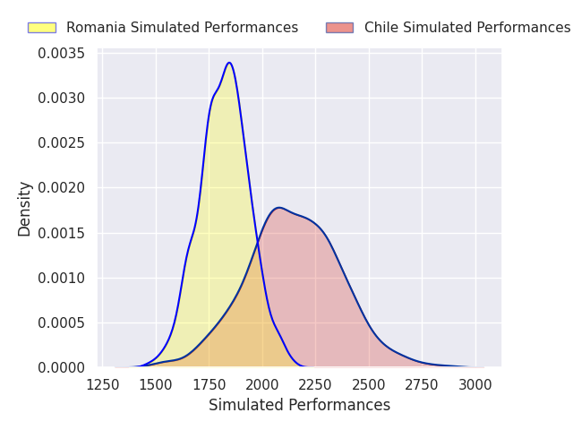
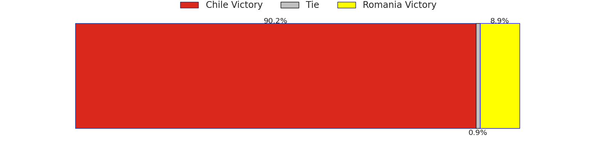
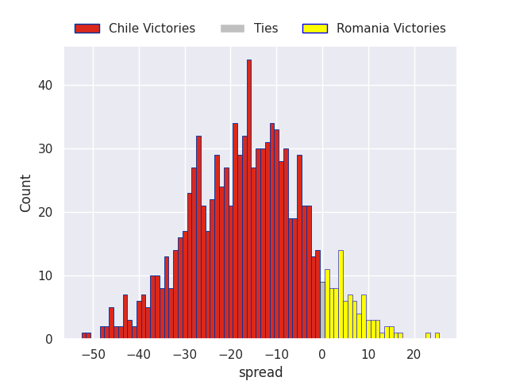

### Argentina V Scotland on 2026/07/04

Average Margin: Argentina by 6.2

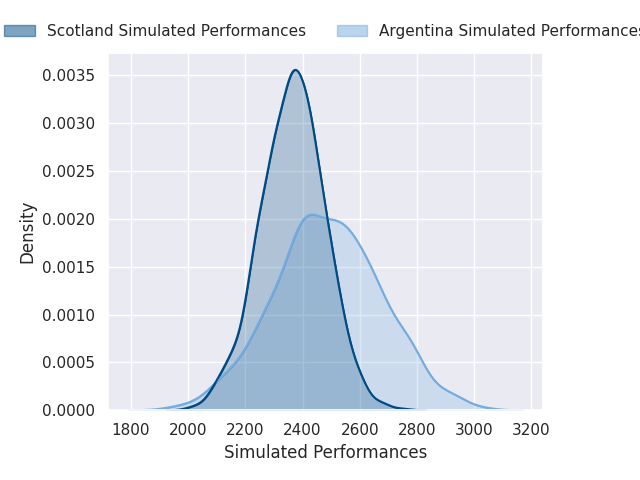
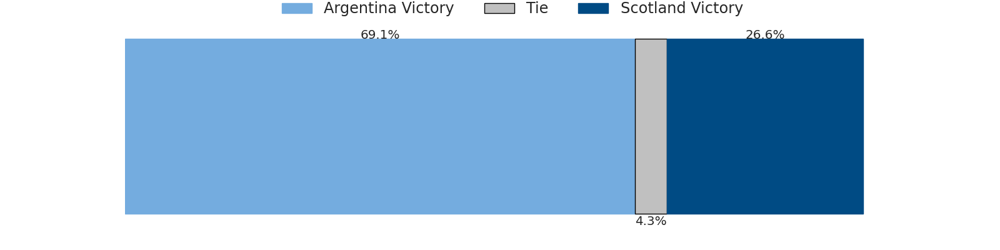
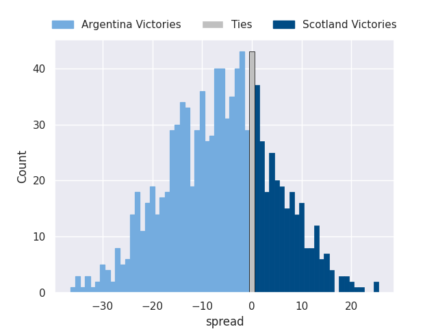

### Fiji V Wales on 2026/07/04

Average Margin: Fiji by 14.3

### New Zealand V France on 2026/07/04

Average Margin: New Zealand by 8.2

### United States of America V Portugal on 2026/07/05

Average Margin: Portugal by 4.5

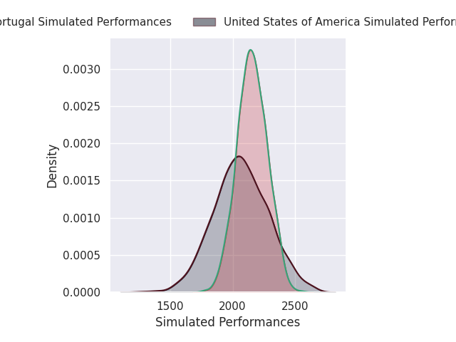
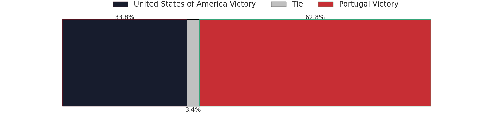
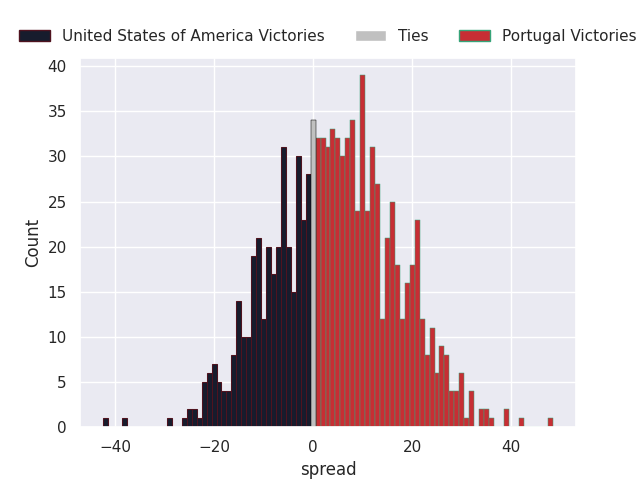

### Canada V Spain on 2026/07/05

Average Margin: Spain by 4.8

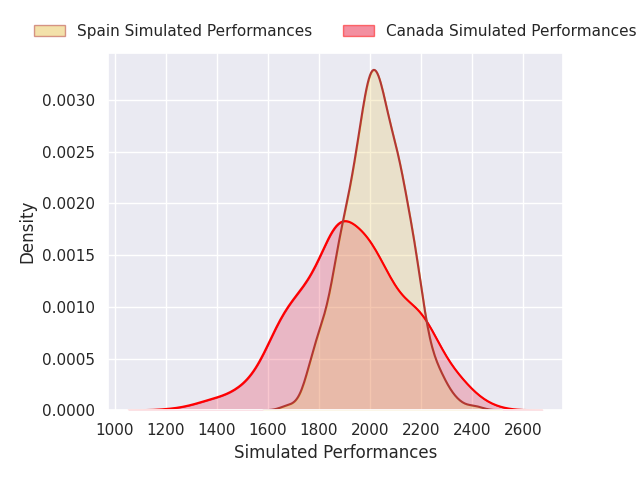
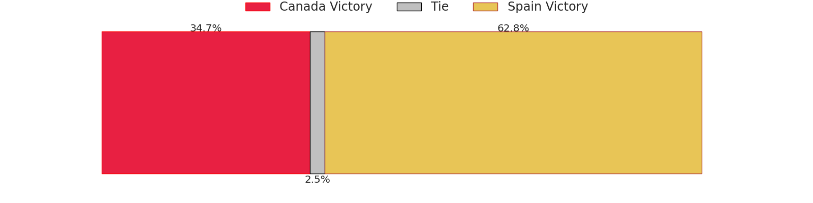
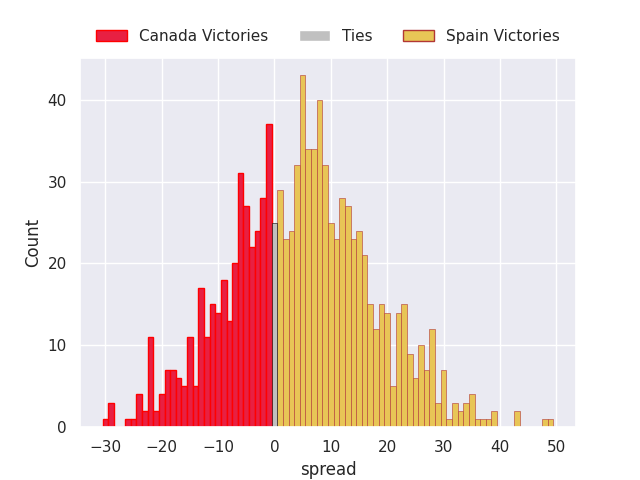

## Week 2

### Argentina V Wales on 2026/07/11

Average Margin: Argentina by 16.5

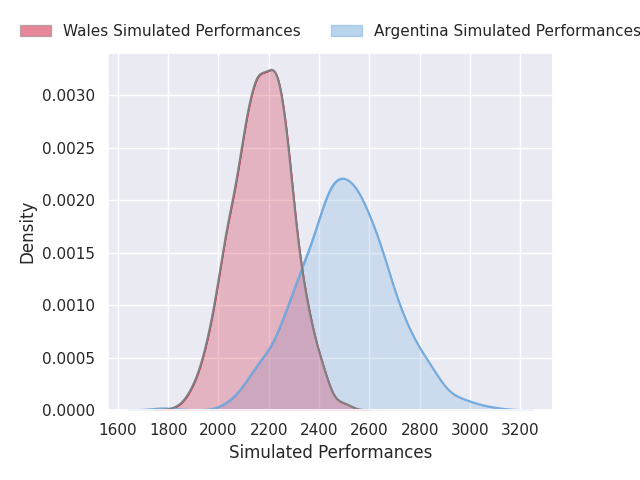
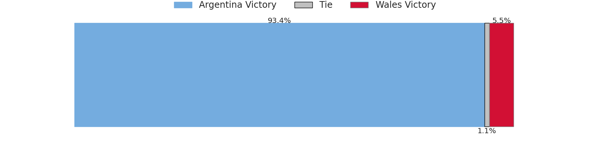
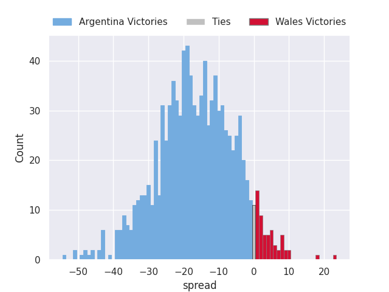

### Japan V Ireland on 2026/07/11

Average Margin: Ireland by 9.1

### New Zealand V Italy on 2026/07/11

Average Margin: New Zealand by 19.0

### Australia V France on 2026/07/11

Average Margin: France by 4.0

### South Africa V Scotland on 2026/07/11

Average Margin: South Africa by 19.0

### Fiji V England on 2026/07/11

Average Margin: Fiji by 3.1

## Week 3

### Japan V France on 2026/07/18

Average Margin: France by 10.4

### Australia V Italy on 2026/07/18

Average Margin: Australia by 7.1

### South Africa V Wales on 2026/07/18

Average Margin: South Africa by 28.2

### New Zealand V Ireland on 2026/07/18

Average Margin: New Zealand by 8.6

### Fiji V Scotland on 2026/07/18

Average Margin: Fiji by 4.6

### Argentina V England on 2026/07/18

Average Margin: Argentina by 4.1

