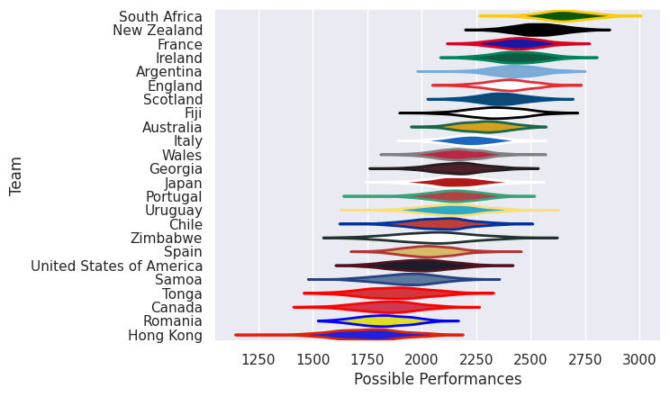
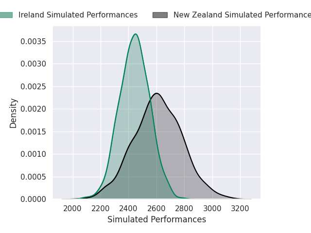
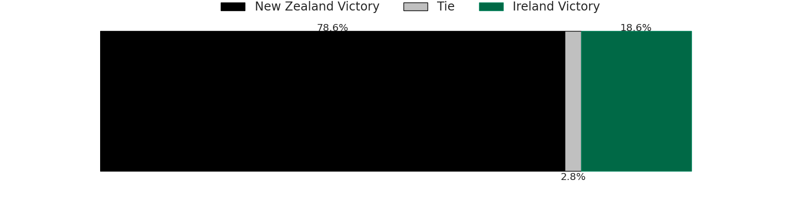
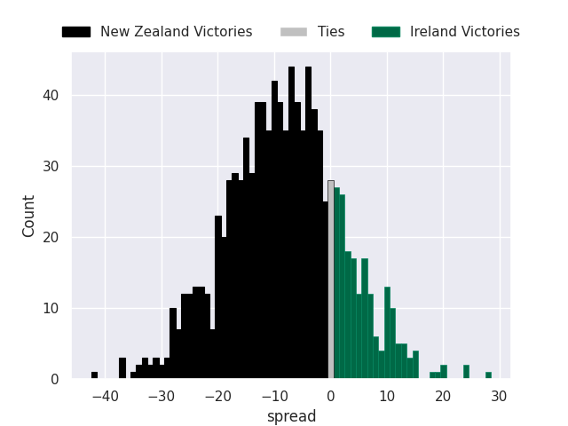
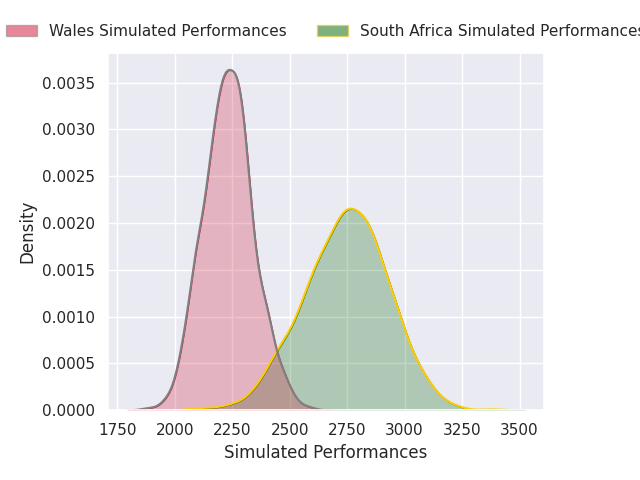
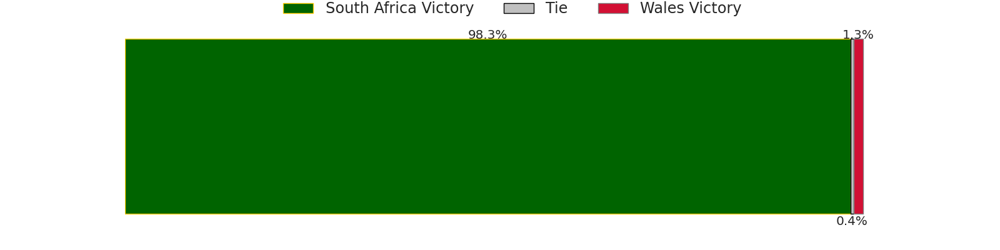
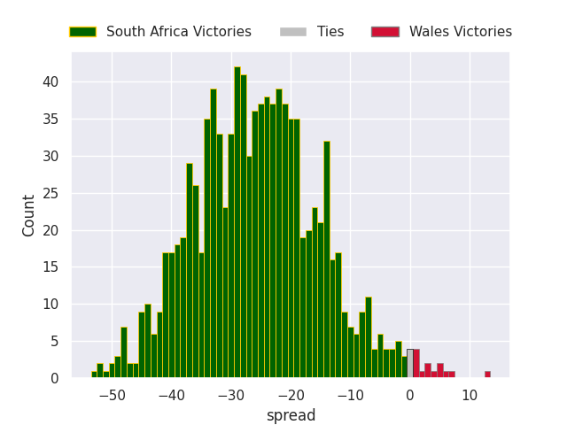
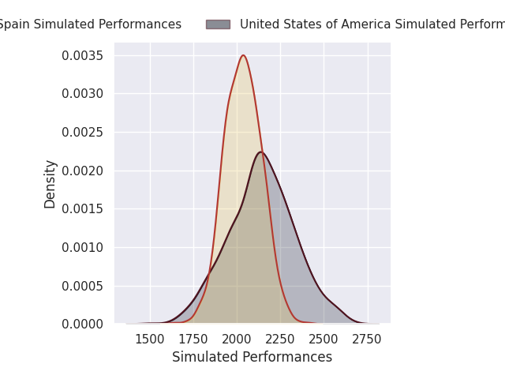
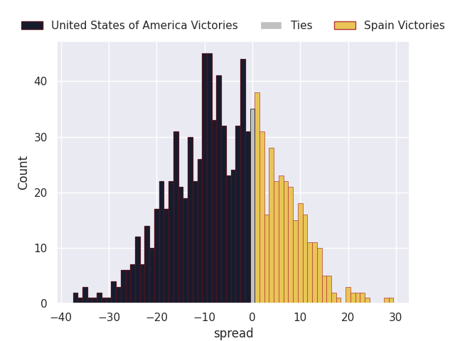

# Team Rankings

# Standings

## Current Standings

| Club                     |   Played |   Wins |   Point Differential |   Losing Bonus Points |   Try Bonus Points |   Competition Points |
|:-------------------------|---------:|-------:|---------------------:|----------------------:|-------------------:|---------------------:|
| South Africa             |        2 |      2 |                   38 |                     0 |                  2 |                   10 |
| New Zealand              |        2 |      2 |                   32 |                     0 |                  2 |                   10 |
| Ireland                  |        2 |      2 |                   18 |                     0 |                  2 |                   10 |
| Chile                    |        2 |      2 |                   38 |                     0 |                  1 |                    9 |
| United States of America |        2 |      2 |                   17 |                     0 |                  1 |                    9 |
| Georgia                  |        2 |      2 |                   28 |                     0 |                    |                    8 |
| France                   |        2 |      1 |                   14 |                     1 |                  2 |                    7 |
| Spain                    |        2 |      1 |                   13 |                     0 |                  1 |                    7 |
| Portugal                 |        2 |      1 |                   23 |                     1 |                  1 |                    6 |
| Argentina                |        2 |      1 |                    5 |                     0 |                  2 |                    6 |
| Scotland                 |        2 |      1 |                   -5 |                     0 |                  2 |                    6 |
| England                  |        2 |      1 |                   41 |                     0 |                  1 |                    5 |
| Wales                    |        2 |      1 |                    1 |                     0 |                  1 |                    5 |
| Samoa                    |        2 |      1 |                   26 |                     0 |                    |                    4 |
| Japan                    |        2 |      1 |                    1 |                     0 |                    |                    4 |
| Tonga                    |        2 |      1 |                   -3 |                     0 |                    |                    4 |
| Uruguay                  |        2 |      0 |                   -7 |                     1 |                  1 |                    4 |
| Romania                  |        2 |      0 |                  -17 |                     0 |                  1 |                    3 |
| Australia                |        2 |      0 |                  -18 |                     1 |                  2 |                    3 |
| Canada                   |        2 |      0 |                  -24 |                     0 |                    |                    2 |
| Zimbabwe                 |        2 |      0 |                  -26 |                     0 |                    |                    0 |
| Italy                    |        2 |      0 |                  -47 |                     0 |                    |                    0 |
| Hong Kong                |        2 |      0 |                  -68 |                     0 |                    |                    0 |
| Fiji                     |        2 |      0 |                  -80 |                     0 |                    |                    0 |

## Projected Remaining Table

| Club                     |   To Play |   Projected Wins |   Projected Differential |   Projected Losing Bonus Points | Projected Try Bonus Points   |   Projected Competition Points |
|:-------------------------|----------:|-----------------:|-------------------------:|--------------------------------:|:-----------------------------|-------------------------------:|
| South Africa             |         1 |            0.983 |                   25.539 |                           0.012 |                              |                          3.952 |
| Uruguay                  |         1 |            0.927 |                   19.564 |                           0.055 |                              |                          3.777 |
| France                   |         1 |            0.811 |                   10.253 |                           0.117 |                              |                          3.409 |
| Australia                |         1 |            0.786 |                    7.923 |                           0.133 |                              |                          3.341 |
| New Zealand              |         1 |            0.786 |                    8.325 |                           0.129 |                              |                          3.329 |
| Samoa                    |         1 |            0.755 |                    7.659 |                           0.129 |                              |                          3.203 |
| Scotland                 |         1 |            0.742 |                    8.108 |                           0.139 |                              |                          3.161 |
| Portugal                 |         1 |            0.736 |                    7.757 |                           0.146 |                              |                          3.138 |
| United States of America |         1 |            0.658 |                    5.33  |                           0.18  |                              |                          2.882 |
| Georgia                  |         1 |            0.598 |                    3.487 |                           0.21  |                              |                          2.652 |
| England                  |         1 |            0.486 |                    0.252 |                           0.245 |                              |                          2.257 |
| Argentina                |         1 |            0.48  |                   -0.252 |                           0.245 |                              |                          2.233 |
| Canada                   |         1 |            0.481 |                   -0.024 |                           0.216 |                              |                          2.202 |
| Zimbabwe                 |         1 |            0.488 |                    0.024 |                           0.186 |                              |                          2.2   |
| Chile                    |         1 |            0.377 |                   -3.487 |                           0.229 |                              |                          1.787 |
| Spain                    |         1 |            0.307 |                   -5.33  |                           0.227 |                              |                          1.525 |
| Tonga                    |         1 |            0.24  |                   -7.757 |                           0.219 |                              |                          1.227 |
| Fiji                     |         1 |            0.231 |                   -8.108 |                           0.213 |                              |                          1.191 |
| Romania                  |         1 |            0.218 |                   -7.659 |                           0.254 |                              |                          1.18  |
| Italy                    |         1 |            0.182 |                   -7.923 |                           0.277 |                              |                          1.069 |
| Ireland                  |         1 |            0.186 |                   -8.325 |                           0.26  |                              |                          1.06  |
| Japan                    |         1 |            0.165 |                  -10.253 |                           0.208 |                              |                          0.916 |
| Hong Kong                |         1 |            0.066 |                  -19.564 |                           0.105 |                              |                          0.383 |
| Wales                    |         1 |            0.013 |                  -25.539 |                           0.037 |                              |                          0.097 |

## Projected Total Table

| Club                     |   Played |   Wins |   Point Differential |   Losing Bonus Points |   Try Bonus Points |   Competition Points |
|:-------------------------|---------:|-------:|---------------------:|----------------------:|-------------------:|---------------------:|
| South Africa             |        3 |  2.983 |               63.539 |                 0.012 |                  2 |               13.952 |
| New Zealand              |        3 |  2.786 |               40.325 |                 0.129 |                  2 |               13.329 |
| United States of America |        3 |  2.658 |               22.33  |                 0.18  |                  1 |               11.882 |
| Ireland                  |        3 |  2.186 |                9.675 |                 0.26  |                  2 |               11.06  |
| Chile                    |        3 |  2.377 |               34.513 |                 0.229 |                  1 |               10.787 |
| Georgia                  |        3 |  2.598 |               31.487 |                 0.21  |                    |               10.652 |
| France                   |        3 |  1.811 |               24.253 |                 1.117 |                  2 |               10.409 |
| Scotland                 |        3 |  1.742 |                3.108 |                 0.139 |                  2 |                9.161 |
| Portugal                 |        3 |  1.736 |               30.757 |                 1.146 |                  1 |                9.138 |
| Spain                    |        3 |  1.307 |                7.67  |                 0.227 |                  1 |                8.525 |
| Argentina                |        3 |  1.48  |                4.748 |                 0.245 |                  2 |                8.233 |
| Uruguay                  |        3 |  0.927 |               12.564 |                 1.055 |                  1 |                7.777 |
| England                  |        3 |  1.486 |               41.252 |                 0.245 |                  1 |                7.257 |
| Samoa                    |        3 |  1.755 |               33.659 |                 0.129 |                    |                7.203 |
| Australia                |        3 |  0.786 |              -10.077 |                 1.133 |                  2 |                6.341 |
| Tonga                    |        3 |  1.24  |              -10.757 |                 0.219 |                    |                5.227 |
| Wales                    |        3 |  1.013 |              -24.539 |                 0.037 |                  1 |                5.097 |
| Japan                    |        3 |  1.165 |               -9.253 |                 0.208 |                    |                4.916 |
| Canada                   |        3 |  0.481 |              -24.024 |                 0.216 |                    |                4.202 |
| Romania                  |        3 |  0.218 |              -24.659 |                 0.254 |                  1 |                4.18  |
| Zimbabwe                 |        3 |  0.488 |              -25.976 |                 0.186 |                    |                2.2   |
| Fiji                     |        3 |  0.231 |              -88.108 |                 0.213 |                    |                1.191 |
| Italy                    |        3 |  0.182 |              -54.923 |                 0.277 |                    |                1.069 |
| Hong Kong                |        3 |  0.066 |              -87.564 |                 0.105 |                    |                0.383 |

# Completed Match Review

| Model | Percent Correct Predictions | Spread Error |
| ------ | ------ | ------ |
| Club Level | 66.7% | 11.4 |
| Player Level: Lineup | nan% | nan |
| Player Level: Minutes | nan% | nan |

# Future Predictions

## Week 3

### Australia V Italy on 2026/07/18

Average Margin: Australia by 7.9

### Japan V France on 2026/07/18

Average Margin: France by 10.3

### Tonga V Portugal on 2026/07/18

Average Margin: Portugal by 7.8

### Uruguay V Hong Kong on 2026/07/18

Average Margin: Uruguay by 19.6

### New Zealand V Ireland on 2026/07/18

Average Margin: New Zealand by 8.3

### Argentina V England on 2026/07/18

Average Margin: England by 0.3

### Fiji V Scotland on 2026/07/18

Average Margin: Scotland by 8.1

### Samoa V Romania on 2026/07/18

Average Margin: Samoa by 7.7

### Chile V Georgia on 2026/07/18

Average Margin: Georgia by 3.5

### Canada V Zimbabwe on 2026/07/18

Average Margin: Zimbabwe by 0.0

### South Africa V Wales on 2026/07/18

Average Margin: South Africa by 25.5

### United States of America V Spain on 2026/07/19

Average Margin: United States of America by 5.3

