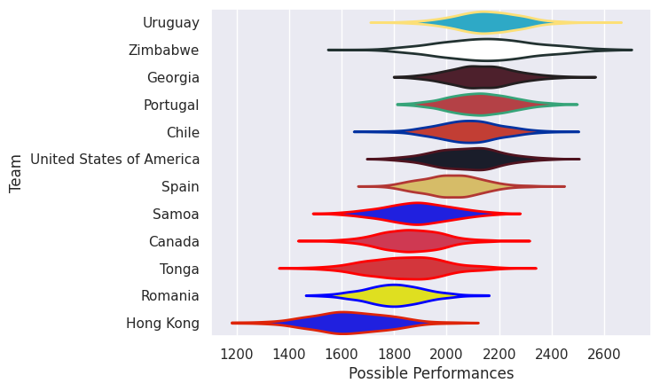

# Team Rankings

# Standings

## Current Standings

### APAC

| Club                     |   Played |   Wins |   Point Differential |   Losing Bonus Points |   Try Bonus Points |   Competition Points |
|:-------------------------|---------:|-------:|---------------------:|----------------------:|-------------------:|---------------------:|
| United States of America |        3 |      3 |                   24 |                     0 |                  2 |                   14 |
| Chile                    |        3 |      2 |                   11 |                     0 |                  1 |                    9 |
| Samoa                    |        3 |      1 |                   25 |                     1 |                  1 |                    6 |
| Tonga                    |        3 |      1 |                   -7 |                     1 |                  1 |                    6 |
| Uruguay                  |        3 |      0 |                   -9 |                     2 |                  2 |                    6 |
| Canada                   |        3 |      1 |                  -20 |                     0 |                    |                    6 |

### EMEA

| Club      |   Played |   Wins |   Point Differential |   Losing Bonus Points |   Try Bonus Points |   Competition Points |
|:----------|---------:|-------:|---------------------:|----------------------:|-------------------:|---------------------:|
| Georgia   |        3 |      3 |                   55 |                     0 |                  1 |                   13 |
| Portugal  |        3 |      2 |                   27 |                     1 |                  2 |                   11 |
| Spain     |        3 |      1 |                    6 |                     1 |                  1 |                    8 |
| Romania   |        3 |      1 |                  -16 |                     0 |                  2 |                    8 |
| Hong Kong |        3 |      1 |                  -66 |                     0 |                  1 |                    5 |
| Zimbabwe  |        3 |      0 |                  -30 |                     1 |                    |                    1 |

## Projected Remaining Table

### APAC

| Club   | To Play   | Projected Wins   | Projected Differential   | Projected Losing Bonus Points   | Projected Try Bonus Points   | Projected Competition Points   |
|--------|-----------|------------------|--------------------------|---------------------------------|------------------------------|--------------------------------|

### EMEA

| Club   | To Play   | Projected Wins   | Projected Differential   | Projected Losing Bonus Points   | Projected Try Bonus Points   | Projected Competition Points   |
|--------|-----------|------------------|--------------------------|---------------------------------|------------------------------|--------------------------------|

## Projected Total Table

### APAC

| Club                     |   Played |   Wins |   Point Differential |   Losing Bonus Points |   Try Bonus Points |   Competition Points |
|:-------------------------|---------:|-------:|---------------------:|----------------------:|-------------------:|---------------------:|
| United States of America |        3 |      3 |                   24 |                     0 |                  2 |                   14 |
| Chile                    |        3 |      2 |                   11 |                     0 |                  1 |                    9 |
| Samoa                    |        3 |      1 |                   25 |                     1 |                  1 |                    6 |
| Tonga                    |        3 |      1 |                   -7 |                     1 |                  1 |                    6 |
| Uruguay                  |        3 |      0 |                   -9 |                     2 |                  2 |                    6 |
| Canada                   |        3 |      1 |                  -20 |                     0 |                    |                    6 |

### EMEA

| Club      |   Played |   Wins |   Point Differential |   Losing Bonus Points |   Try Bonus Points |   Competition Points |
|:----------|---------:|-------:|---------------------:|----------------------:|-------------------:|---------------------:|
| Georgia   |        3 |      3 |                   55 |                     0 |                  1 |                   13 |
| Portugal  |        3 |      2 |                   27 |                     1 |                  2 |                   11 |
| Spain     |        3 |      1 |                    6 |                     1 |                  1 |                    8 |
| Romania   |        3 |      1 |                  -16 |                     0 |                  2 |                    8 |
| Hong Kong |        3 |      1 |                  -66 |                     0 |                  1 |                    5 |
| Zimbabwe  |        3 |      0 |                  -30 |                     1 |                    |                    1 |

## Projected Playoff Results

|                          | Reach Final   | Win Final   |
|:-------------------------|:--------------|:------------|
| Uruguay                  | 100.0 %       | 90.9 %      |
| Tonga                    | 100.0 %       | 70.2 %      |
| Georgia                  | 100.0 %       | 69.3 %      |
| Spain                    | 100.0 %       | 67.3 %      |
| Portugal                 | 100.0 %       | 59.9 %      |
| Canada                   | 100.0 %       | 59.1 %      |
| Zimbabwe                 | 100.0 %       | 40.9 %      |
| Chile                    | 100.0 %       | 40.1 %      |
| Samoa                    | 100.0 %       | 32.7 %      |
| United States of America | 100.0 %       | 30.7 %      |
| Romania                  | 100.0 %       | 29.8 %      |
| Hong Kong                | 100.0 %       | 9.1 %       |

# Completed Match Review

| Model | Percent Correct Predictions | Spread Error |
| ------ | ------ | ------ |
| Club Level | 45.8% | 13.0 |
| Player Level: Lineup | nan% | nan |
| Player Level: Minutes | nan% | nan |

# Future Predictions

## Week 4

### Samoa V Spain on 2026-11-26

Average Margin: Spain by 4.6

### United States of America V Georgia on 2026-11-26

Average Margin: Georgia by 5.2

### Canada V Zimbabwe on 2026-11-26

Average Margin: Canada by 3.2

### Tonga V Romania on 2026-11-26

Average Margin: Tonga by 7.0

### Chile V Portugal on 2026-11-26

Average Margin: Portugal by 2.0

### Uruguay V Hong Kong on 2026-11-26

Average Margin: Uruguay by 17.2

