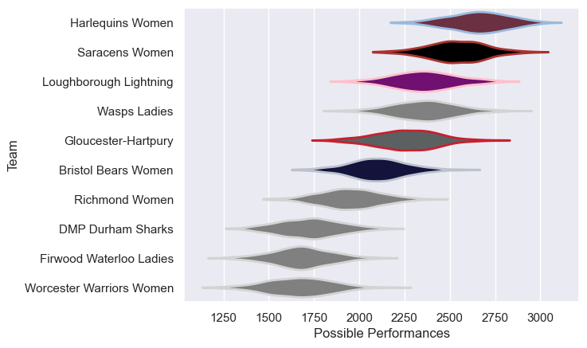

---  
title: "PWR 18/19"  
date: 2025-07-29 6:00:00 -0500  
categories: model review projection  
layout: article  
aside:  
    toc: true  
---
# Current Team Rankings

# Standings

## Current Standings

| Club                     |   Played |   Wins |   Point Differential |   Losing Bonus Points | Try Bonus Points   |   Competition Points |
|:-------------------------|---------:|-------:|---------------------:|----------------------:|:-------------------|---------------------:|
| Saracens Women           |       19 |     18 |                  524 |                     1 |                    |                   73 |
| Harlequins Women         |       19 |     15 |                  471 |                     1 |                    |                   63 |
| Loughborough Lightning   |       18 |     14 |                  347 |                     2 |                    |                   58 |
| Wasps Ladies             |       18 |     12 |                  209 |                     1 |                    |                   49 |
| Bristol Bears Women      |       18 |      8 |                   93 |                     3 |                    |                   37 |
| Gloucester-Hartpury      |       18 |      8 |                  114 |                     2 |                    |                   36 |
| Richmond Women           |       18 |      5 |                 -225 |                     1 |                    |                   23 |
| DMP Durham Sharks        |       18 |      4 |                 -521 |                     1 |                    |                   17 |
| Firwood Waterloo Ladies  |       18 |      3 |                 -502 |                     1 |                    |                   13 |
| Worcester Warriors Women |       18 |      2 |                 -510 |                     3 |                    |                   11 |

# Completed Match Review

| Model | Percent Correct Predictions | Spread Error |
| ------ | ------ | ------ |
| Club Level | 75.8% | 16.4 |
| Player Level: Lineup | nan% | nan |
| Player Level: Minutes | nan% | nan |

