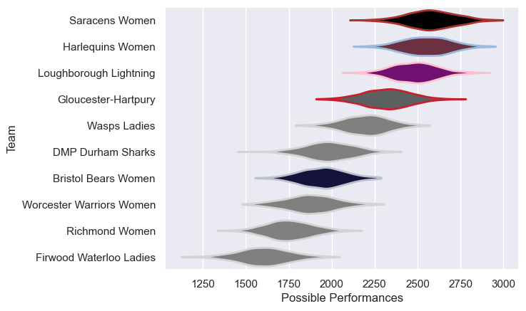

---  
title: "PWR 19/20"  
date: 2025-07-29 6:00:00 -0500  
categories: model review projection  
layout: article  
aside:  
    toc: true  
---
# Current Team Rankings

# Standings

## Current Standings

| Club                     |   Played |   Wins |   Point Differential |   Losing Bonus Points | Try Bonus Points   |   Competition Points |
|:-------------------------|---------:|-------:|---------------------:|----------------------:|:-------------------|---------------------:|
| Saracens Women           |       11 |     11 |                  319 |                     0 |                    |                   44 |
| Harlequins Women         |       11 |     10 |                  362 |                     1 |                    |                   41 |
| Loughborough Lightning   |       11 |      7 |                  257 |                     1 |                    |                   29 |
| Gloucester-Hartpury      |       11 |      7 |                  111 |                     0 |                    |                   28 |
| Wasps Ladies             |       11 |      6 |                  103 |                     2 |                    |                   26 |
| DMP Durham Sharks        |       11 |      5 |                 -179 |                     0 |                    |                   20 |
| Bristol Bears Women      |       11 |      4 |                  -47 |                     2 |                    |                   18 |
| Worcester Warriors Women |       11 |      3 |                 -203 |                     0 |                    |                   12 |
| Richmond Women           |       11 |      1 |                 -204 |                     1 |                    |                    5 |
| Firwood Waterloo Ladies  |       11 |      1 |                 -519 |                     0 |                    |                    4 |

# Completed Match Review

| Model | Percent Correct Predictions | Spread Error |
| ------ | ------ | ------ |
| Club Level | 80.0% | 15.7 |
| Player Level: Lineup | nan% | nan |
| Player Level: Minutes | nan% | nan |

