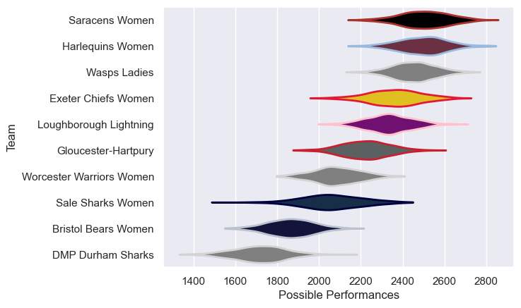

---  
title: "PWR 20/21"  
date: 2025-07-29 6:00:00 -0500  
categories: model review projection  
layout: article  
aside:  
    toc: true  
---
# Current Team Rankings

# Standings

## Current Standings

| Club                     |   Played |   Wins |   Point Differential |   Losing Bonus Points | Try Bonus Points   |   Competition Points |
|:-------------------------|---------:|-------:|---------------------:|----------------------:|:-------------------|---------------------:|
| Harlequins Women         |       19 |     16 |                  469 |                     2 |                    |                   68 |
| Saracens Women           |       19 |     15 |                  392 |                     1 |                    |                   63 |
| Wasps Ladies             |       19 |     14 |                  369 |                     3 |                    |                   59 |
| Loughborough Lightning   |       19 |     12 |                  187 |                     3 |                    |                   51 |
| Exeter Chiefs Women      |       18 |     10 |                   89 |                     4 |                    |                   44 |
| Gloucester-Hartpury      |       18 |     10 |                   94 |                     2 |                    |                   42 |
| Worcester Warriors Women |       18 |      5 |                  -69 |                     2 |                    |                   22 |
| Bristol Bears Women      |       18 |      4 |                 -322 |                     3 |                    |                   19 |
| Sale Sharks Women        |       18 |      4 |                 -247 |                     1 |                    |                   17 |
| DMP Durham Sharks        |       18 |      1 |                 -962 |                     0 |                    |                    4 |

# Completed Match Review

| Model | Percent Correct Predictions | Spread Error |
| ------ | ------ | ------ |
| Club Level | 79.3% | 16.0 |
| Player Level: Lineup | nan% | nan |
| Player Level: Minutes | nan% | nan |

