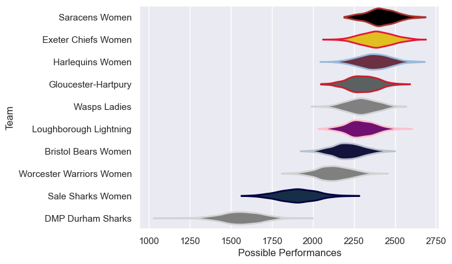

---  
title: "PWR 21/22"  
date: 2025-07-29 6:00:00 -0500  
categories: model review projection  
layout: article  
aside:  
    toc: true  
---
# Current Team Rankings

# Standings

## Current Standings

| Club                     |   Played |   Wins |   Point Differential |   Losing Bonus Points | Try Bonus Points   |   Competition Points |
|:-------------------------|---------:|-------:|---------------------:|----------------------:|:-------------------|---------------------:|
| Saracens Women           |       20 |     18 |                  329 |                     0 |                    |                   72 |
| Exeter Chiefs Women      |       20 |     14 |                  357 |                     2 |                    |                   60 |
| Bristol Bears Women      |       19 |     11 |                  207 |                     5 |                    |                   51 |
| Harlequins Women         |       19 |     12 |                  250 |                     2 |                    |                   50 |
| Gloucester-Hartpury      |       18 |      9 |                  214 |                     5 |                    |                   43 |
| Loughborough Lightning   |       18 |      9 |                   69 |                     2 |                    |                   42 |
| Wasps Ladies             |       17 |      8 |                  113 |                     3 |                    |                   37 |
| Worcester Warriors Women |       17 |      6 |                  -56 |                     4 |                    |                   28 |
| Sale Sharks Women        |       18 |      2 |                 -306 |                     1 |                    |                    9 |
| DMP Durham Sharks        |       18 |      0 |                -1177 |                     0 |                    |                    0 |

# Completed Match Review

| Model | Percent Correct Predictions | Spread Error |
| ------ | ------ | ------ |
| Club Level | 72.8% | 18.6 |
| Player Level: Lineup | nan% | nan |
| Player Level: Minutes | nan% | nan |

