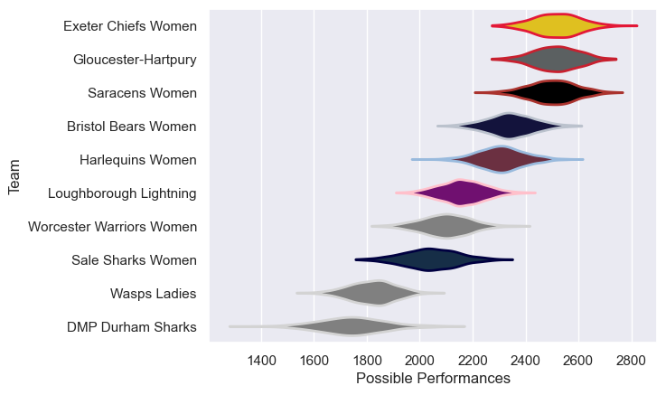

---  
title: "PWR 22/23"  
date: 2025-07-29 6:00:00 -0500  
categories: model review projection  
layout: article  
aside:  
    toc: true  
---
# Current Team Rankings

# Standings

## Current Standings

| Club                     |   Played |   Wins |   Point Differential |   Losing Bonus Points | Try Bonus Points   |   Competition Points |
|:-------------------------|---------:|-------:|---------------------:|----------------------:|:-------------------|---------------------:|
| Gloucester-Hartpury      |       19 |     17 |                  513 |                     0 |                    |                   68 |
| Exeter Chiefs Women      |       20 |     16 |                  687 |                     2 |                    |                   66 |
| Saracens Women           |       19 |     15 |                  474 |                     1 |                    |                   61 |
| Bristol Bears Women      |       19 |     12 |                  204 |                     1 |                    |                   49 |
| Harlequins Women         |       18 |     10 |                  221 |                     1 |                    |                   43 |
| Sale Sharks Women        |       18 |      7 |                 -194 |                     1 |                    |                   29 |
| Worcester Warriors Women |       17 |      6 |                 -127 |                     2 |                    |                   28 |
| Loughborough Lightning   |       17 |      5 |                   -6 |                     2 |                    |                   22 |
| DMP Durham Sharks        |       18 |      2 |                 -870 |                     0 |                    |                    8 |
| Wasps Ladies             |       17 |      0 |                 -902 |                     0 |                    |                    0 |

# Completed Match Review

| Model | Percent Correct Predictions | Spread Error |
| ------ | ------ | ------ |
| Club Level | 79.1% | 24.5 |
| Player Level: Lineup | nan% | nan |
| Player Level: Minutes | nan% | nan |

