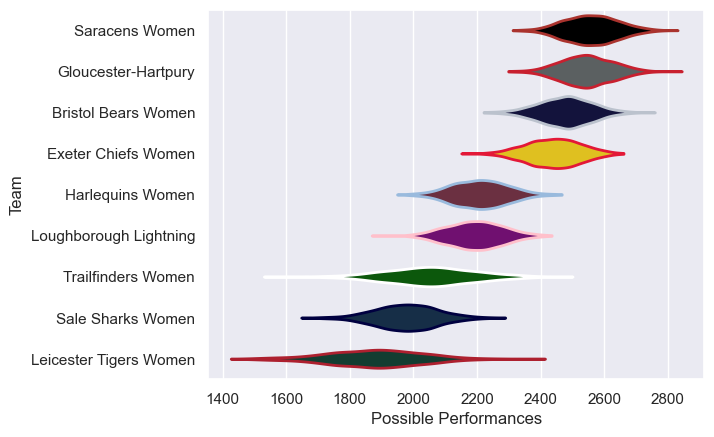

---  
title: "PWR 23/24 Status"  
date: 2025-07-28 6:00:00 -0500  
categories: model review projection  
layout: article  
aside:  
    toc: true  
---
# Current Team Rankings

# Standings

## Current Standings

| Club                   |   Played |   Wins |   Point Differential |   Losing Bonus Points | Try Bonus Points   |   Competition Points |
|:-----------------------|---------:|-------:|---------------------:|----------------------:|:-------------------|---------------------:|
| Gloucester-Hartpury    |       17 |     16 |                  300 |                     1 |                    |                   65 |
| Saracens Women         |       17 |     14 |                  373 |                     0 |                    |                   56 |
| Bristol Bears Women    |       18 |     12 |                  231 |                     2 |                    |                   50 |
| Exeter Chiefs Women    |       17 |     10 |                  177 |                     2 |                    |                   44 |
| Loughborough Lightning |       16 |      7 |                 -103 |                     1 |                    |                   29 |
| Trailfinders Women     |       16 |      5 |                 -160 |                     3 |                    |                   23 |
| Harlequins Women       |       16 |      4 |                 -110 |                     3 |                    |                   21 |
| Sale Sharks Women      |       15 |      3 |                 -353 |                     2 |                    |                   14 |
| Leicester Tigers Women |       16 |      2 |                 -355 |                     1 |                    |                    9 |

# Completed Match Review

| Model | Percent Correct Predictions | Spread Error |
| ------ | ------ | ------ |
| Club Level | 73.0% | 15.3 |
| Player Level: Lineup | nan% | nan |
| Player Level: Minutes | nan% | nan |

