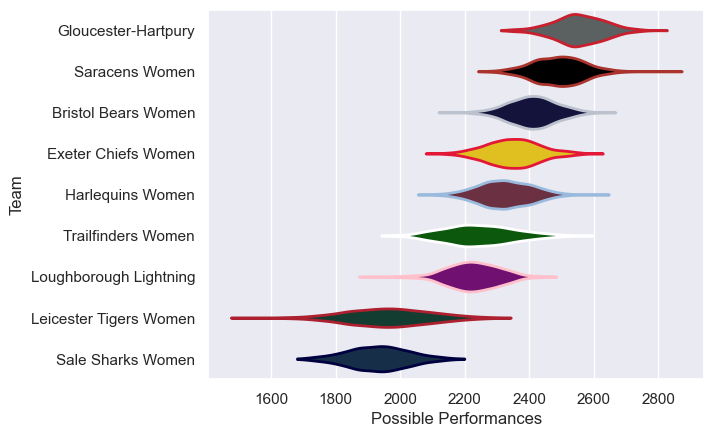

---  
title: "PWR 24/25 Status"  
date: 2025-07-28 6:00:00 -0500  
categories: model review projection  
layout: article  
aside:  
    toc: true  
---
# Current Team Rankings

# Standings

## Current Standings

| Club                   |   Played |   Wins |   Point Differential |   Losing Bonus Points |   Try Bonus Points |   Competition Points |
|:-----------------------|---------:|-------:|---------------------:|----------------------:|-------------------:|---------------------:|
| Gloucester-Hartpury    |       18 |     15 |                  271 |                     2 |                 16 |                   78 |
| Saracens Women         |       18 |     13 |                  280 |                     2 |                 13 |                   67 |
| Harlequins Women       |       17 |     11 |                   79 |                     1 |                 11 |                   56 |
| Bristol Bears Women    |       17 |     10 |                  161 |                     1 |                 13 |                   54 |
| Exeter Chiefs Women    |       16 |     10 |                   54 |                     2 |                  9 |                   51 |
| Loughborough Lightning |       16 |      7 |                  -17 |                     2 |                  9 |                   39 |
| Trailfinders Women     |       16 |      5 |                  -29 |                     4 |                 12 |                   36 |
| Leicester Tigers Women |       16 |      3 |                 -387 |                     1 |                  5 |                   18 |
| Sale Sharks Women      |       16 |      1 |                 -412 |                     0 |                    |                    4 |

# Completed Match Review

| Model | Percent Correct Predictions | Spread Error |
| ------ | ------ | ------ |
| Club Level | 76.0% | 14.9 |
| Player Level: Lineup | nan% | nan |
| Player Level: Minutes | nan% | nan |

