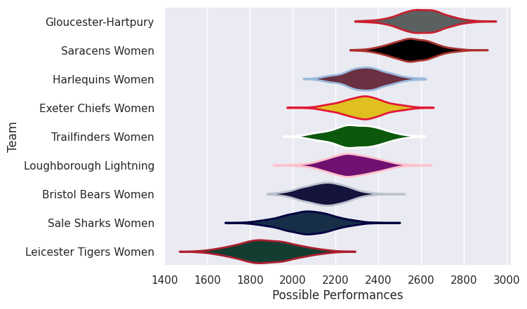

---  
title: "PWR 25/26"  
date: 2025-10-24 6:00:00 -0500  
categories: model review projection  
layout: article  
aside:  
    toc: true  
---
# Team Rankings

# Standings

## Projected Remaining Table

| Club                   |   To Play |   Projected Wins |   Projected Differential |   Projected Losing Bonus Points | Projected Try Bonus Points   |   Projected Competition Points |
|:-----------------------|----------:|-----------------:|-------------------------:|--------------------------------:|:-----------------------------|-------------------------------:|
| Gloucester-Hartpury    |         1 |            0.676 |                    5.203 |                           0.159 |                              |                          2.945 |
| Harlequins Women       |         1 |            0.665 |                    4.573 |                           0.157 |                              |                          2.901 |
| Leicester Tigers Women |         1 |            0.499 |                    0.546 |                           0.225 |                              |                          2.309 |
| Trailfinders Women     |         1 |            0.479 |                   -0.085 |                           0.226 |                              |                          2.236 |
| Exeter Chiefs Women    |         1 |            0.474 |                    0.085 |                           0.241 |                              |                          2.231 |
| Sale Sharks Women      |         1 |            0.457 |                   -0.546 |                           0.236 |                              |                          2.152 |
| Loughborough Lightning |         1 |            0.293 |                   -4.573 |                           0.267 |                              |                          1.523 |
| Saracens Women         |         1 |            0.283 |                   -5.203 |                           0.253 |                              |                          1.467 |

## Projected Total Table

| Club                   |   Played |   Wins |   Point Differential |   Losing Bonus Points | Try Bonus Points   |   Competition Points |
|:-----------------------|---------:|-------:|---------------------:|----------------------:|:-------------------|---------------------:|
| Gloucester-Hartpury    |        1 |  0.676 |                5.203 |                 0.159 |                    |                2.945 |
| Harlequins Women       |        1 |  0.665 |                4.573 |                 0.157 |                    |                2.901 |
| Leicester Tigers Women |        1 |  0.499 |                0.546 |                 0.225 |                    |                2.309 |
| Trailfinders Women     |        1 |  0.479 |               -0.085 |                 0.226 |                    |                2.236 |
| Exeter Chiefs Women    |        1 |  0.474 |                0.085 |                 0.241 |                    |                2.231 |
| Sale Sharks Women      |        1 |  0.457 |               -0.546 |                 0.236 |                    |                2.152 |
| Loughborough Lightning |        1 |  0.293 |               -4.573 |                 0.267 |                    |                1.523 |
| Saracens Women         |        1 |  0.283 |               -5.203 |                 0.253 |                    |                1.467 |

# Future Predictions

## Week 1

### Harlequins Ladies V Loughborough Lightning on 2025/10/24

Average Margin: Harlequins Women by 4.6

### Trailfinders Women V Exeter Chiefs Women on 2025/10/25

Average Margin: Exeter Chiefs Women by 0.1

### Sale Sharks Women V Leicester Tigers Women on 2025/10/25

Average Margin: Leicester Tigers Women by 0.5

### Gloucester-Hartpury V Saracens Women on 2025/10/26

Average Margin: Gloucester-Hartpury by 5.2

