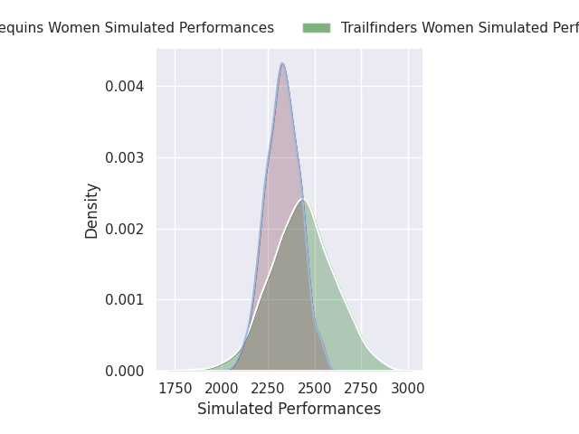
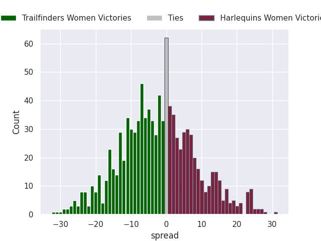
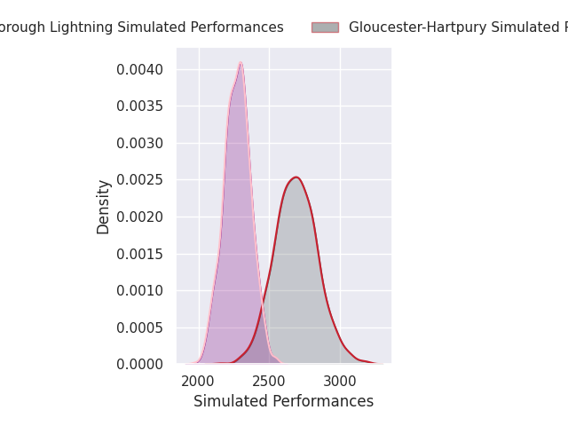
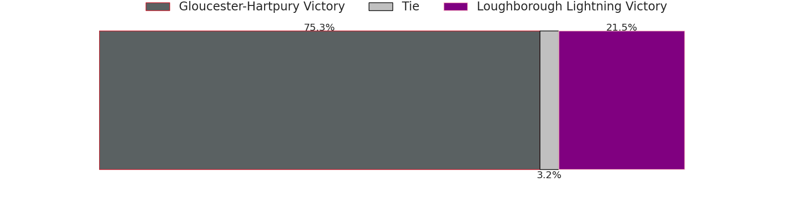
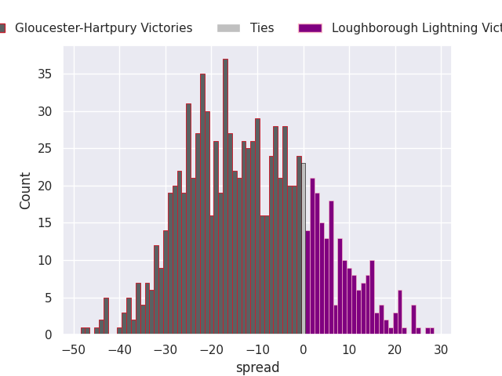
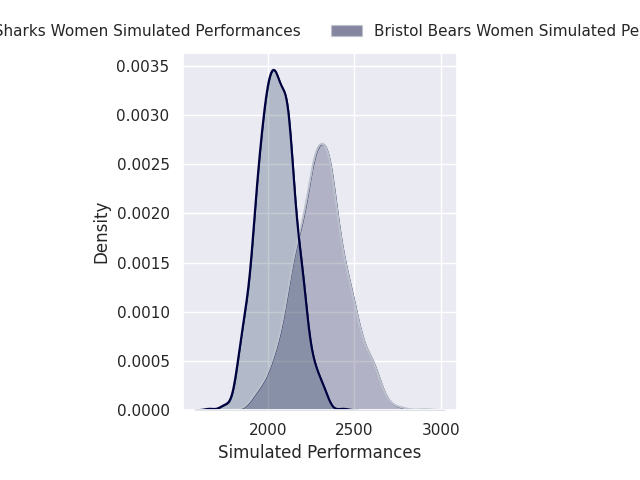
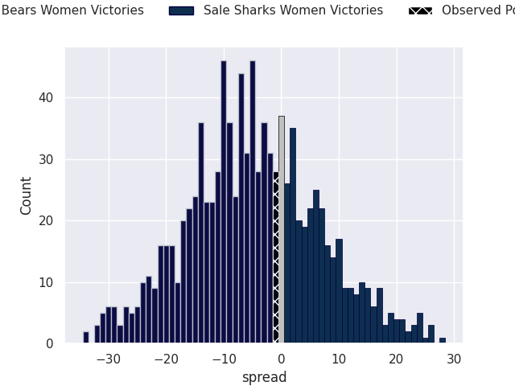

# Team Rankings

# Standings

## Current Standings

| Club                   |   Played |   Wins |   Point Differential |   Losing Bonus Points |   Try Bonus Points |   Competition Points |
|:-----------------------|---------:|-------:|---------------------:|----------------------:|-------------------:|---------------------:|
| Saracens Women         |        8 |      7 |                  205 |                     0 |                    |                   28 |
| Gloucester-Hartpury    |        7 |      7 |                  169 |                     0 |                    |                   28 |
| Harlequins Women       |        7 |      4 |                   18 |                     2 |                  1 |                   19 |
| Loughborough Lightning |        7 |      3 |                   26 |                     0 |                    |                   16 |
| Exeter Chiefs Women    |        7 |      3 |                   24 |                     0 |                    |                   16 |
| Trailfinders Women     |        7 |      3 |                   50 |                     1 |                    |                   15 |
| Sale Sharks Women      |        7 |      1 |                  -60 |                     2 |                    |                    8 |
| Bristol Bears Women    |        7 |      1 |                  -82 |                     0 |                    |                    4 |
| Leicester Tigers Women |        7 |      0 |                 -350 |                     0 |                    |                    0 |

## Projected Remaining Table

| Club                   |   To Play |   Projected Wins |   Projected Differential |   Projected Losing Bonus Points | Projected Try Bonus Points   |   Projected Competition Points |
|:-----------------------|----------:|-----------------:|-------------------------:|--------------------------------:|:-----------------------------|-------------------------------:|
| Gloucester-Hartpury    |         2 |            1.525 |                   23.396 |                           0.215 |                              |                          6.415 |
| Bristol Bears Women    |         2 |            1.208 |                    7.755 |                           0.376 |                              |                          5.382 |
| Trailfinders Women     |         2 |            1.058 |                    2.402 |                           0.442 |                              |                          4.864 |
| Exeter Chiefs Women    |         1 |            0.767 |                   14.032 |                           0.105 |                              |                          3.217 |
| Sale Sharks Women      |         2 |            0.474 |                  -19.036 |                           0.355 |                              |                          2.373 |
| Harlequins Women       |         1 |            0.354 |                   -2.965 |                           0.269 |                              |                          1.769 |
| Loughborough Lightning |         1 |            0.202 |                  -11.552 |                           0.165 |                              |                          1.019 |
| Leicester Tigers Women |         1 |            0.211 |                  -14.032 |                           0.126 |                              |                          1.014 |

## Projected Total Table

| Club                   |   Played |   Wins |   Point Differential |   Losing Bonus Points |   Try Bonus Points |   Competition Points |
|:-----------------------|---------:|-------:|---------------------:|----------------------:|-------------------:|---------------------:|
| Gloucester-Hartpury    |        9 |  8.525 |              192.396 |                 0.215 |                    |               34.415 |
| Saracens Women         |        8 |  7     |              205     |                 0     |                    |               28     |
| Harlequins Women       |        8 |  4.354 |               15.035 |                 2.269 |                  1 |               20.769 |
| Trailfinders Women     |        9 |  4.058 |               52.402 |                 1.442 |                    |               19.864 |
| Exeter Chiefs Women    |        8 |  3.767 |               38.032 |                 0.105 |                    |               19.217 |
| Loughborough Lightning |        8 |  3.202 |               14.448 |                 0.165 |                    |               17.019 |
| Sale Sharks Women      |        9 |  1.474 |              -79.036 |                 2.355 |                    |               10.373 |
| Bristol Bears Women    |        9 |  2.208 |              -74.245 |                 0.376 |                    |                9.382 |
| Leicester Tigers Women |        8 |  0.211 |             -364.032 |                 0.126 |                    |                1.014 |

# Completed Match Review

| Model | Percent Correct Predictions | Spread Error |
| ------ | ------ | ------ |
| Club Level | 76.3% | 18.1 |
| Player Level: Lineup | nan% | nan |
| Player Level: Minutes | nan% | nan |

# Future Predictions

## Week 9

### Trailfinders Women V Harlequins Women on 2026/01/30

Average Margin: Trailfinders Women by 3.0

### Gloucester-Hartpury V Loughborough Lightning on 2026/02/01

Average Margin: Gloucester-Hartpury by 11.6

### Bristol Bears Women V Sale Sharks Women on 2026/02/01

Average Margin: Bristol Bears Women by 7.2

### Exeter Chiefs Women V Leicester Tigers Women on 2026/02/01

Average Margin: Exeter Chiefs Women by 14.0

## Week 10

### Bristol Bears Women V Trailfinders Women on 2026/02/07

Average Margin: Bristol Bears Women by 0.6

### Sale Sharks Women V Gloucester-Hartpury on 2026/02/07

Average Margin: Gloucester-Hartpury by 11.8

