# Team Rankings

# Standings

## Current Standings

| Club                   |   Played |   Wins |   Point Differential |   Losing Bonus Points |   Try Bonus Points |   Competition Points |
|:-----------------------|---------:|-------:|---------------------:|----------------------:|-------------------:|---------------------:|
| Gloucester-Hartpury    |        8 |      8 |                  188 |                     0 |                    |                   32 |
| Saracens Women         |        8 |      7 |                  205 |                     0 |                    |                   28 |
| Harlequins Women       |        8 |      5 |                   19 |                     2 |                  1 |                   23 |
| Exeter Chiefs Women    |        8 |      4 |                   60 |                     0 |                    |                   20 |
| Trailfinders Women     |        8 |      3 |                   49 |                     2 |                    |                   16 |
| Loughborough Lightning |        8 |      3 |                    7 |                     0 |                    |                   16 |
| Sale Sharks Women      |        8 |      1 |                  -61 |                     3 |                    |                    9 |
| Bristol Bears Women    |        8 |      2 |                  -81 |                     0 |                    |                    8 |
| Leicester Tigers Women |        8 |      0 |                 -386 |                     0 |                    |                    0 |

## Projected Remaining Table

| Club                   |   To Play |   Projected Wins |   Projected Differential |   Projected Losing Bonus Points | Projected Try Bonus Points   |   Projected Competition Points |
|:-----------------------|----------:|-----------------:|-------------------------:|--------------------------------:|:-----------------------------|-------------------------------:|
| Saracens Women         |         3 |            2.204 |                   38.117 |                           0.345 |                              |                          9.317 |
| Trailfinders Women     |         3 |            1.987 |                   19.756 |                           0.479 |                              |                          8.689 |
| Harlequins Women       |         3 |            1.435 |                   -2.419 |                           0.57  |                              |                          6.558 |
| Gloucester-Hartpury    |         2 |            1.481 |                   20.208 |                           0.218 |                              |                          6.288 |
| Exeter Chiefs Women    |         3 |            1.278 |                   -6.595 |                           0.602 |                              |                          5.964 |
| Loughborough Lightning |         2 |            1.038 |                    2.958 |                           0.365 |                              |                          4.681 |
| Bristol Bears Women    |         3 |            0.849 |                  -23.291 |                           0.635 |                              |                          4.253 |
| Sale Sharks Women      |         3 |            0.791 |                  -23.976 |                           0.607 |                              |                          4.007 |
| Leicester Tigers Women |         2 |            0.488 |                  -24.758 |                           0.319 |                              |                          2.383 |

## Projected Total Table

| Club                   |   Played |   Wins |   Point Differential |   Losing Bonus Points |   Try Bonus Points |   Competition Points |
|:-----------------------|---------:|-------:|---------------------:|----------------------:|-------------------:|---------------------:|
| Gloucester-Hartpury    |       10 |  9.481 |              208.208 |                 0.218 |                    |               38.288 |
| Saracens Women         |       11 |  9.204 |              243.117 |                 0.345 |                    |               37.317 |
| Harlequins Women       |       11 |  6.435 |               16.581 |                 2.57  |                  1 |               29.558 |
| Exeter Chiefs Women    |       11 |  5.278 |               53.405 |                 0.602 |                    |               25.964 |
| Trailfinders Women     |       11 |  4.987 |               68.756 |                 2.479 |                    |               24.689 |
| Loughborough Lightning |       10 |  4.038 |                9.958 |                 0.365 |                    |               20.681 |
| Sale Sharks Women      |       11 |  1.791 |              -84.976 |                 3.607 |                    |               13.007 |
| Bristol Bears Women    |       11 |  2.849 |             -104.291 |                 0.635 |                    |               12.253 |
| Leicester Tigers Women |       10 |  0.488 |             -410.758 |                 0.319 |                    |                2.383 |

# Completed Match Review

| Model | Percent Correct Predictions | Spread Error |
| ------ | ------ | ------ |
| Club Level | 75.0% | 16.6 |
| Player Level: Lineup | nan% | nan |
| Player Level: Minutes | nan% | nan |

# Future Predictions

## Week 9

### Bristol Bears Women V Trailfinders Women on 2026/02/07

Average Margin: Trailfinders Women by 1.6

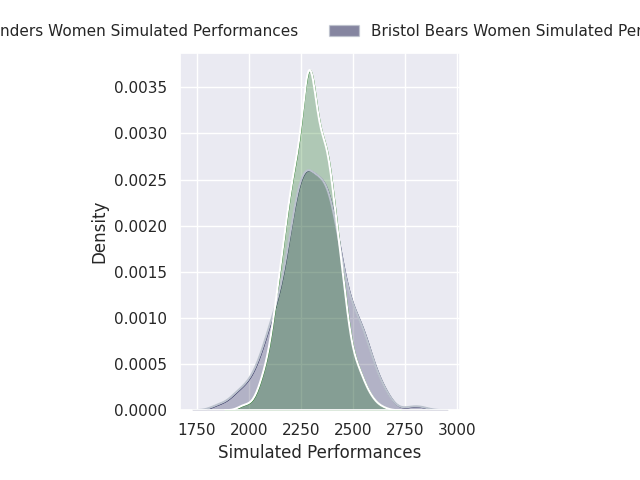

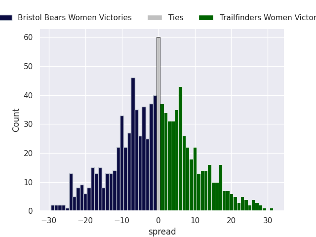

### Sale Sharks Women V Gloucester-Hartpury on 2026/02/07

Average Margin: Gloucester-Hartpury by 11.0

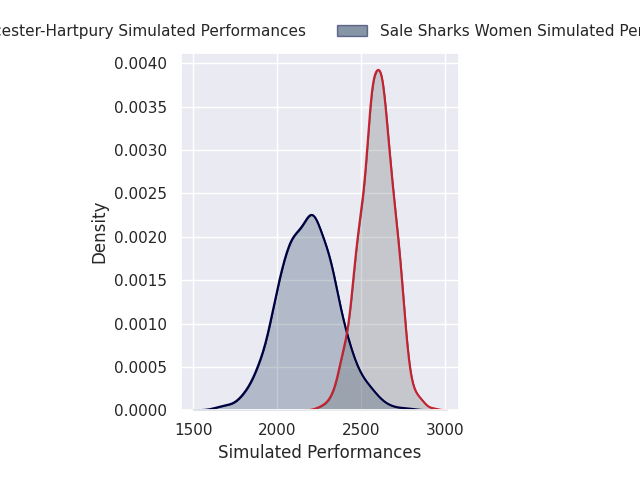
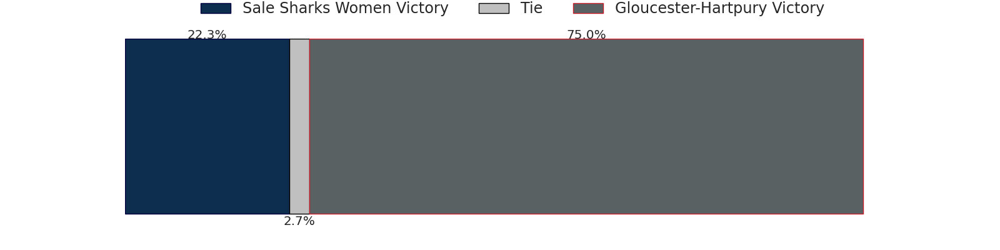
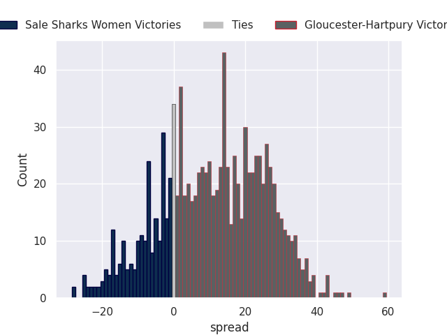

### Leicester Tigers Women V Saracens Women on 2026/02/08

Average Margin: Saracens Women by 15.8

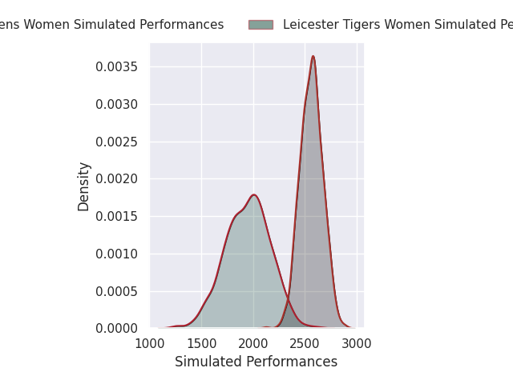
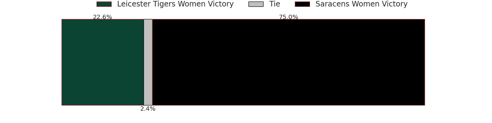
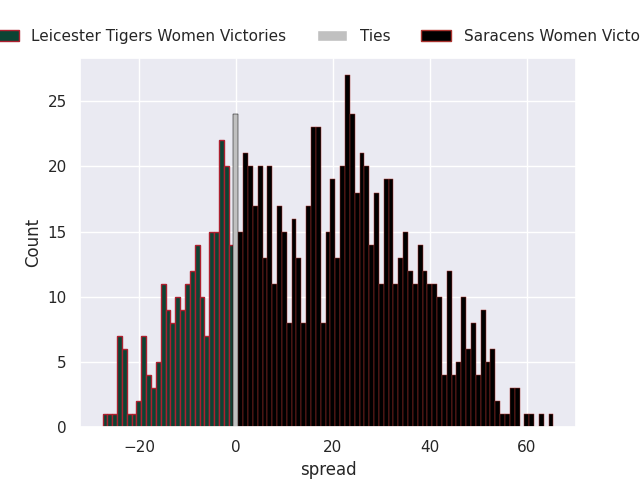

### Harlequins Women V Exeter Chiefs Women on 2026/02/08

Average Margin: Harlequins Women by 3.0

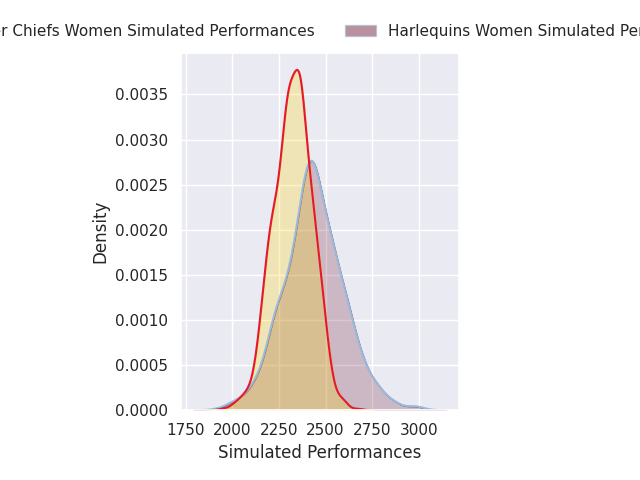
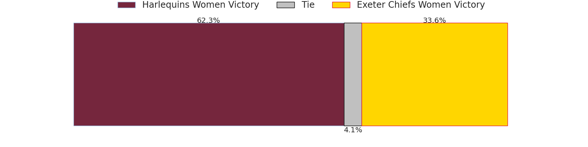
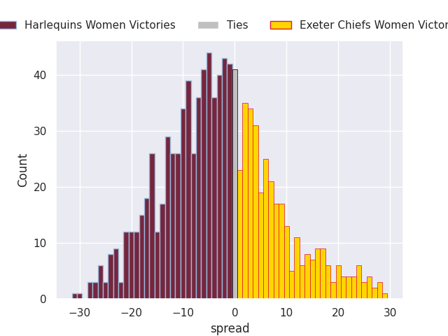

## Week 10

### Trailfinders Women V Sale Sharks Women on 2026/02/14

Average Margin: Trailfinders Women by 9.2

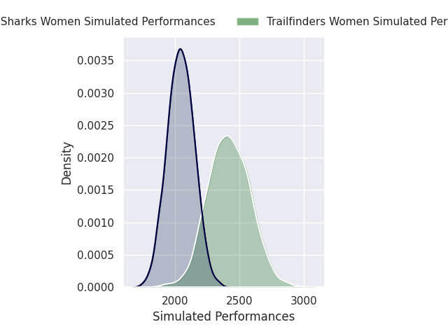

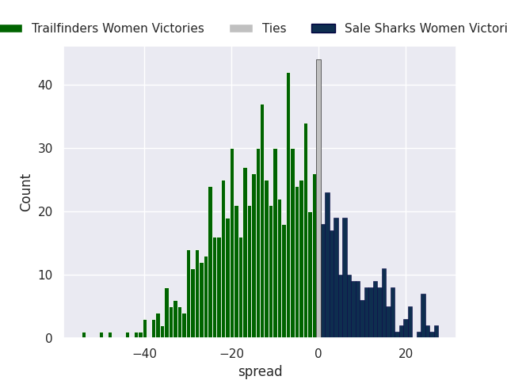

### Gloucester-Hartpury V Harlequins Women on 2026/02/14

Average Margin: Gloucester-Hartpury by 9.2

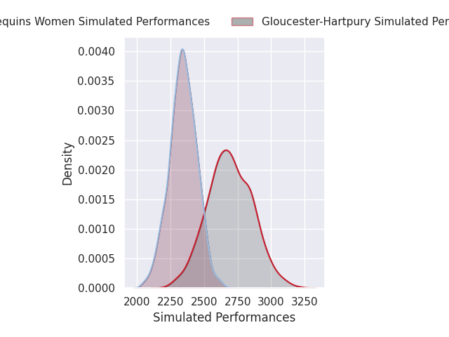
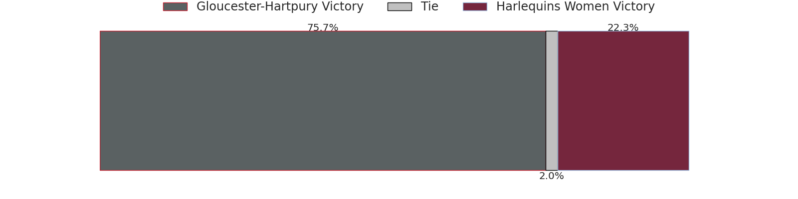
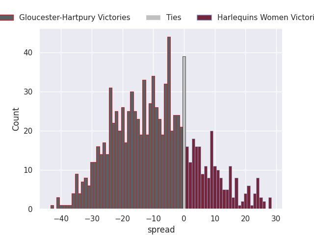

### Saracens Women V Bristol Bears Women on 2026/02/15

Average Margin: Saracens Women by 14.2

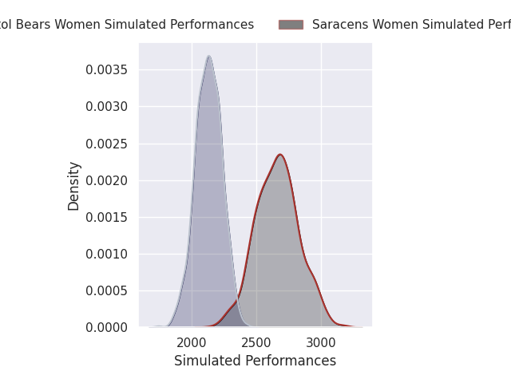

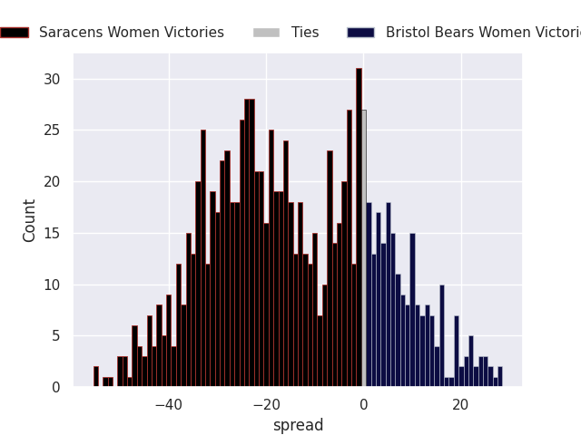

### Exeter Chiefs Women V Loughborough Lightning on 2026/02/15

Average Margin: Exeter Chiefs Women by 4.5

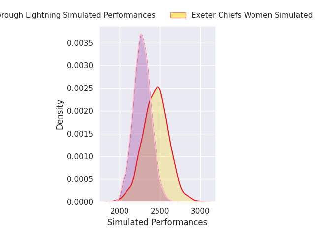
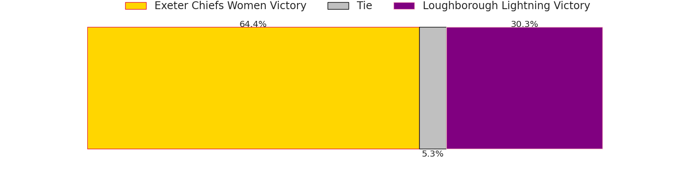
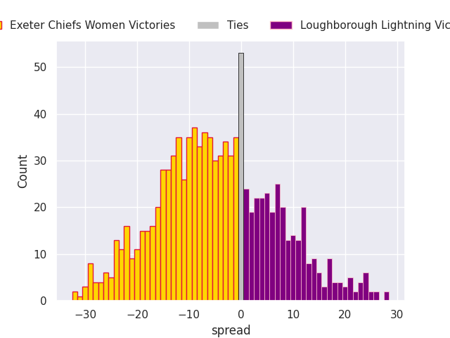

## Week 11

### Saracens Women V Exeter Chiefs Women on 2026/02/21

Average Margin: Saracens Women by 8.1

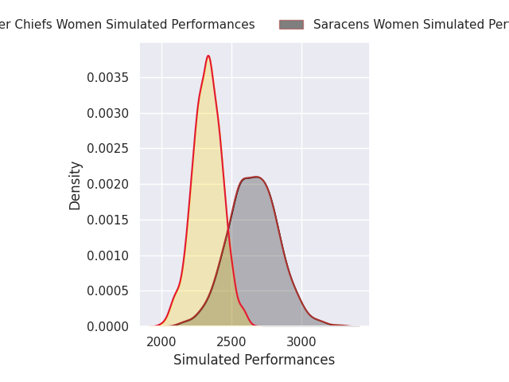

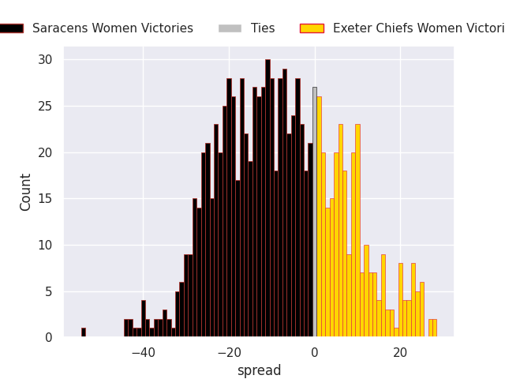

### Leicester Tigers Women V Trailfinders Women on 2026/02/21

Average Margin: Trailfinders Women by 8.9

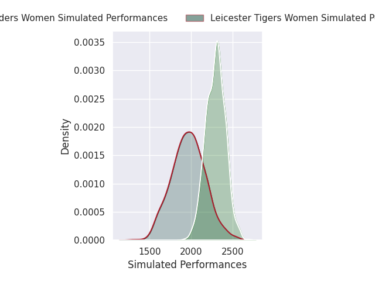
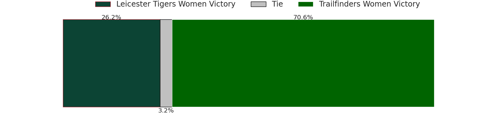
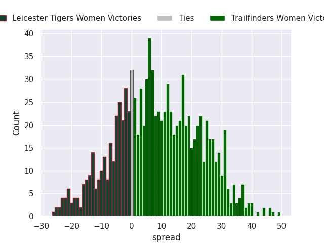

### Sale Sharks Women V Harlequins Women on 2026/02/21

Average Margin: Harlequins Women by 3.8

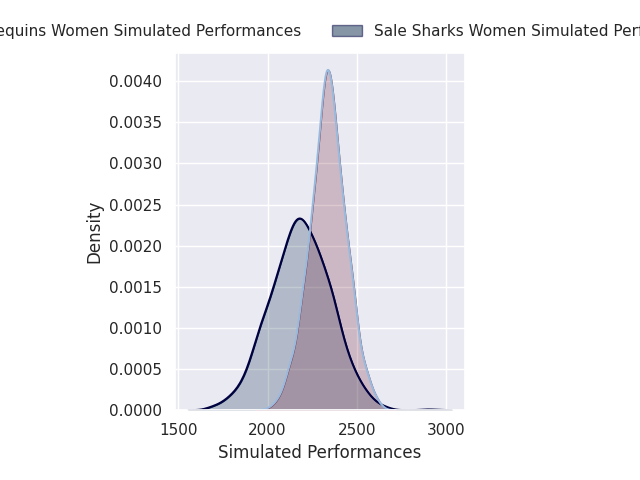
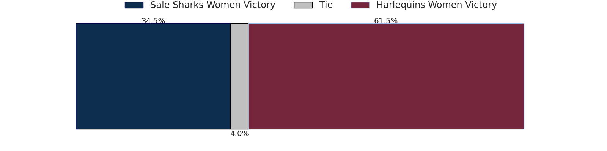
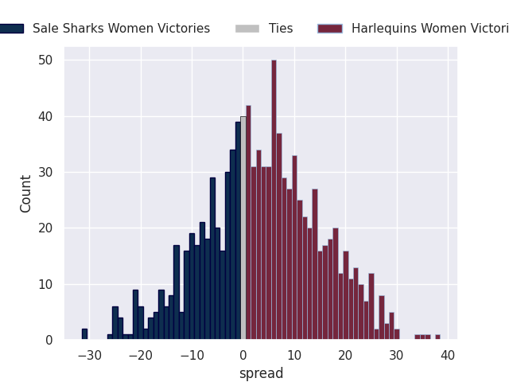

### Loughborough Lightning V Bristol Bears Women on 2026/02/22

Average Margin: Loughborough Lightning by 7.5

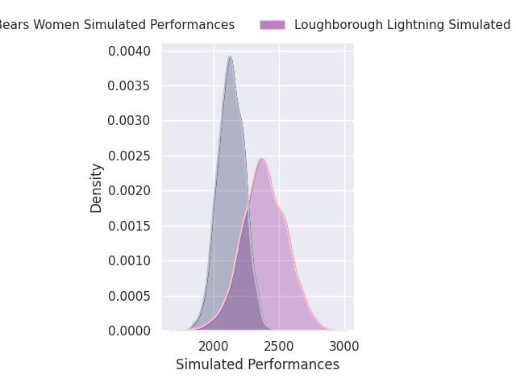
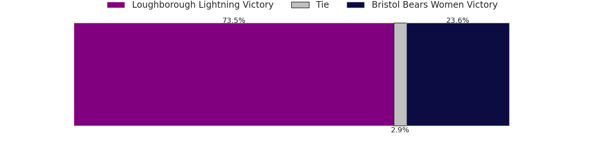
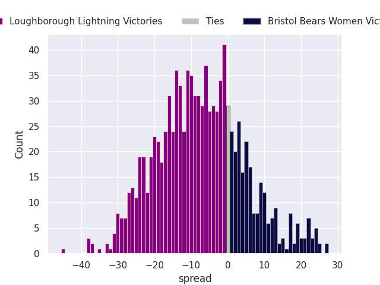

