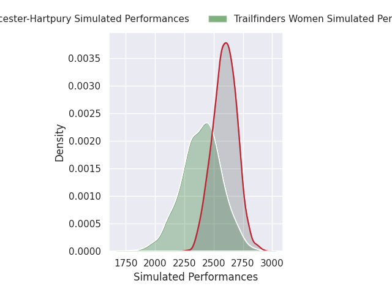
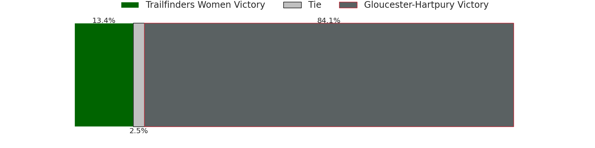
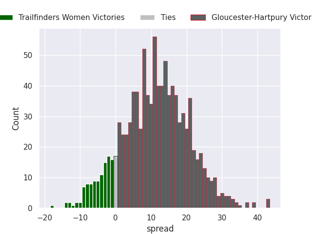
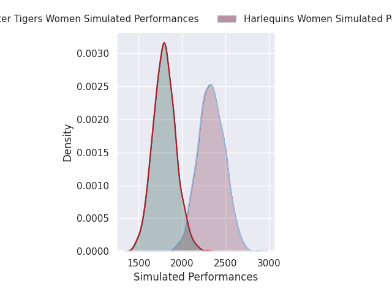
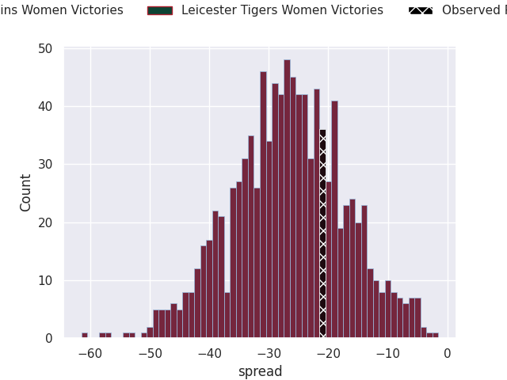
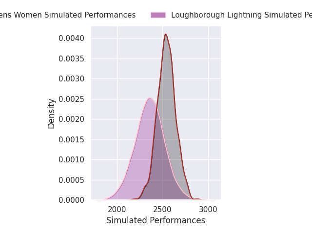
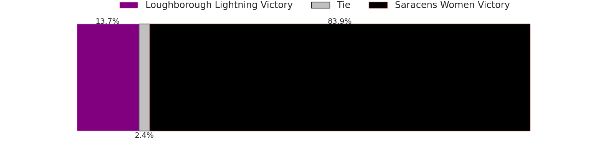
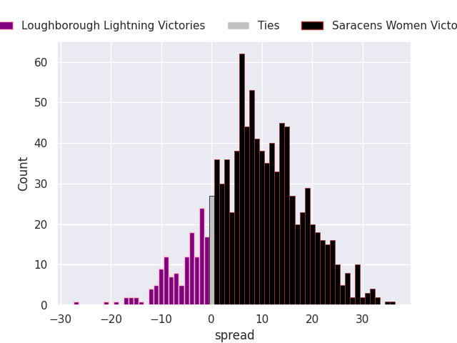

# Team Rankings

# Standings

## Current Standings

| Club                   |   Played |   Wins |   Point Differential |   Losing Bonus Points |   Try Bonus Points |   Competition Points |
|:-----------------------|---------:|-------:|---------------------:|----------------------:|-------------------:|---------------------:|
| Gloucester-Hartpury    |       14 |     14 |                  291 |                     0 |                    |                   56 |
| Saracens Women         |       14 |     12 |                  393 |                     1 |                    |                   49 |
| Exeter Chiefs Women    |       14 |      7 |                  101 |                     0 |                    |                   34 |
| Trailfinders Women     |       14 |      6 |                   49 |                     3 |                    |                   31 |
| Sale Sharks Women      |       15 |      6 |                  -43 |                     3 |                    |                   29 |
| Harlequins Women       |       15 |      5 |                  -41 |                     5 |                  1 |                   28 |
| Loughborough Lightning |       14 |      4 |                  -27 |                     3 |                    |                   23 |
| Bristol Bears Women    |       14 |      5 |                  -28 |                     1 |                    |                   23 |
| Leicester Tigers Women |       14 |      0 |                 -695 |                     0 |                    |                    0 |

## Projected Remaining Table

| Club                   |   To Play |   Projected Wins |   Projected Differential |   Projected Losing Bonus Points | Projected Try Bonus Points   |   Projected Competition Points |
|:-----------------------|----------:|-----------------:|-------------------------:|--------------------------------:|:-----------------------------|-------------------------------:|
| Harlequins Women       |         1 |            1     |                   26.62  |                           0     |                              |                          4     |
| Gloucester-Hartpury    |         1 |            0.841 |                    9.931 |                           0.091 |                              |                          3.505 |
| Saracens Women         |         1 |            0.83  |                    9.026 |                           0.096 |                              |                          3.47  |
| Exeter Chiefs Women    |         1 |            0.623 |                    3.318 |                           0.204 |                              |                          2.79  |
| Bristol Bears Women    |         1 |            0.33  |                   -3.318 |                           0.3   |                              |                          1.714 |
| Loughborough Lightning |         1 |            0.143 |                   -9.026 |                           0.269 |                              |                          0.895 |
| Trailfinders Women     |         1 |            0.134 |                   -9.931 |                           0.251 |                              |                          0.837 |
| Leicester Tigers Women |         1 |            0     |                  -26.62  |                           0.019 |                              |                          0.019 |

## Projected Total Table

| Club                   |   Played |   Wins |   Point Differential |   Losing Bonus Points |   Try Bonus Points |   Competition Points |
|:-----------------------|---------:|-------:|---------------------:|----------------------:|-------------------:|---------------------:|
| Gloucester-Hartpury    |       15 | 14.841 |              300.931 |                 0.091 |                    |               59.505 |
| Saracens Women         |       15 | 12.83  |              402.026 |                 1.096 |                    |               52.47  |
| Exeter Chiefs Women    |       15 |  7.623 |              104.318 |                 0.204 |                    |               36.79  |
| Harlequins Women       |       16 |  6     |              -14.38  |                 5     |                  1 |               32     |
| Trailfinders Women     |       15 |  6.134 |               39.069 |                 3.251 |                    |               31.837 |
| Sale Sharks Women      |       15 |  6     |              -43     |                 3     |                    |               29     |
| Bristol Bears Women    |       15 |  5.33  |              -31.318 |                 1.3   |                    |               24.714 |
| Loughborough Lightning |       15 |  4.143 |              -36.026 |                 3.269 |                    |               23.895 |
| Leicester Tigers Women |       15 |  0     |             -721.62  |                 0.019 |                    |                0.019 |

# Completed Match Review

| Model | Percent Correct Predictions | Spread Error |
| ------ | ------ | ------ |
| Club Level | 77.9% | 16.0 |
| Player Level: Lineup | nan% | nan |
| Player Level: Minutes | nan% | nan |

# Future Predictions

## Week 16

### Trailfinders Women V Gloucester-Hartpury on 2026/05/29

Average Margin: Gloucester-Hartpury by 9.9

### Bristol Bears Women V Exeter Chiefs Women on 2026/05/30

Average Margin: Exeter Chiefs Women by 3.3

### Harlequins Ladies V Leicester Tigers Women on 2026/05/30

Average Margin: Harlequins Women by 26.6

### Loughborough Lightning V Saracens Women on 2026/05/31

Average Margin: Saracens Women by 9.0

