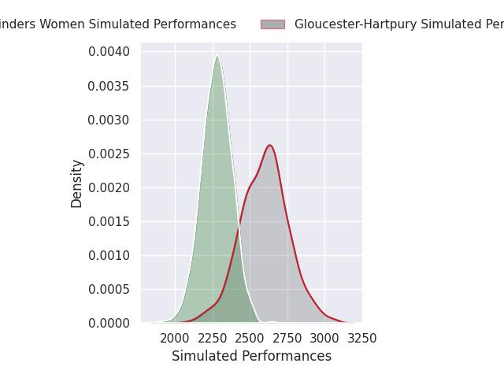
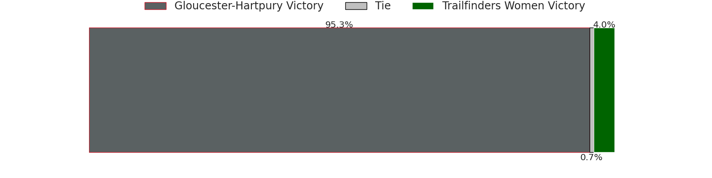
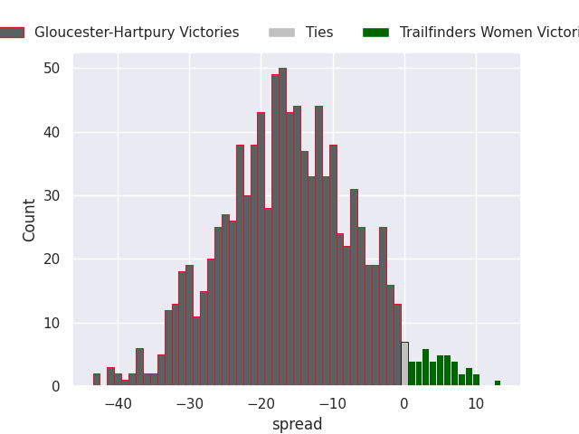
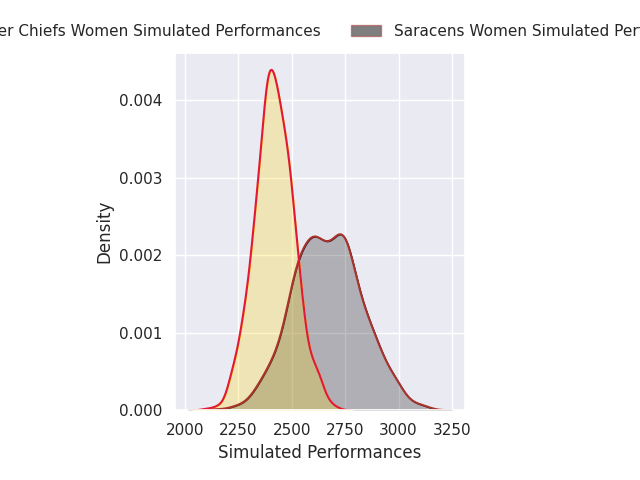
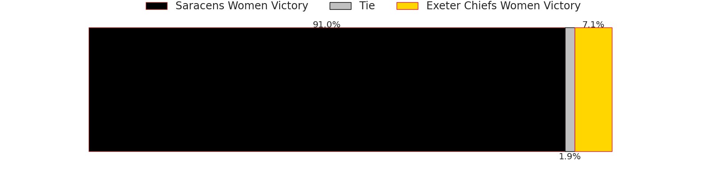
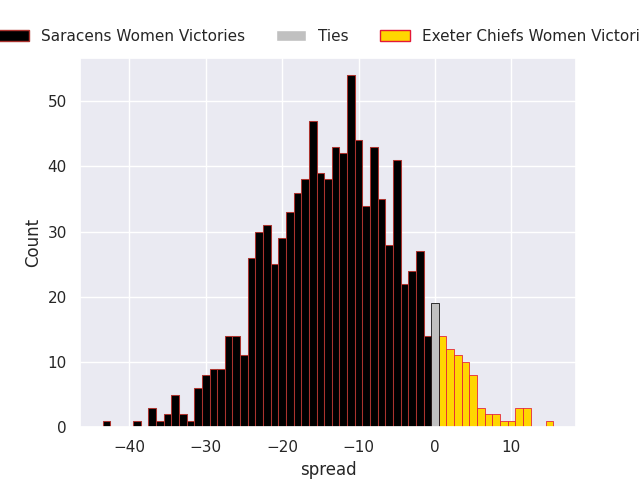

# Team Rankings

# Standings

## Current Standings

| Club                   |   Played |   Wins |   Point Differential |   Losing Bonus Points |   Try Bonus Points |   Competition Points |
|:-----------------------|---------:|-------:|---------------------:|----------------------:|-------------------:|---------------------:|
| Gloucester-Hartpury    |       16 |     14 |                  284 |                     2 |                    |                   58 |
| Saracens Women         |       16 |     14 |                  497 |                     1 |                    |                   57 |
| Exeter Chiefs Women    |       16 |      9 |                  179 |                     0 |                    |                   42 |
| Trailfinders Women     |       16 |      7 |                  -15 |                     3 |                    |                   35 |
| Harlequins Women       |       16 |      6 |                  -20 |                     5 |                  1 |                   32 |
| Sale Sharks Women      |       16 |      6 |                  -69 |                     3 |                    |                   29 |
| Loughborough Lightning |       16 |      5 |                  -51 |                     3 |                    |                   27 |
| Bristol Bears Women    |       16 |      6 |                  -75 |                     1 |                    |                   27 |
| Leicester Tigers Women |       16 |      0 |                 -730 |                     0 |                    |                    0 |

## Projected Remaining Table

| Club                |   To Play |   Projected Wins |   Projected Differential |   Projected Losing Bonus Points | Projected Try Bonus Points   |   Projected Competition Points |
|:--------------------|----------:|-----------------:|-------------------------:|--------------------------------:|:-----------------------------|-------------------------------:|
| Gloucester-Hartpury |         1 |            0.948 |                   15.936 |                           0.03  |                              |                          3.852 |
| Saracens Women      |         1 |            0.896 |                   12.455 |                           0.063 |                              |                          3.697 |
| Exeter Chiefs Women |         1 |            0.079 |                  -12.455 |                           0.201 |                              |                          0.567 |
| Trailfinders Women  |         1 |            0.037 |                  -15.936 |                           0.128 |                              |                          0.306 |

## Projected Total Table

| Club                   |   Played |   Wins |   Point Differential |   Losing Bonus Points |   Try Bonus Points |   Competition Points |
|:-----------------------|---------:|-------:|---------------------:|----------------------:|-------------------:|---------------------:|
| Gloucester-Hartpury    |       17 | 14.948 |              299.936 |                 2.03  |                    |               61.852 |
| Saracens Women         |       17 | 14.896 |              509.455 |                 1.063 |                    |               60.697 |
| Exeter Chiefs Women    |       17 |  9.079 |              166.545 |                 0.201 |                    |               42.567 |
| Trailfinders Women     |       17 |  7.037 |              -30.936 |                 3.128 |                    |               35.306 |
| Harlequins Women       |       16 |  6     |              -20     |                 5     |                  1 |               32     |
| Sale Sharks Women      |       16 |  6     |              -69     |                 3     |                    |               29     |
| Loughborough Lightning |       16 |  5     |              -51     |                 3     |                    |               27     |
| Bristol Bears Women    |       16 |  6     |              -75     |                 1     |                    |               27     |
| Leicester Tigers Women |       16 |  0     |             -730     |                 0     |                    |                0     |

# Completed Match Review

| Model | Percent Correct Predictions | Spread Error |
| ------ | ------ | ------ |
| Club Level | 77.0% | 17.0 |
| Player Level: Lineup | nan% | nan |
| Player Level: Minutes | nan% | nan |

# Future Predictions

## Week 17

### Gloucester-Hartpury V Trailfinders Women on 2026/06/14

Average Margin: Gloucester-Hartpury by 15.9

### Saracens Women V Exeter Chiefs Women on 2026/06/14

Average Margin: Saracens Women by 12.5

