# Team Rankings

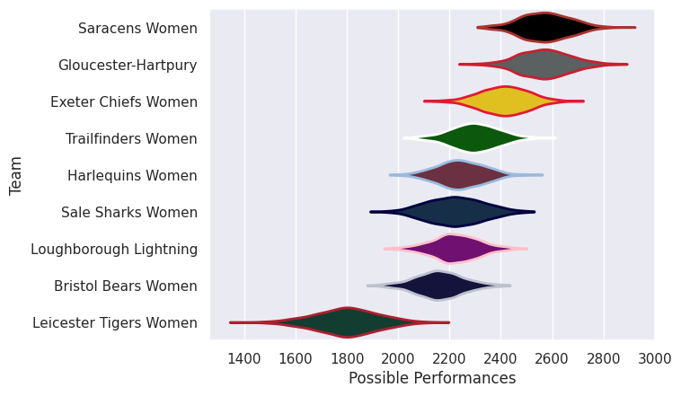
# Standings

## Current Standings

| Club                   |   Played |   Wins |   Point Differential |   Losing Bonus Points |   Try Bonus Points |   Competition Points |
|:-----------------------|---------:|-------:|---------------------:|----------------------:|-------------------:|---------------------:|
| Gloucester-Hartpury    |        8 |      8 |                  188 |                     0 |                    |                   32 |
| Saracens Women         |        8 |      7 |                  205 |                     0 |                    |                   28 |
| Harlequins Women       |        8 |      5 |                   19 |                     2 |                  1 |                   23 |
| Exeter Chiefs Women    |        8 |      4 |                   60 |                     0 |                    |                   20 |
| Trailfinders Women     |        8 |      3 |                   49 |                     2 |                    |                   16 |
| Loughborough Lightning |        8 |      3 |                    7 |                     0 |                    |                   16 |
| Sale Sharks Women      |        8 |      1 |                  -61 |                     3 |                    |                    9 |
| Bristol Bears Women    |        8 |      2 |                  -81 |                     0 |                    |                    8 |
| Leicester Tigers Women |        8 |      0 |                 -386 |                     0 |                    |                    0 |

## Projected Remaining Table

| Club                   |   To Play |   Projected Wins |   Projected Differential |   Projected Losing Bonus Points | Projected Try Bonus Points   |   Projected Competition Points |
|:-----------------------|----------:|-----------------:|-------------------------:|--------------------------------:|:-----------------------------|-------------------------------:|
| Saracens Women         |         3 |            2.277 |                   38.267 |                           0.328 |                              |                          9.62  |
| Trailfinders Women     |         3 |            1.901 |                   16.617 |                           0.507 |                              |                          8.351 |
| Harlequins Women       |         3 |            1.381 |                   -3.536 |                           0.609 |                              |                          6.433 |
| Gloucester-Hartpury    |         2 |            1.489 |                   20.971 |                           0.235 |                              |                          6.317 |
| Exeter Chiefs Women    |         3 |            1.232 |                   -7.162 |                           0.647 |                              |                          5.839 |
| Loughborough Lightning |         2 |            1.007 |                    2.104 |                           0.402 |                              |                          4.586 |
| Bristol Bears Women    |         3 |            0.913 |                  -20.444 |                           0.624 |                              |                          4.524 |
| Sale Sharks Women      |         3 |            0.889 |                  -21.925 |                           0.587 |                              |                          4.397 |
| Leicester Tigers Women |         2 |            0.439 |                  -24.892 |                           0.334 |                              |                          2.206 |

## Projected Total Table

| Club                   |   Played |   Wins |   Point Differential |   Losing Bonus Points |   Try Bonus Points |   Competition Points |
|:-----------------------|---------:|-------:|---------------------:|----------------------:|-------------------:|---------------------:|
| Gloucester-Hartpury    |       10 |  9.489 |              208.971 |                 0.235 |                    |               38.317 |
| Saracens Women         |       11 |  9.277 |              243.267 |                 0.328 |                    |               37.62  |
| Harlequins Women       |       11 |  6.381 |               15.464 |                 2.609 |                  1 |               29.433 |
| Exeter Chiefs Women    |       11 |  5.232 |               52.838 |                 0.647 |                    |               25.839 |
| Trailfinders Women     |       11 |  4.901 |               65.617 |                 2.507 |                    |               24.351 |
| Loughborough Lightning |       10 |  4.007 |                9.104 |                 0.402 |                    |               20.586 |
| Sale Sharks Women      |       11 |  1.889 |              -82.925 |                 3.587 |                    |               13.397 |
| Bristol Bears Women    |       11 |  2.913 |             -101.444 |                 0.624 |                    |               12.524 |
| Leicester Tigers Women |       10 |  0.439 |             -410.892 |                 0.334 |                    |                2.206 |

# Completed Match Review

| Model | Percent Correct Predictions | Spread Error |
| ------ | ------ | ------ |
| Club Level | 79.2% | 15.3 |
| Player Level: Lineup | nan% | nan |
| Player Level: Minutes | nan% | nan |

# Future Predictions

## Week 9

### Sale Sharks Women V Gloucester-Hartpury on 2026/02/07

Average Margin: Gloucester-Hartpury by 11.3

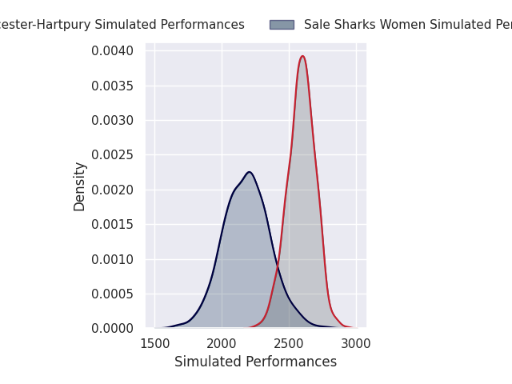
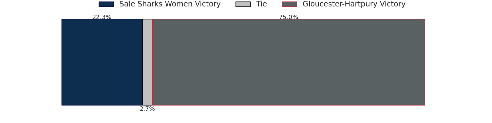
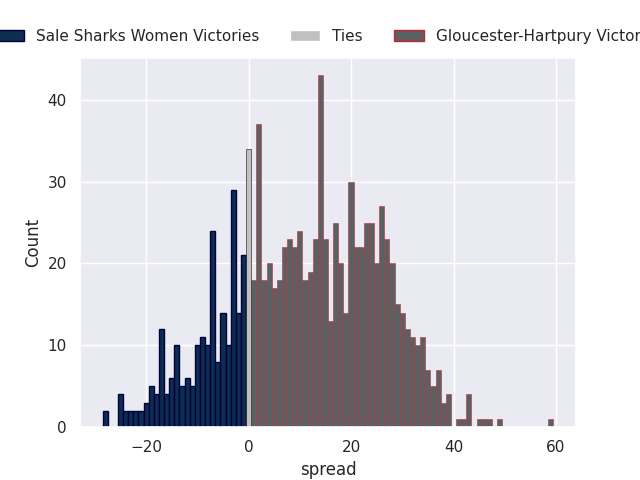

### Bristol Bears Women V Trailfinders Women on 2026/02/07

Average Margin: Trailfinders Women by 0.6

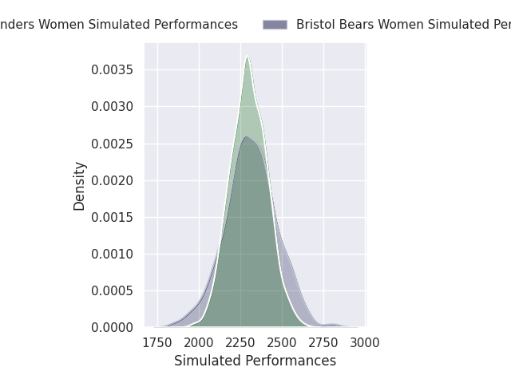
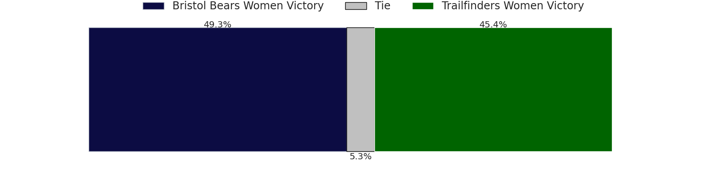
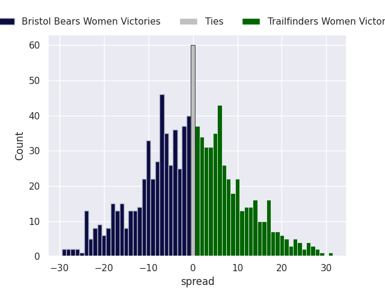

### Leicester Tigers Women V Saracens Women on 2026/02/08

Average Margin: Saracens Women by 16.4

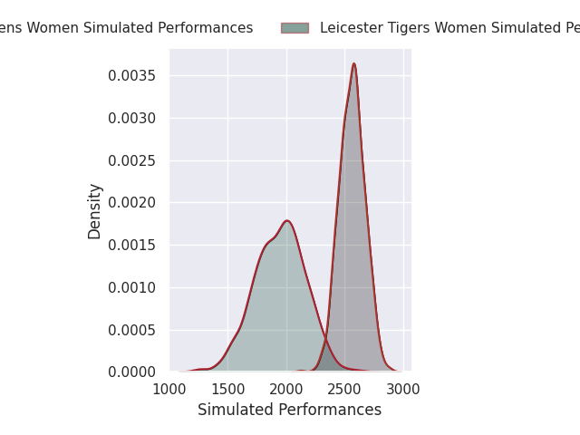
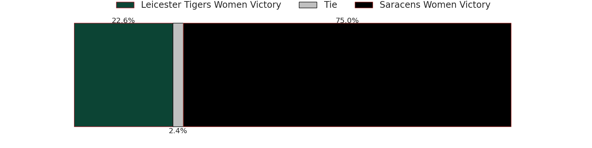
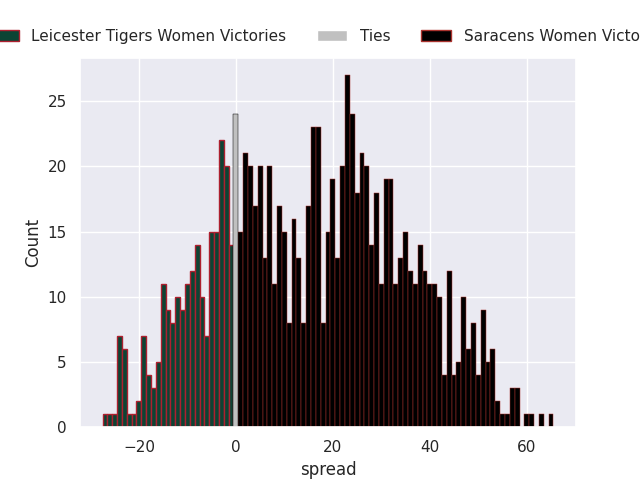

### Harlequins Ladies V Exeter Chiefs Women on 2026/02/08

Average Margin: Harlequins Women by 3.1

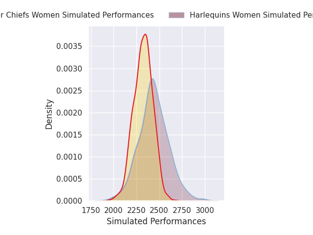
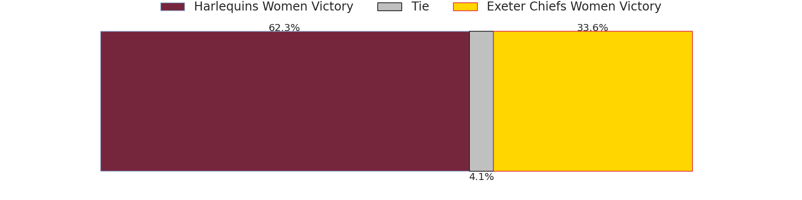
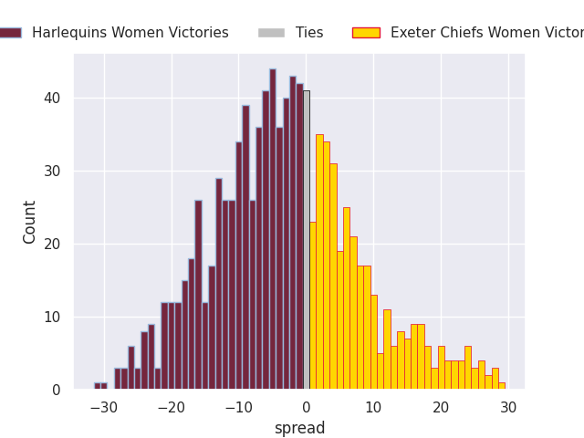

## Week 10

### Gloucester-Hartpury V Harlequins Women on 2026/02/14

Average Margin: Gloucester-Hartpury by 9.6

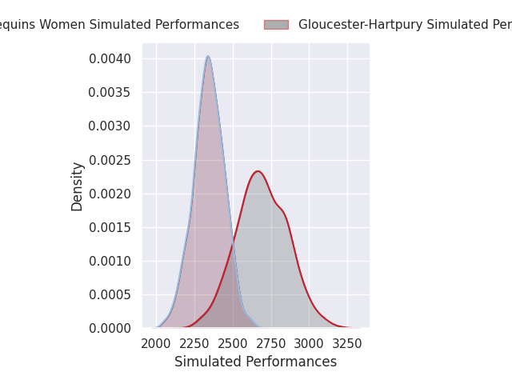
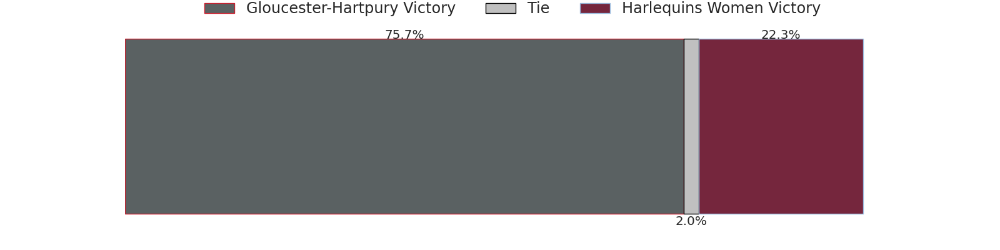
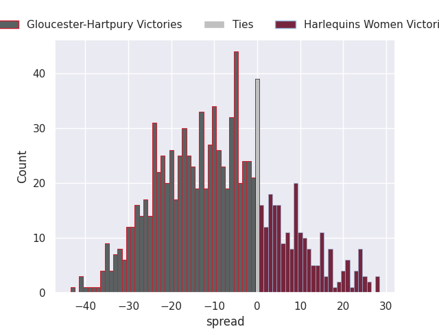

### Trailfinders Women V Sale Sharks Women on 2026/02/14

Average Margin: Trailfinders Women by 7.6

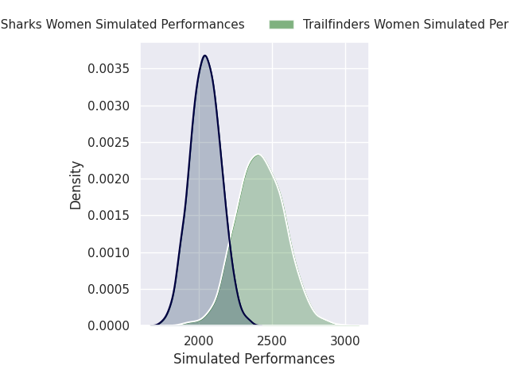
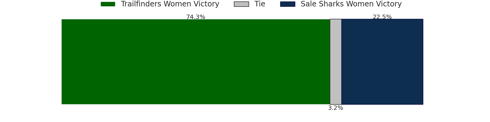
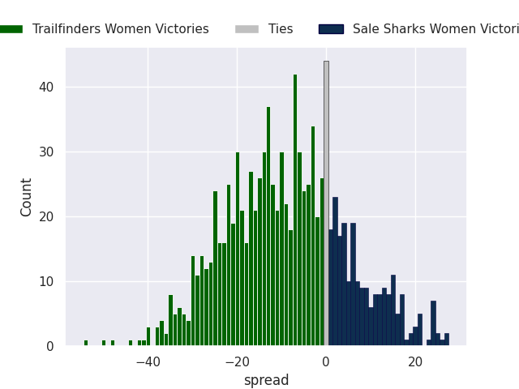

### Saracens Women V Bristol Bears Women on 2026/02/15

Average Margin: Saracens Women by 13.2

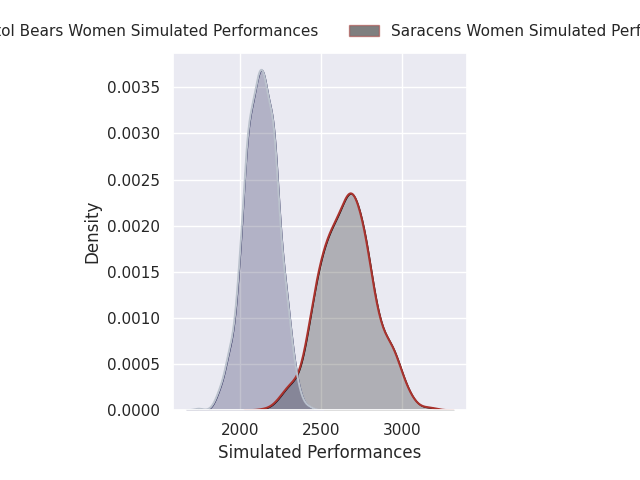

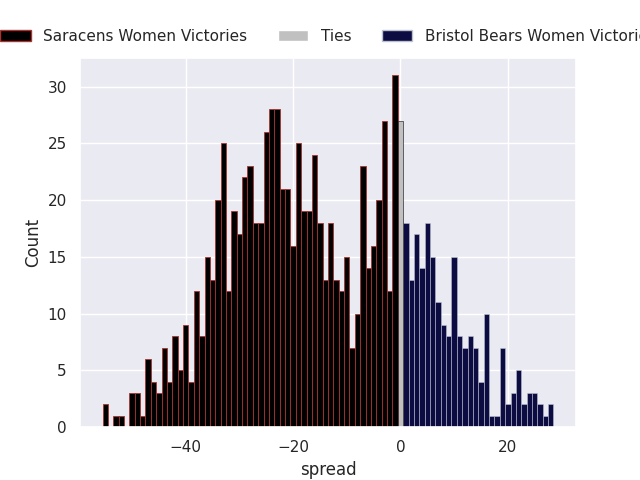

### Exeter Chiefs Women V Loughborough Lightning on 2026/02/15

Average Margin: Exeter Chiefs Women by 4.6

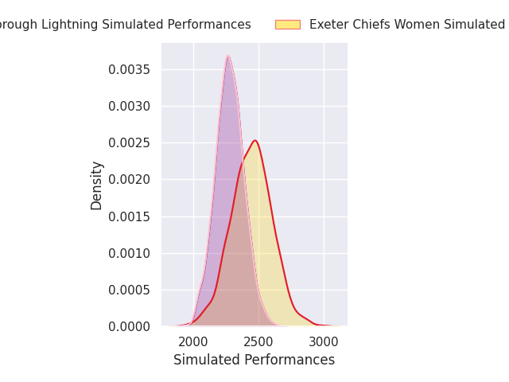
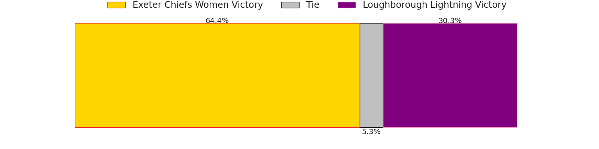
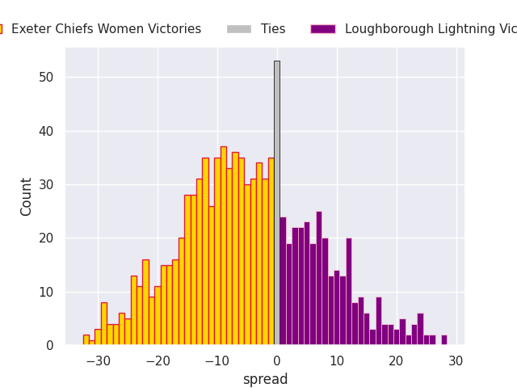

## Week 11

### Saracens Women V Exeter Chiefs Women on 2026/02/21

Average Margin: Saracens Women by 8.7

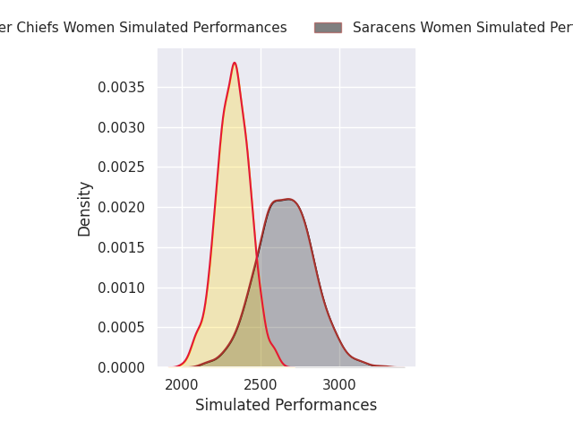

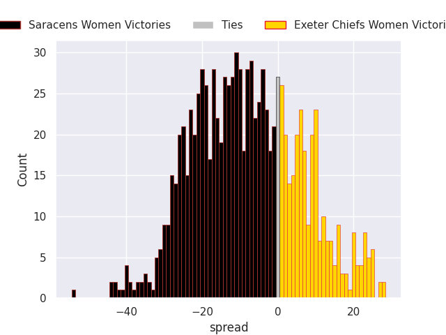

### Sale Sharks Women V Harlequins Women on 2026/02/21

Average Margin: Harlequins Women by 3.0

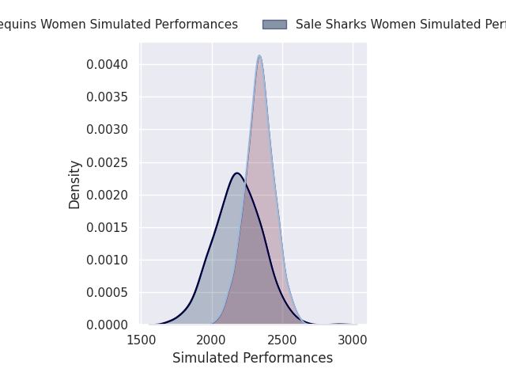
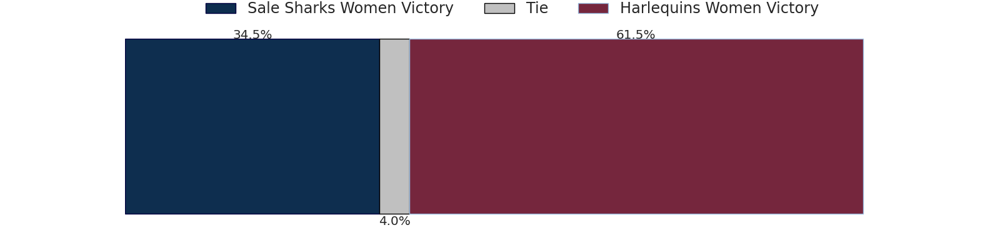
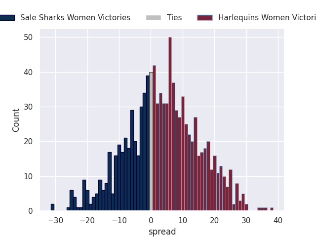

### Leicester Tigers Women V Trailfinders Women on 2026/02/21

Average Margin: Trailfinders Women by 8.5

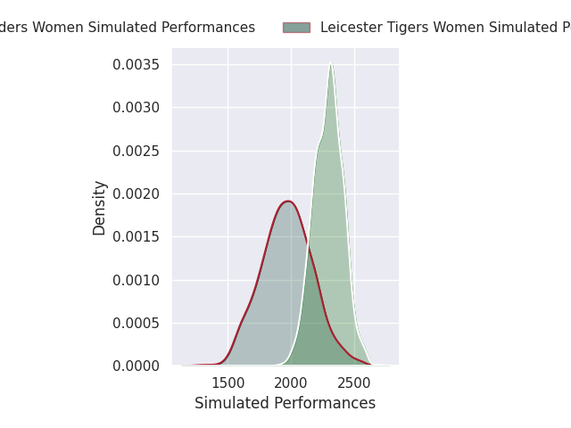
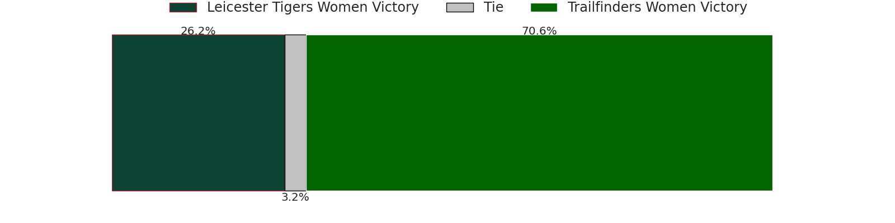
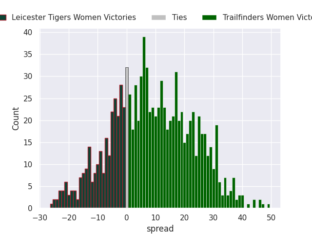

### Loughborough Lightning V Bristol Bears Women on 2026/02/22

Average Margin: Loughborough Lightning by 6.7

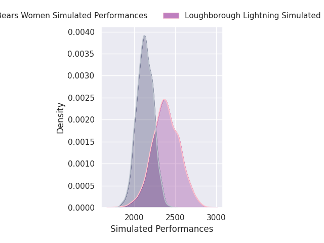
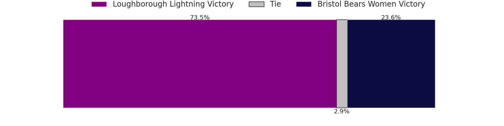
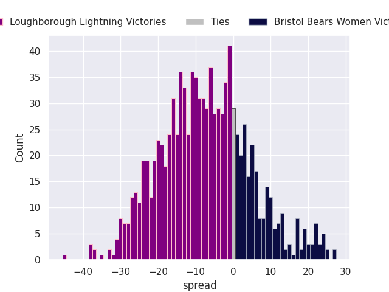

