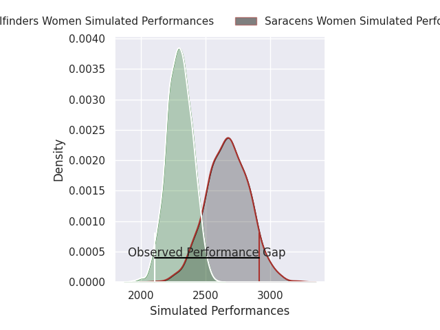
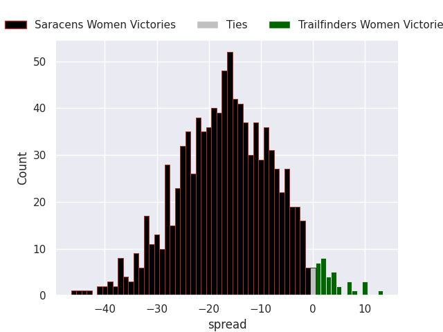

# Team Rankings

# Standings

## Current Standings

| Club                   |   Played |   Wins |   Point Differential |   Losing Bonus Points |   Try Bonus Points |   Competition Points |
|:-----------------------|---------:|-------:|---------------------:|----------------------:|-------------------:|---------------------:|
| Saracens Women         |       17 |     15 |                  499 |                     1 |                    |                   61 |
| Gloucester-Hartpury    |       17 |     14 |                  281 |                     3 |                    |                   59 |
| Exeter Chiefs Women    |       17 |      9 |                  177 |                     1 |                    |                   43 |
| Trailfinders Women     |       17 |      8 |                  -12 |                     3 |                    |                   39 |
| Harlequins Women       |       16 |      6 |                  -20 |                     5 |                  1 |                   32 |
| Sale Sharks Women      |       16 |      6 |                  -69 |                     3 |                    |                   29 |
| Loughborough Lightning |       16 |      5 |                  -51 |                     3 |                    |                   27 |
| Bristol Bears Women    |       16 |      6 |                  -75 |                     1 |                    |                   27 |
| Leicester Tigers Women |       16 |      0 |                 -730 |                     0 |                    |                    0 |

## Projected Remaining Table

| Club               |   To Play |   Projected Wins |   Projected Differential |   Projected Losing Bonus Points | Projected Try Bonus Points   |   Projected Competition Points |
|:-------------------|----------:|-----------------:|-------------------------:|--------------------------------:|:-----------------------------|-------------------------------:|
| Saracens Women     |         1 |            0.96  |                   16.377 |                           0.029 |                              |                          3.881 |
| Trailfinders Women |         1 |            0.034 |                  -16.377 |                           0.136 |                              |                          0.284 |

## Projected Total Table

| Club                   |   Played |   Wins |   Point Differential |   Losing Bonus Points |   Try Bonus Points |   Competition Points |
|:-----------------------|---------:|-------:|---------------------:|----------------------:|-------------------:|---------------------:|
| Saracens Women         |       18 | 15.96  |              515.377 |                 1.029 |                    |               64.881 |
| Gloucester-Hartpury    |       17 | 14     |              281     |                 3     |                    |               59     |
| Exeter Chiefs Women    |       17 |  9     |              177     |                 1     |                    |               43     |
| Trailfinders Women     |       18 |  8.034 |              -28.377 |                 3.136 |                    |               39.284 |
| Harlequins Women       |       16 |  6     |              -20     |                 5     |                  1 |               32     |
| Sale Sharks Women      |       16 |  6     |              -69     |                 3     |                    |               29     |
| Loughborough Lightning |       16 |  5     |              -51     |                 3     |                    |               27     |
| Bristol Bears Women    |       16 |  6     |              -75     |                 1     |                    |               27     |
| Leicester Tigers Women |       16 |  0     |             -730     |                 0     |                    |                0     |

# Completed Match Review

| Model | Percent Correct Predictions | Spread Error |
| ------ | ------ | ------ |
| Club Level | 76.0% | 17.1 |
| Player Level: Lineup | nan% | nan |
| Player Level: Minutes | nan% | nan |

# Future Predictions

## Week 18

### Saracens Women V Trailfinders Women on 2026/06/28

Average Margin: Saracens Women by 16.4

