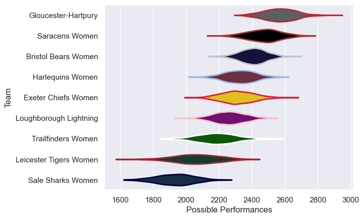

# Team Rankings

# Standings

## Current Standings

| Club                   |   Played |   Wins |   Point Differential |   Losing Bonus Points |   Try Bonus Points |   Competition Points |
|:-----------------------|---------:|-------:|---------------------:|----------------------:|-------------------:|---------------------:|
| Saracens Women         |        8 |      7 |                  205 |                     0 |                    |                   28 |
| Gloucester-Hartpury    |        7 |      7 |                  169 |                     0 |                    |                   28 |
| Harlequins Women       |        7 |      4 |                   18 |                     2 |                  1 |                   19 |
| Loughborough Lightning |        7 |      3 |                   26 |                     0 |                    |                   16 |
| Exeter Chiefs Women    |        7 |      3 |                   24 |                     0 |                    |                   16 |
| Trailfinders Women     |        7 |      3 |                   50 |                     1 |                    |                   15 |
| Sale Sharks Women      |        7 |      1 |                  -60 |                     2 |                    |                    8 |
| Bristol Bears Women    |        7 |      1 |                  -82 |                     0 |                    |                    4 |
| Leicester Tigers Women |        7 |      0 |                 -350 |                     0 |                    |                    0 |

## Projected Remaining Table

| Club               |   To Play |   Projected Wins |   Projected Differential |   Projected Losing Bonus Points | Projected Try Bonus Points   |   Projected Competition Points |
|:-------------------|----------:|-----------------:|-------------------------:|--------------------------------:|:-----------------------------|-------------------------------:|
| Trailfinders Women |         1 |            0.565 |                    2.321 |                           0.21  |                              |                          2.594 |
| Harlequins Women   |         1 |            0.373 |                   -2.321 |                           0.253 |                              |                          1.869 |

## Projected Total Table

| Club                   |   Played |   Wins |   Point Differential |   Losing Bonus Points |   Try Bonus Points |   Competition Points |
|:-----------------------|---------:|-------:|---------------------:|----------------------:|-------------------:|---------------------:|
| Saracens Women         |        8 |  7     |              205     |                 0     |                    |               28     |
| Gloucester-Hartpury    |        7 |  7     |              169     |                 0     |                    |               28     |
| Harlequins Women       |        8 |  4.373 |               15.679 |                 2.253 |                  1 |               20.869 |
| Trailfinders Women     |        8 |  3.565 |               52.321 |                 1.21  |                    |               17.594 |
| Loughborough Lightning |        7 |  3     |               26     |                 0     |                    |               16     |
| Exeter Chiefs Women    |        7 |  3     |               24     |                 0     |                    |               16     |
| Sale Sharks Women      |        7 |  1     |              -60     |                 2     |                    |                8     |
| Bristol Bears Women    |        7 |  1     |              -82     |                 0     |                    |                4     |
| Leicester Tigers Women |        7 |  0     |             -350     |                 0     |                    |                0     |

# Completed Match Review

| Model | Percent Correct Predictions | Spread Error |
| ------ | ------ | ------ |
| Club Level | 78.8% | 19.0 |
| Player Level: Lineup | nan% | nan |
| Player Level: Minutes | nan% | nan |

# Future Predictions

## Week 9

### Trailfinders Women V Harlequins Women on 2026/01/30

Average Margin: Trailfinders Women by 2.3

