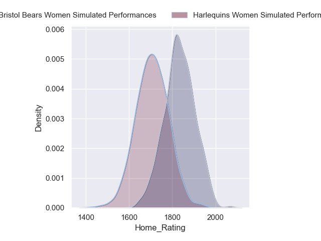
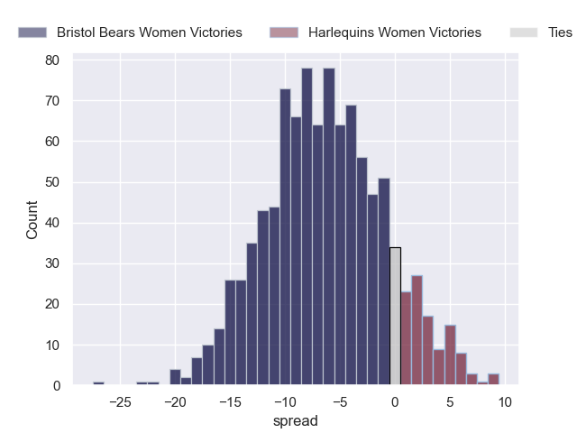
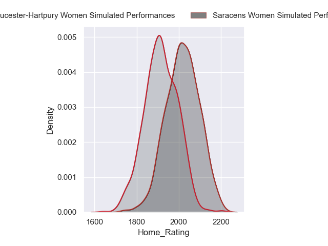
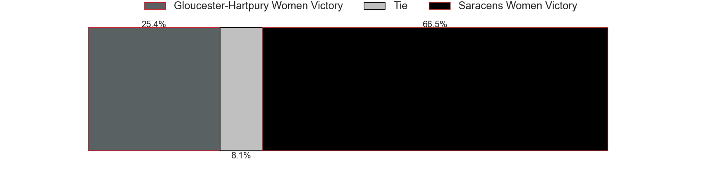
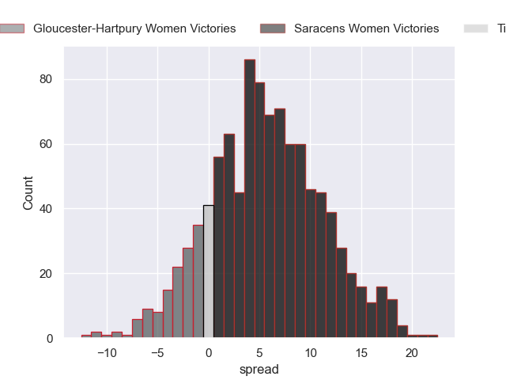
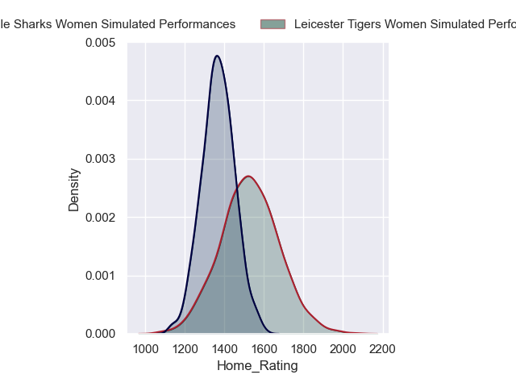
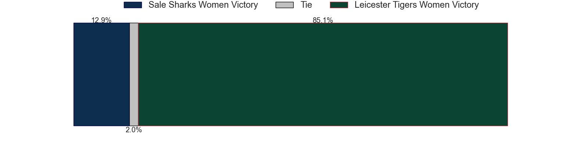
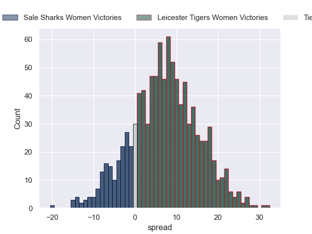

---  
title: "P 2024 Status"  
date: 2024-05-20 6:00:00 -0500  
categories: model review projection  
layout: article  
aside:  
    toc: true  
---
# Current Team Rankings

# Standings

## Projected Total Table

| Club                      |   Total Matches |   Wins |   Point Differential |   Losing Bonus Points |   Try Bonus Points |   Competition Points |
|:--------------------------|----------------:|-------:|---------------------:|----------------------:|-------------------:|---------------------:|
| Bristol Bears Women       |               1 |    0.9 |              7.1049  |                   0.1 |                0.5 |                  4.2 |
| Saracens Women            |               1 |    0.8 |              4.35788 |                   0.2 |                0.2 |                  3.6 |
| Leicester Tigers Women    |               1 |    0.8 |              6.13855 |                   0.2 |                0.3 |                  3.5 |
| Sale Sharks Women         |               1 |    0.2 |             -6.13855 |                   0.3 |                0.4 |                  1.6 |
| Gloucester-Hartpury Women |               1 |    0.2 |             -4.35788 |                   0.5 |                0.2 |                  1.5 |
| Harlequins Women          |               1 |    0.1 |             -7.1049  |                   0.4 |                0.1 |                  0.9 |

# Future Predictions

## Week 1

### Harlequins Women V Bristol Bears Women on 2024/05/25

Average Margin: Bristol Bears Women by 7.1

Average Scoreline: 34-27

### Saracens Women V Gloucester-Hartpury Women on 2024/05/25

Average Margin: Saracens Women by 4.4

Average Scoreline: 38-34

### Leicester Tigers Women V Sale Sharks Women on 2024/05/25

Average Margin: Leicester Tigers Women by 6.1

Average Scoreline: 34-28

