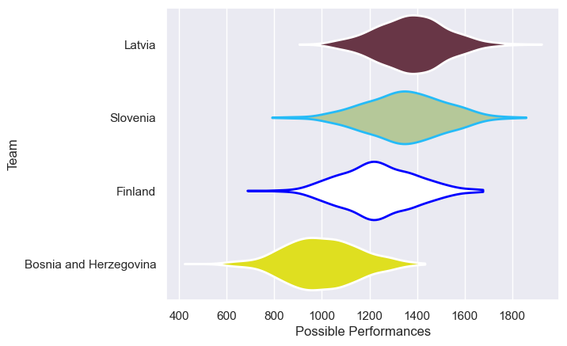
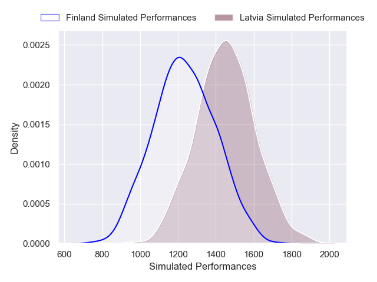
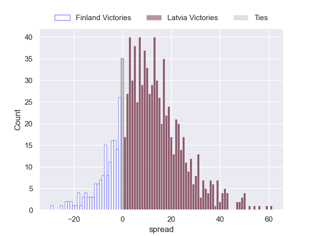
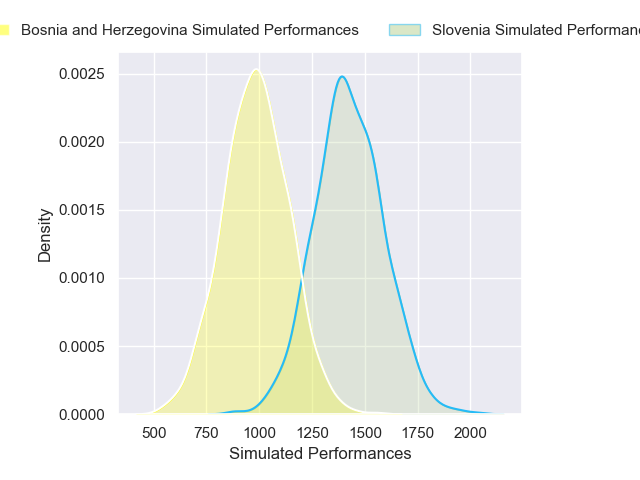
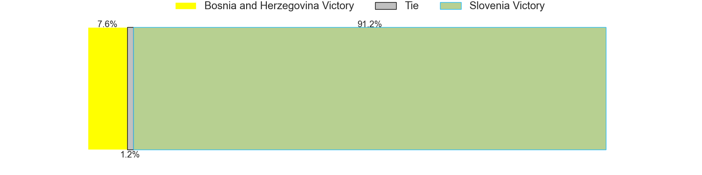
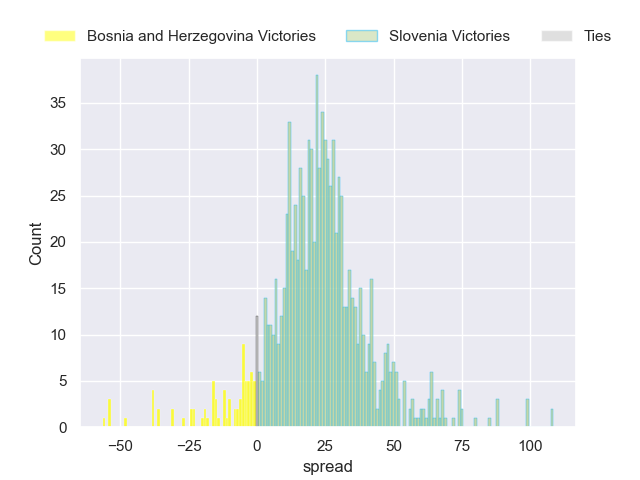

---  
title: "P 2025 Status"  
date: 2025-04-21 6:00:00 -0500  
categories: model review projection  
layout: article  
aside:  
    toc: true  
---
# Current Team Rankings

# Standings

## Projected Total Table

| Club                   |   Total Matches |   Wins |   Point Differential |   Losing Bonus Points |   Try Bonus Points |   Competition Points |
|:-----------------------|----------------:|-------:|---------------------:|----------------------:|-------------------:|---------------------:|
| Slovenia               |               1 |    0.9 |              21.7811 |                   0.1 |                0.7 |                  4.4 |
| Latvia                 |               1 |    0.8 |              11.3476 |                   0.1 |                0.5 |                  3.9 |
| Finland                |               1 |    0.2 |             -11.3476 |                   0.2 |                0.4 |                  1.3 |
| Bosnia and Herzegovina |               1 |    0.1 |             -21.7811 |                   0.1 |                0.3 |                  0.7 |

# Future Predictions

## Week 1

### Latvia V Finland on 2025/04/26

Average Margin: Latvia by 11.3

Average Scoreline: 24-12

### Slovenia V Bosnia and Herzegovina on 2025/04/26

Average Margin: Slovenia by 21.8

Average Scoreline: 31-9

