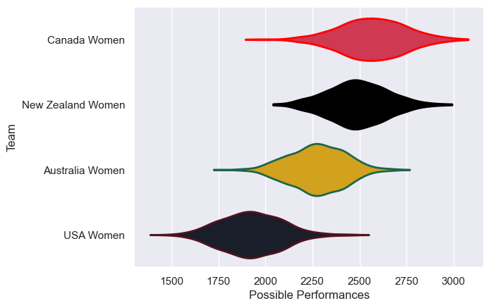

---  
title: "Pacific Four Series 2025"  
date: 2025-07-29 6:00:00 -0500  
categories: model review projection  
layout: article  
aside:  
    toc: true  
---
# Current Team Rankings

# Standings

## Current Standings

| Club              |   Played |   Wins |   Point Differential |   Losing Bonus Points |   Try Bonus Points |   Competition Points |
|:------------------|---------:|-------:|---------------------:|----------------------:|-------------------:|---------------------:|
| New Zealand Women |        3 |      2 |                   91 |                     0 |                  3 |                   13 |
| Canada Women      |        3 |      2 |                   50 |                     0 |                  3 |                   13 |
| Australia Women   |        3 |      1 |                  -56 |                     0 |                  1 |                    5 |
| USA Women         |        3 |      0 |                  -85 |                     0 |                    |                    0 |

# Completed Match Review

| Model | Percent Correct Predictions | Spread Error |
| ------ | ------ | ------ |
| Club Level | 83.3% | 19.0 |
| Player Level: Lineup | nan% | nan |
| Player Level: Minutes | nan% | nan |

