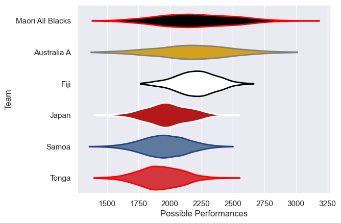

---  
title: "Pacific Nations Cup 2008 Status"  
date: 2025-07-28 6:00:00 -0500  
categories: model review projection  
layout: article  
aside:  
    toc: true  
---
# Current Team Rankings

# Standings

## Current Standings

| Club             |   Played |   Wins |   Point Differential |   Losing Bonus Points | Try Bonus Points   |   Competition Points |
|:-----------------|---------:|-------:|---------------------:|----------------------:|:-------------------|---------------------:|
| Australia A      |        3 |      3 |                  109 |                     0 |                    |                   12 |
| Maori All Blacks |        3 |      3 |                   58 |                     0 |                    |                   12 |
| Fiji             |        4 |      2 |                   14 |                     1 |                    |                    9 |
| Samoa            |        4 |      2 |                  -11 |                     1 |                    |                    9 |
| Japan            |        5 |      1 |                  -60 |                     1 |                    |                    5 |
| Tonga            |        5 |      1 |                 -110 |                     1 |                    |                    5 |

# Completed Match Review

| Model | Percent Correct Predictions | Spread Error |
| ------ | ------ | ------ |
| Club Level | 60.0% | 21.1 |
| Player Level: Lineup | nan% | nan |
| Player Level: Minutes | nan% | nan |

