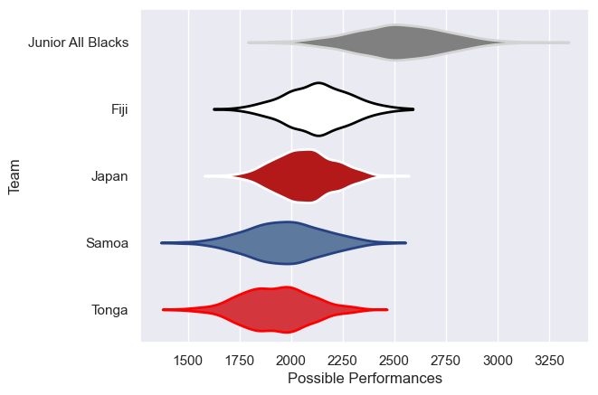

---  
title: "Pacific Nations Cup 2009 Status"  
date: 2025-07-28 6:00:00 -0500  
categories: model review projection  
layout: article  
aside:  
    toc: true  
---
# Current Team Rankings

# Standings

## Current Standings

| Club              |   Played |   Wins |   Point Differential |   Losing Bonus Points | Try Bonus Points   |   Competition Points |
|:------------------|---------:|-------:|---------------------:|----------------------:|:-------------------|---------------------:|
| Junior All Blacks |        4 |      4 |                   82 |                     0 |                    |                   16 |
| Fiji              |        4 |      3 |                   -8 |                     0 |                    |                   12 |
| Samoa             |        4 |      2 |                   27 |                     2 |                    |                   10 |
| Japan             |        4 |      1 |                  -49 |                     1 |                    |                    5 |
| Tonga             |        4 |      0 |                  -52 |                     1 |                    |                    1 |

# Completed Match Review

| Model | Percent Correct Predictions | Spread Error |
| ------ | ------ | ------ |
| Club Level | 60.0% | 14.8 |
| Player Level: Lineup | nan% | nan |
| Player Level: Minutes | nan% | nan |

