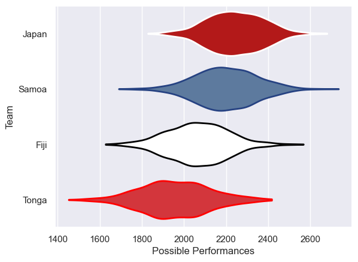

---  
title: "Pacific Nations Cup 2010"  
date: 2025-07-29 6:00:00 -0500  
categories: model review projection  
layout: article  
aside:  
    toc: true  
---
# Current Team Rankings

# Standings

## Current Standings

| Club   |   Played |   Wins |   Point Differential |   Losing Bonus Points | Try Bonus Points   |   Competition Points |
|:-------|---------:|-------:|---------------------:|----------------------:|:-------------------|---------------------:|
| Samoa  |        3 |      2 |                   15 |                     0 |                    |                    8 |
| Japan  |        3 |      2 |                   -3 |                     0 |                    |                    8 |
| Fiji   |        3 |      2 |                   -5 |                     0 |                    |                    8 |
| Tonga  |        3 |      0 |                   -7 |                     3 |                    |                    3 |

# Completed Match Review

| Model | Percent Correct Predictions | Spread Error |
| ------ | ------ | ------ |
| Club Level | 66.7% | 11.6 |
| Player Level: Lineup | nan% | nan |
| Player Level: Minutes | nan% | nan |

