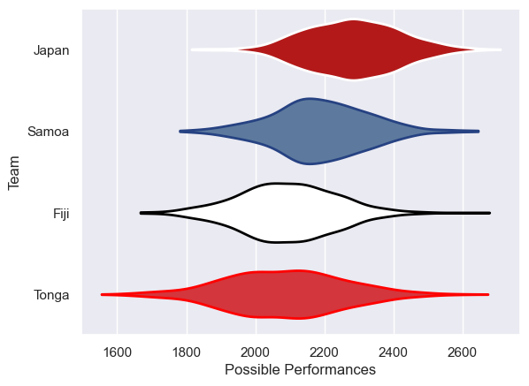

---  
title: "Pacific Nations Cup 2011 Status"  
date: 2025-07-28 6:00:00 -0500  
categories: model review projection  
layout: article  
aside:  
    toc: true  
---
# Current Team Rankings

# Standings

## Current Standings

| Club   |   Played |   Wins |   Point Differential |   Losing Bonus Points | Try Bonus Points   |   Competition Points |
|:-------|---------:|-------:|---------------------:|----------------------:|:-------------------|---------------------:|
| Tonga  |        3 |      2 |                   33 |                     1 |                    |                    9 |
| Japan  |        3 |      2 |                   -7 |                     0 |                    |                    8 |
| Samoa  |        3 |      1 |                   -9 |                     0 |                    |                    4 |
| Fiji   |        3 |      1 |                  -17 |                     0 |                    |                    4 |

# Completed Match Review

| Model | Percent Correct Predictions | Spread Error |
| ------ | ------ | ------ |
| Club Level | 50.0% | 18.0 |
| Player Level: Lineup | nan% | nan |
| Player Level: Minutes | nan% | nan |

