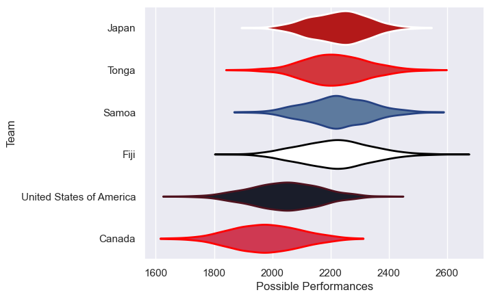

---  
title: "Pacific Nations Cup 2015"  
date: 2025-07-29 6:00:00 -0500  
categories: model review projection  
layout: article  
aside:  
    toc: true  
---
# Current Team Rankings

# Standings

## Current Standings

| Club                     |   Played |   Wins |   Point Differential |   Losing Bonus Points | Try Bonus Points   |   Competition Points |
|:-------------------------|---------:|-------:|---------------------:|----------------------:|:-------------------|---------------------:|
| Fiji                     |        4 |      3 |                   23 |                     0 |                    |                   14 |
| Tonga                    |        4 |      3 |                   27 |                     0 |                    |                   12 |
| Samoa                    |        4 |      2 |                   -4 |                     0 |                    |                   10 |
| United States of America |        4 |      2 |                  -12 |                     1 |                    |                    9 |
| Canada                   |        5 |      0 |                  -13 |                     2 |                    |                    6 |
| Japan                    |        3 |      0 |                  -21 |                     2 |                    |                    2 |

# Completed Match Review

| Model | Percent Correct Predictions | Spread Error |
| ------ | ------ | ------ |
| Club Level | 58.3% | 5.6 |
| Player Level: Lineup | nan% | nan |
| Player Level: Minutes | nan% | nan |

