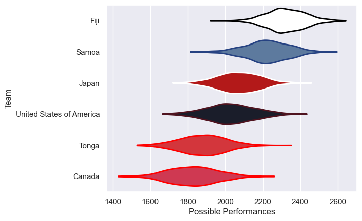

---  
title: "Pacific Nations Cup 2024 Status"  
date: 2025-07-28 6:00:00 -0500  
categories: model review projection  
layout: article  
aside:  
    toc: true  
---
# Current Team Rankings

# Standings

## Current Standings

| Club                     |   Played |   Wins |   Point Differential |   Losing Bonus Points |   Try Bonus Points |   Competition Points |
|:-------------------------|---------:|-------:|---------------------:|----------------------:|-------------------:|---------------------:|
| Fiji                     |        4 |      4 |                  100 |                     0 |                  3 |                   19 |
| Japan                    |        4 |      3 |                   42 |                     0 |                  3 |                   15 |
| Samoa                    |        5 |      2 |                  -22 |                     1 |                  1 |                   10 |
| United States of America |        3 |      1 |                  -23 |                     0 |                  1 |                    5 |
| Tonga                    |        3 |      1 |                  -44 |                     0 |                  1 |                    5 |
| Canada                   |        3 |      0 |                  -53 |                     0 |                  1 |                    1 |

# Completed Match Review

| Model | Percent Correct Predictions | Spread Error |
| ------ | ------ | ------ |
| Club Level | 90.9% | 11.1 |
| Player Level: Lineup | nan% | nan |
| Player Level: Minutes | nan% | nan |

