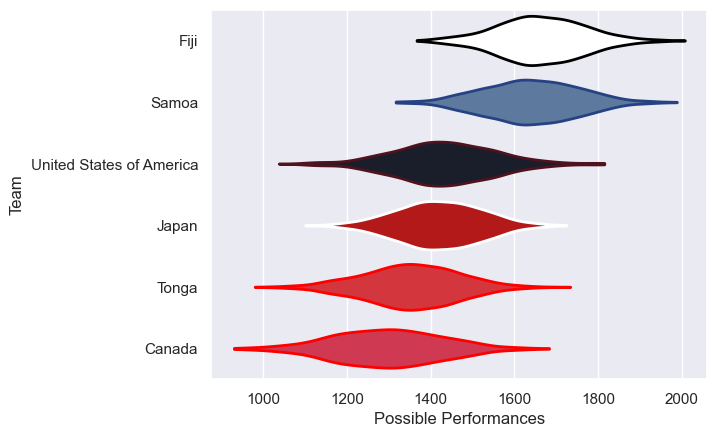
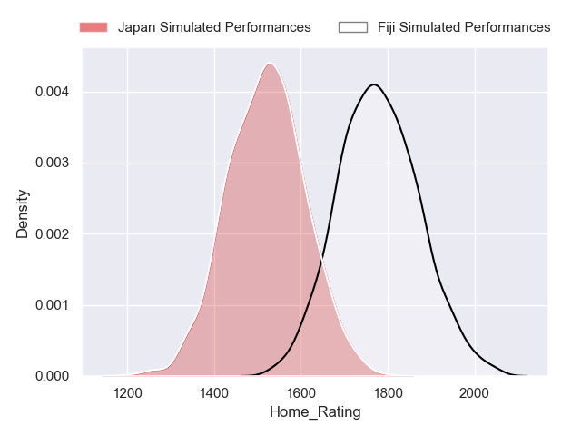
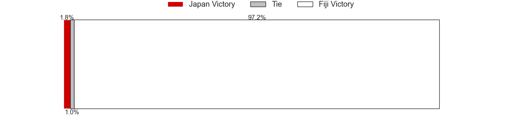
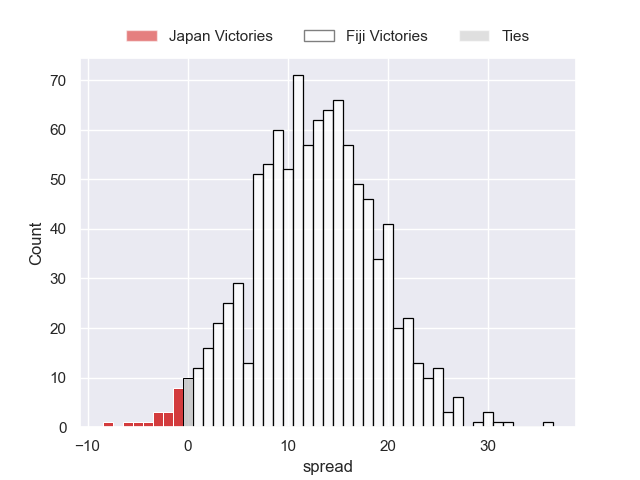
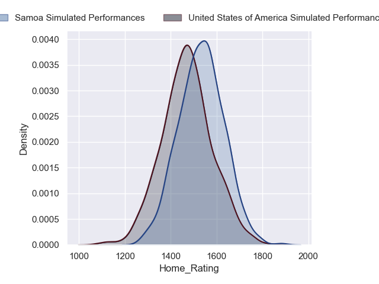
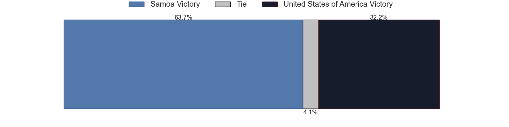
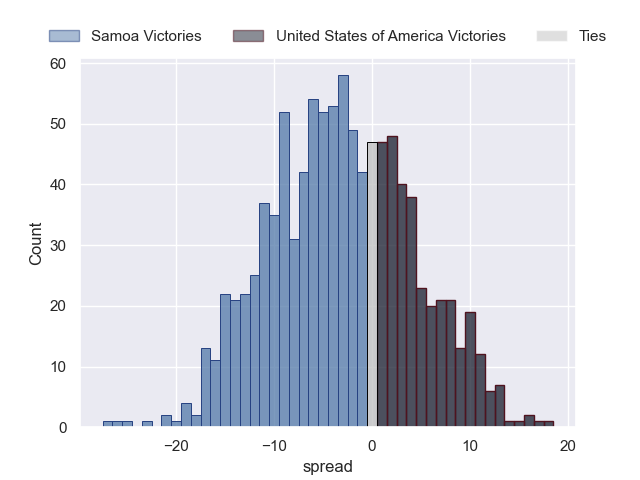

---  
title: "Pacific Nations Cup 2024 Status"  
date: 2024-09-20 6:00:00 -0500  
categories: model review projection  
layout: article  
aside:  
    toc: true  
---
# Current Team Rankings

# Standings

## Current Standings

| Club                     |   Played |   Wins |   Point Differential |   Losing Bonus Points |   Try Bonus Points |   Competition Points |
|:-------------------------|---------:|-------:|---------------------:|----------------------:|-------------------:|---------------------:|
| Fiji                     |        3 |      3 |                   76 |                     0 |                nan |                   12 |
| Japan                    |        3 |      3 |                   66 |                     0 |                nan |                   12 |
| Tonga                    |        3 |      1 |                  -44 |                     0 |                nan |                    5 |
| Samoa                    |        3 |      1 |                  -22 |                     0 |                nan |                    4 |
| United States of America |        3 |      1 |                  -23 |                     0 |                nan |                    4 |
| Canada                   |        3 |      0 |                  -53 |                     0 |                nan |                    0 |

## Projected Remaining Table

| Club                     |   Matches Remaining |   Wins |   Point Differential |   Losing Bonus Points |   Try Bonus Points |   Competition Points |
|:-------------------------|--------------------:|-------:|---------------------:|----------------------:|-------------------:|---------------------:|
| Fiji                     |                   1 |    1   |             12.4835  |                   0   |                0.5 |                  4.4 |
| Samoa                    |                   1 |    0.7 |              3.13759 |                   0.3 |                0.3 |                  3.2 |
| United States of America |                   1 |    0.3 |             -3.13759 |                   0.4 |                0.2 |                  2   |
| Japan                    |                   1 |    0   |            -12.4835  |                   0.2 |                0.1 |                  0.4 |

## Projected Total Table

| Club                     |   Total Matches |   Wins |   Point Differential |   Losing Bonus Points |   Try Bonus Points |   Competition Points |
|:-------------------------|----------------:|-------:|---------------------:|----------------------:|-------------------:|---------------------:|
| Fiji                     |               4 |    4   |              88.4835 |                   0   |                0.5 |                 16.4 |
| Japan                    |               4 |    3   |              53.5165 |                   0.2 |                0.1 |                 12.4 |
| Samoa                    |               4 |    1.7 |             -18.8624 |                   0.3 |                0.3 |                  7.2 |
| United States of America |               4 |    1.3 |             -26.1376 |                   0.4 |                0.2 |                  6   |
| Tonga                    |               3 |    1   |             -44      |                   0   |                0   |                  5   |
| Canada                   |               3 |    0   |             -53      |                   0   |                0   |                  0   |

# Completed Match Review

| Model | Percent Correct Predictions | Spread Error |
| ------ | ------ | ------ |
| Club Level | 88.9% | 13.8 |
| Player Level: Lineup | 66.7% | 13.8 |
| Player Level: Minutes | 75.0% | 13.7 |

# Future Predictions

## Week 4

### Fiji V Japan on 2024/09/21

Average Margin: Fiji by 12.5

Average Scoreline: 38-25

### United States of America V Samoa on 2024/09/21

Average Margin: Samoa by 3.1

Average Scoreline: 21-18

