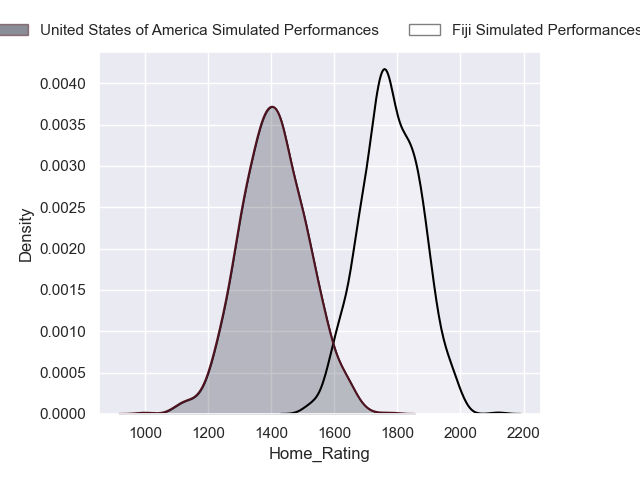
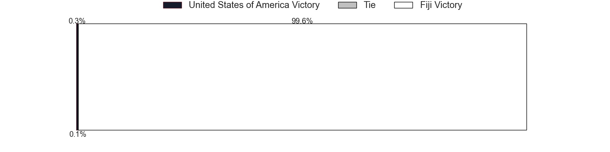
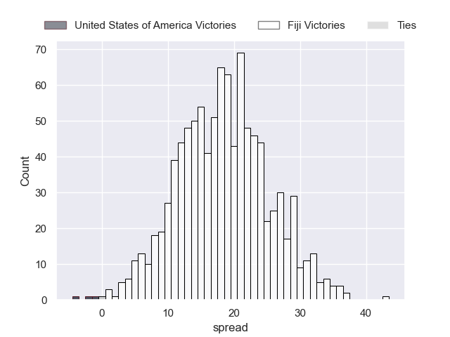
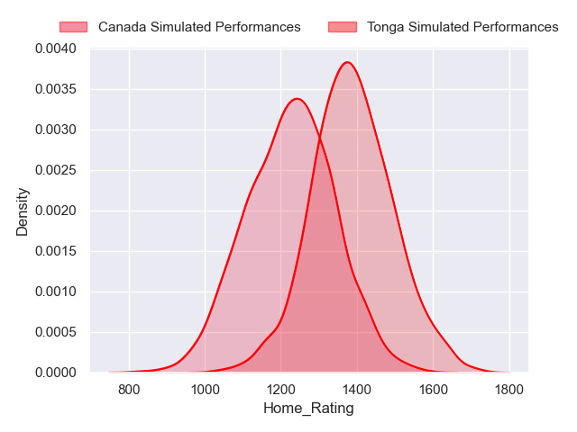
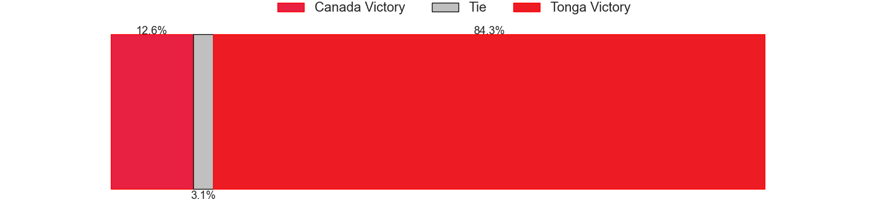
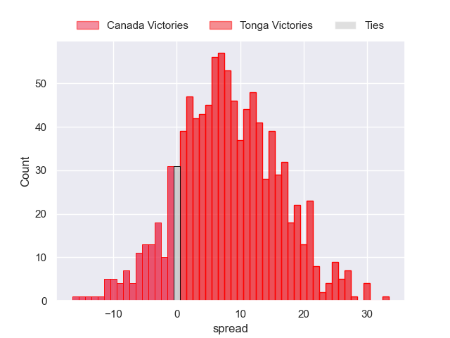
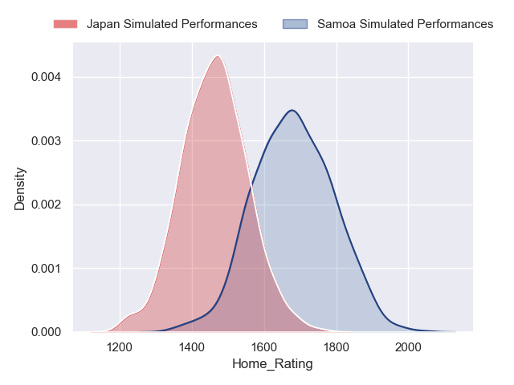
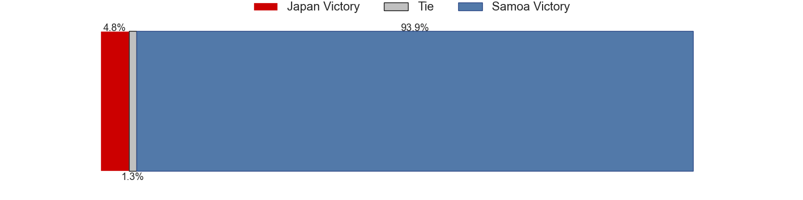
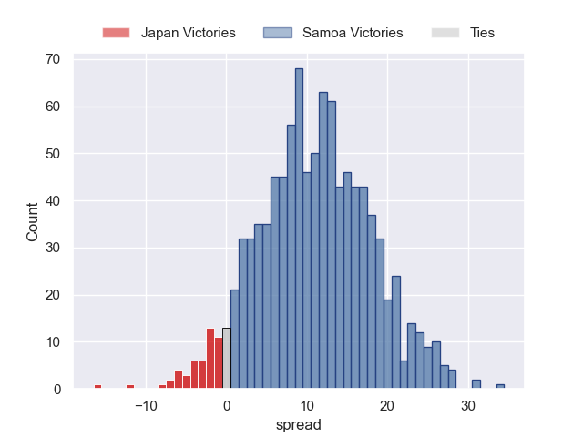

---  
title: "Pacific Nations Cup 2024 Status"  
date: 2024-09-09 6:00:00 -0500  
categories: model review projection  
layout: article  
aside:  
    toc: true  
---
# Current Team Rankings

# Standings

## Current Standings

| Club                     |   Played |   Wins |   Point Differential |   Losing Bonus Points |   Try Bonus Points |   Competition Points |
|:-------------------------|---------:|-------:|---------------------:|----------------------:|-------------------:|---------------------:|
| Fiji                     |        2 |      2 |                   57 |                     0 |                  2 |                   10 |
| Japan                    |        2 |      2 |                   44 |                     0 |                  2 |                   10 |
| Samoa                    |        2 |      1 |                    0 |                     0 |                  1 |                    5 |
| United States of America |        2 |      1 |                   -4 |                     0 |                  1 |                    5 |
| Canada                   |        2 |      0 |                  -40 |                     0 |                  1 |                    1 |
| Tonga                    |        2 |      0 |                  -57 |                     0 |                  0 |                    0 |

## Projected Remaining Table

| Club                     |   Matches Remaining |   Wins |   Point Differential |   Losing Bonus Points |   Try Bonus Points |   Competition Points |
|:-------------------------|--------------------:|-------:|---------------------:|----------------------:|-------------------:|---------------------:|
| Fiji                     |                   1 |    1   |             18.4067  |                   0   |                0.7 |                  4.7 |
| Samoa                    |                   1 |    0.9 |             10.967   |                   0   |                0.4 |                  4.2 |
| Tonga                    |                   1 |    0.9 |              8.12978 |                   0.1 |                0.6 |                  4.1 |
| Canada                   |                   1 |    0.1 |             -8.12978 |                   0.3 |                0.1 |                  0.9 |
| Japan                    |                   1 |    0.1 |            -10.967   |                   0.2 |                0.2 |                  0.6 |
| United States of America |                   1 |    0   |            -18.4067  |                   0   |                0.1 |                  0.2 |

## Projected Total Table

| Club                     |   Total Matches |   Wins |   Point Differential |   Losing Bonus Points |   Try Bonus Points |   Competition Points |
|:-------------------------|----------------:|-------:|---------------------:|----------------------:|-------------------:|---------------------:|
| Fiji                     |               3 |    3   |              75.4067 |                   0   |                2.7 |                 14.7 |
| Japan                    |               3 |    2.1 |              33.033  |                   0.2 |                2.2 |                 10.6 |
| Samoa                    |               3 |    1.9 |              10.967  |                   0   |                1.4 |                  9.2 |
| United States of America |               3 |    1   |             -22.4067 |                   0   |                1.1 |                  5.2 |
| Tonga                    |               3 |    0.9 |             -48.8702 |                   0.1 |                0.6 |                  4.1 |
| Canada                   |               3 |    0.1 |             -48.1298 |                   0.3 |                1.1 |                  1.9 |

# Completed Match Review

| Model | Percent Correct Predictions | Spread Error |
| ------ | ------ | ------ |
| Club Level | 100.0% | 14.3 |
| Player Level: Lineup | 100.0% | 15.2 |
| Player Level: Minutes | nan% | nan |

# Future Predictions

## Week 3

### Fiji V United States of America on 2024/09/14

Average Margin: Fiji by 18.4

Average Scoreline: 36-18

### Tonga V Canada on 2024/09/14

Average Margin: Tonga by 8.1

Average Scoreline: 28-20

### Samoa V Japan on 2024/09/15

Average Margin: Samoa by 11.0

Average Scoreline: 33-22

