---  
title: "Pacific Nations Cup 2024 Status"  
date: 2024-08-29 6:00:00 -0500  
categories: model review projection  
layout: article  
aside:  
    toc: true  
---
# Current Team Rankings

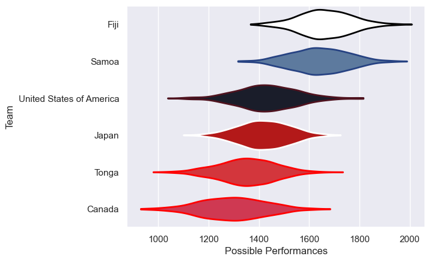
# Standings

## Current Standings

| Club   |   Played |   Wins |   Point Differential |   Losing Bonus Points |   Try Bonus Points |   Competition Points |
|:-------|---------:|-------:|---------------------:|----------------------:|-------------------:|---------------------:|
| Japan  |        1 |      1 |                   27 |                     0 |                  1 |                    5 |
| Fiji   |        1 |      1 |                   26 |                     0 |                  1 |                    5 |
| Canada |        1 |      0 |                  -27 |                     0 |                  1 |                    1 |
| Samoa  |        1 |      0 |                  -26 |                     0 |                  0 |                    0 |

## Projected Remaining Table

| Club                     |   Matches Remaining |   Wins |   Point Differential |   Losing Bonus Points |   Try Bonus Points |   Competition Points |
|:-------------------------|--------------------:|-------:|---------------------:|----------------------:|-------------------:|---------------------:|
| United States of America |                   2 |    1.3 |             10.4345  |                   0.4 |                1   |                  6.4 |
| Fiji                     |                   1 |    1   |             13.777   |                   0   |                0.8 |                  4.7 |
| Samoa                    |                   1 |    1   |             16.4073  |                   0   |                0.7 |                  4.6 |
| Japan                    |                   1 |    0.7 |              3.63883 |                   0.2 |                0.3 |                  3.3 |
| Tonga                    |                   2 |    0   |            -30.1844  |                   0.3 |                0.3 |                  0.7 |
| Canada                   |                   1 |    0.1 |            -14.0733  |                   0.1 |                0.1 |                  0.5 |

## Projected Total Table

| Club                     |   Total Matches |   Wins |   Point Differential |   Losing Bonus Points |   Try Bonus Points |   Competition Points |
|:-------------------------|----------------:|-------:|---------------------:|----------------------:|-------------------:|---------------------:|
| Fiji                     |               2 |    2   |             39.777   |                   0   |                1.8 |                  9.7 |
| Japan                    |               2 |    1.7 |             30.6388  |                   0.2 |                1.3 |                  8.3 |
| United States of America |               2 |    1.3 |             10.4345  |                   0.4 |                1   |                  6.4 |
| Samoa                    |               2 |    1   |             -9.59267 |                   0   |                0.7 |                  4.6 |
| Canada                   |               2 |    0.1 |            -41.0733  |                   0.1 |                1.1 |                  1.5 |
| Tonga                    |               2 |    0   |            -30.1844  |                   0.3 |                0.3 |                  0.7 |

# Completed Match Review

| Model | Percent Correct Predictions | Spread Error |
| ------ | ------ | ------ |
| Club Level | 100.0% | 23.3 |
| Player Level: Lineup | 100.0% | 19.0 |
| Player Level: Minutes | 100.0% | 24.8 |

# Future Predictions

## Week 2

### Samoa V Tonga on 2024/08/30

Average Margin: Samoa by 16.4

Average Scoreline: 37-20

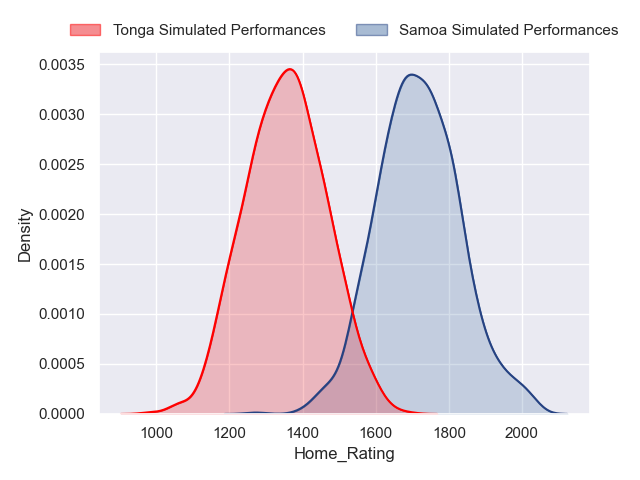
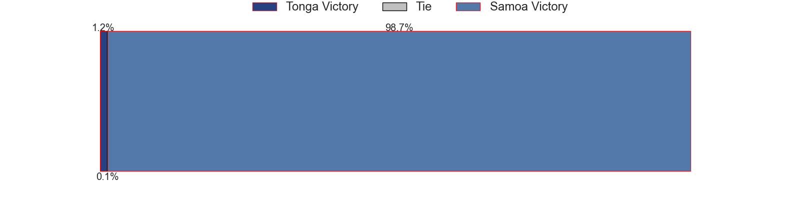
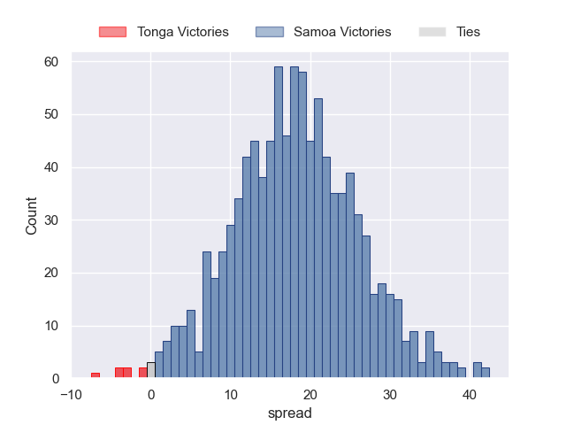

### United States of America V Canada on 2024/09/01

Average Margin: United States of America by 14.1

Average Scoreline: 34-20

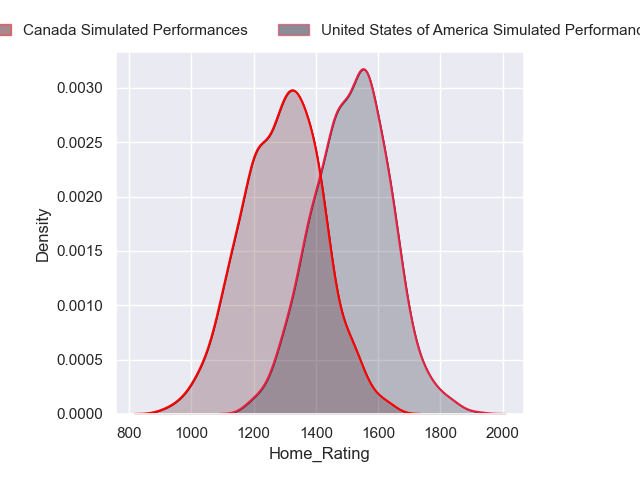
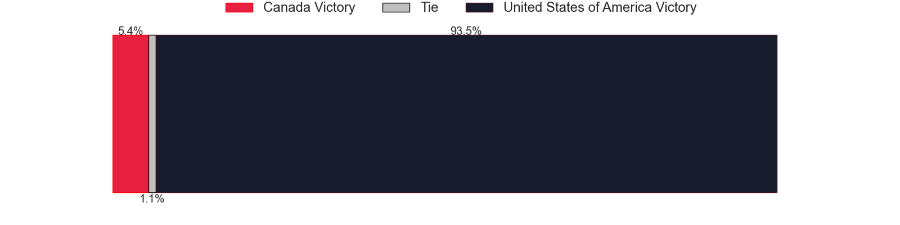
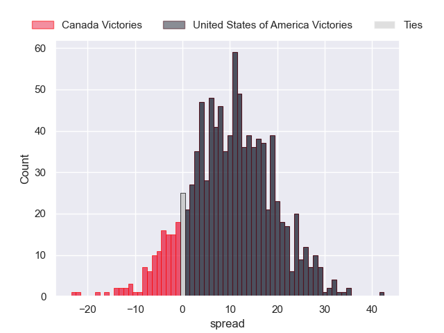

## Week 3

### Tonga V Fiji on 2024/09/06

Average Margin: Fiji by 13.8

Average Scoreline: 38-24

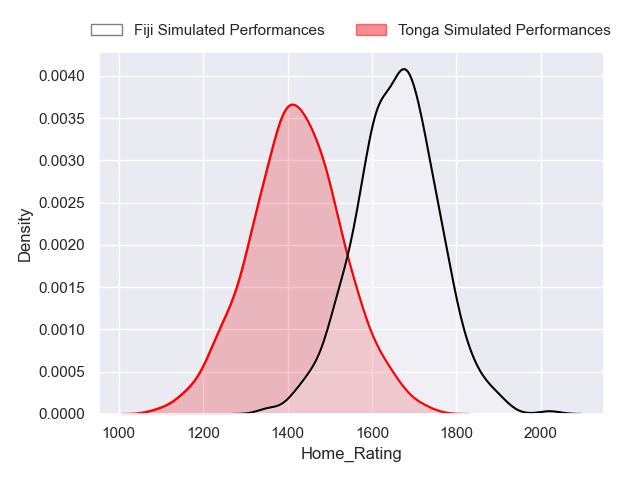
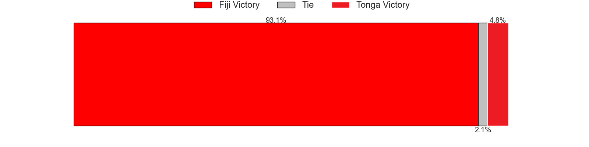
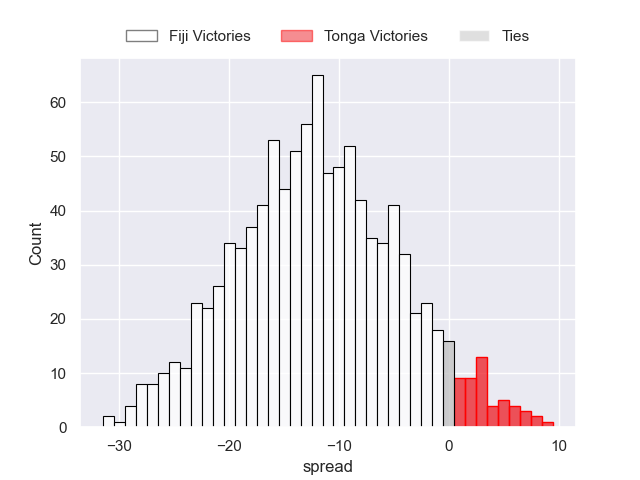

### Japan V United States of America on 2024/09/07

Average Margin: Japan by 3.6

Average Scoreline: 34-31

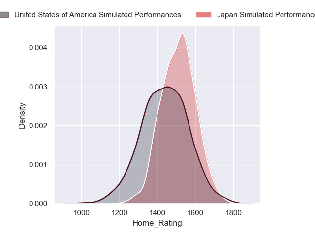
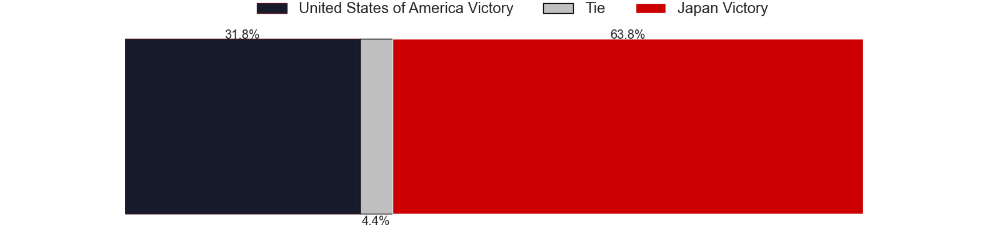
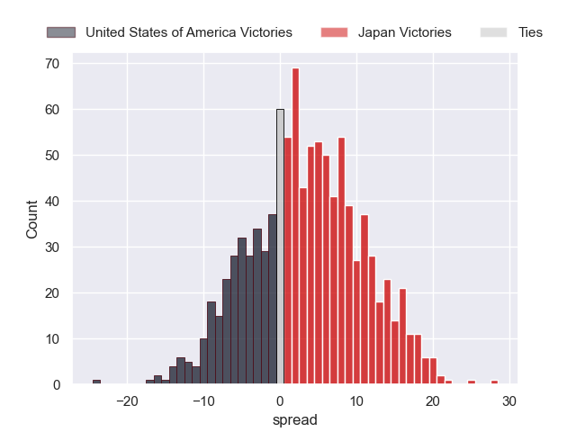

