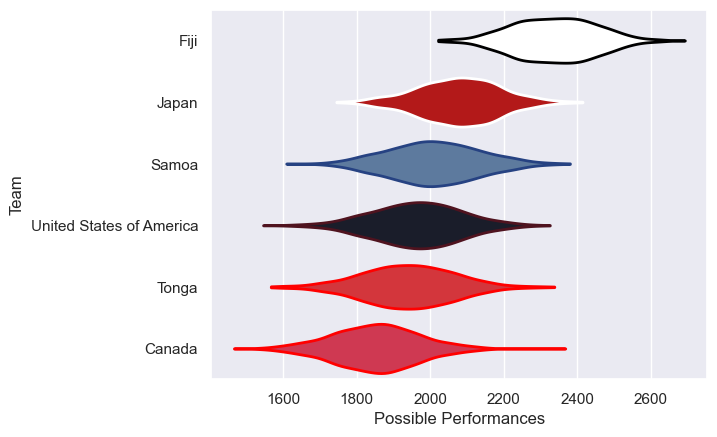

---  
title: "Pacific Nations Cup 2025"  
date: 2025-09-18 6:00:00 -0500  
categories: model review projection  
layout: article  
aside:  
    toc: true  
---
# Team Rankings

# Standings

## Current Standings

| Club                     |   Played |   Wins |   Point Differential |   Losing Bonus Points |   Try Bonus Points |   Competition Points |
|:-------------------------|---------:|-------:|---------------------:|----------------------:|-------------------:|---------------------:|
| Japan                    |        3 |      3 |                  106 |                     0 |                  3 |                   15 |
| Fiji                     |        3 |      3 |                   89 |                     0 |                  3 |                   15 |
| United States of America |        3 |      1 |                  -24 |                     0 |                  1 |                    5 |
| Tonga                    |        3 |      1 |                  -46 |                     0 |                  1 |                    5 |
| Canada                   |        3 |      1 |                  -81 |                     0 |                  1 |                    5 |
| Samoa                    |        3 |      0 |                  -44 |                     0 |                    |                    0 |

## Projected Remaining Table

| Club   |   To Play |   Projected Wins |   Projected Differential |   Projected Losing Bonus Points | Projected Try Bonus Points   |   Projected Competition Points |
|:-------|----------:|-----------------:|-------------------------:|--------------------------------:|:-----------------------------|-------------------------------:|
| Fiji   |         1 |            0.602 |                    3.074 |                           0.2   |                              |                          2.706 |
| Tonga  |         1 |            0.613 |                    3.265 |                           0.174 |                              |                          2.688 |
| Japan  |         1 |            0.349 |                   -3.074 |                           0.301 |                              |                          1.795 |
| Canada |         1 |            0.356 |                   -3.265 |                           0.257 |                              |                          1.743 |

## Projected Total Table

| Club                     |   Played |   Wins |   Point Differential |   Losing Bonus Points |   Try Bonus Points |   Competition Points |
|:-------------------------|---------:|-------:|---------------------:|----------------------:|-------------------:|---------------------:|
| Fiji                     |        4 |  3.602 |               92.074 |                 0.2   |                  3 |               17.706 |
| Japan                    |        4 |  3.349 |              102.926 |                 0.301 |                  3 |               16.795 |
| Tonga                    |        4 |  1.613 |              -42.735 |                 0.174 |                  1 |                7.688 |
| Canada                   |        4 |  1.356 |              -84.265 |                 0.257 |                  1 |                6.743 |
| United States of America |        3 |  1     |              -24     |                 0     |                  1 |                5     |
| Samoa                    |        3 |  0     |              -44     |                 0     |                    |                0     |

# Completed Match Review

| Model | Percent Correct Predictions | Spread Error |
| ------ | ------ | ------ |
| Club Level | 63.6% | 18.0 |
| Player Level: Lineup | nan% | nan |
| Player Level: Minutes | nan% | nan |

# Future Predictions

## Week 4

### Japan V Fiji on 2025/09/20

Average Margin: Fiji by 3.1

### Tonga V Canada on 2025/09/20

Average Margin: Tonga by 3.3

