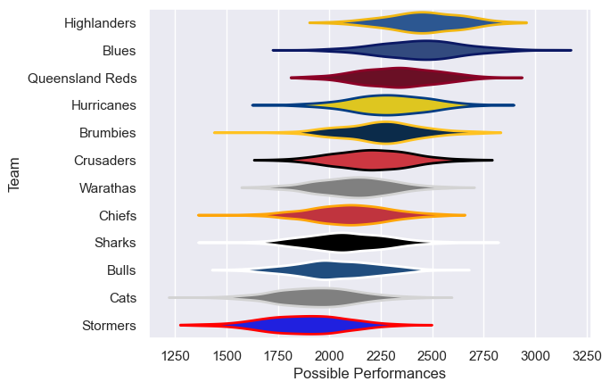

---  
title: "Peroni Top10 2003"  
date: 2025-07-29 6:00:00 -0500  
categories: model review projection  
layout: article  
aside:  
    toc: true  
---
# Current Team Rankings

# Standings

## Current Standings

| Club            |   Played |   Wins |   Point Differential |   Losing Bonus Points | Try Bonus Points   |   Competition Points |
|:----------------|---------:|-------:|---------------------:|----------------------:|:-------------------|---------------------:|
| Blues           |       13 |     12 |                  233 |                     0 |                    |                   48 |
| Crusaders       |       13 |      9 |                  114 |                     3 |                    |                   39 |
| Hurricanes      |       12 |      7 |                   17 |                     0 |                    |                   28 |
| Highlanders     |       11 |      6 |                   41 |                     3 |                    |                   27 |
| Brumbies        |       12 |      6 |                   24 |                     2 |                    |                   26 |
| Bulls           |       11 |      6 |                  -34 |                     2 |                    |                   26 |
| Warathas        |       11 |      6 |                  -24 |                     0 |                    |                   24 |
| Queensland Reds |       11 |      5 |                  -37 |                     2 |                    |                   22 |
| Stormers        |       11 |      5 |                  -99 |                     0 |                    |                   20 |
| Sharks          |       11 |      3 |                  -65 |                     2 |                    |                   14 |
| Chiefs          |       11 |      2 |                  -31 |                     5 |                    |                   13 |
| Cats            |       11 |      2 |                 -139 |                     3 |                    |                   11 |

# Completed Match Review

| Model | Percent Correct Predictions | Spread Error |
| ------ | ------ | ------ |
| Club Level | 60.9% | 15.8 |
| Player Level: Lineup | nan% | nan |
| Player Level: Minutes | nan% | nan |

