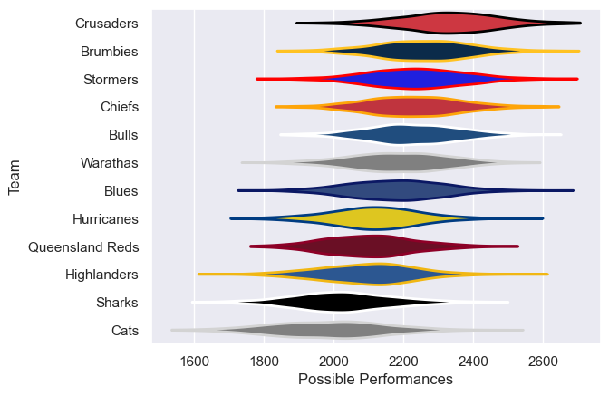

---  
title: "Peroni Top10 2004 Status"  
date: 2025-07-28 6:00:00 -0500  
categories: model review projection  
layout: article  
aside:  
    toc: true  
---
# Current Team Rankings

# Standings

## Current Standings

| Club            |   Played |   Wins |   Point Differential |   Losing Bonus Points | Try Bonus Points   |   Competition Points |
|:----------------|---------:|-------:|---------------------:|----------------------:|:-------------------|---------------------:|
| Brumbies        |       13 |     10 |                  163 |                     0 |                    |                   40 |
| Crusaders       |       13 |      8 |                   44 |                     1 |                    |                   33 |
| Chiefs          |       12 |      7 |                    8 |                     2 |                    |                   30 |
| Stormers        |       12 |      7 |                   15 |                     1 |                    |                   29 |
| Blues           |       11 |      6 |                   28 |                     1 |                    |                   27 |
| Bulls           |       11 |      5 |                  -18 |                     2 |                    |                   24 |
| Sharks          |       11 |      5 |                  -38 |                     4 |                    |                   24 |
| Warathas        |       11 |      5 |                   68 |                     3 |                    |                   23 |
| Queensland Reds |       11 |      5 |                  -29 |                     3 |                    |                   23 |
| Highlanders     |       11 |      4 |                  -48 |                     2 |                    |                   20 |
| Hurricanes      |       11 |      4 |                  -28 |                     1 |                    |                   19 |
| Cats            |       11 |      1 |                 -165 |                     3 |                    |                    7 |

# Completed Match Review

| Model | Percent Correct Predictions | Spread Error |
| ------ | ------ | ------ |
| Club Level | 58.0% | 13.6 |
| Player Level: Lineup | nan% | nan |
| Player Level: Minutes | nan% | nan |

