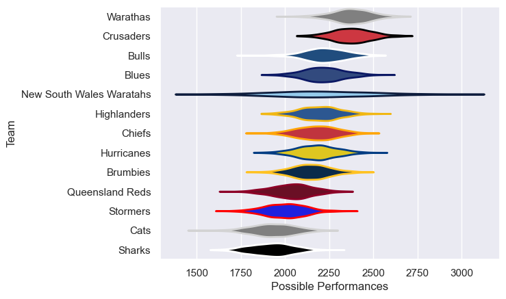

---  
title: "Peroni Top10 2005"  
date: 2025-07-29 6:00:00 -0500  
categories: model review projection  
layout: article  
aside:  
    toc: true  
---
# Current Team Rankings

# Standings

## Current Standings

| Club                     |   Played |   Wins |   Point Differential |   Losing Bonus Points | Try Bonus Points   |   Competition Points |
|:-------------------------|---------:|-------:|---------------------:|----------------------:|:-------------------|---------------------:|
| Crusaders                |       13 |     11 |                  228 |                     0 |                    |                   44 |
| Warathas                 |       11 |      9 |                  148 |                     2 |                    |                   38 |
| Hurricanes               |       12 |      8 |                   -5 |                     0 |                    |                   32 |
| Bulls                    |       12 |      7 |                   62 |                     2 |                    |                   30 |
| Highlanders              |       11 |      6 |                    7 |                     0 |                    |                   26 |
| Blues                    |       11 |      6 |                   27 |                     1 |                    |                   25 |
| Brumbies                 |       11 |      5 |                   -8 |                     2 |                    |                   24 |
| Chiefs                   |       11 |      5 |                   22 |                     1 |                    |                   23 |
| Stormers                 |       11 |      3 |                 -105 |                     3 |                    |                   17 |
| Queensland Reds          |       11 |      3 |                  -97 |                     3 |                    |                   15 |
| Cats                     |       11 |      1 |                 -100 |                     5 |                    |                   11 |
| Sharks                   |       11 |      1 |                 -179 |                     3 |                    |                    9 |
| New South Wales Waratahs |        2 |      1 |                    0 |                     0 |                    |                    4 |

# Completed Match Review

| Model | Percent Correct Predictions | Spread Error |
| ------ | ------ | ------ |
| Club Level | 65.2% | 13.7 |
| Player Level: Lineup | nan% | nan |
| Player Level: Minutes | nan% | nan |

