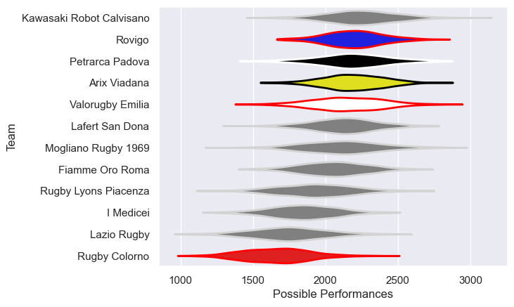

---  
title: "Peroni Top10 2019"  
date: 2025-07-29 6:00:00 -0500  
categories: model review projection  
layout: article  
aside:  
    toc: true  
---
# Current Team Rankings

# Standings

## Current Standings

| Club                     |   Played |   Wins |   Point Differential |   Losing Bonus Points | Try Bonus Points   |   Competition Points |
|:-------------------------|---------:|-------:|---------------------:|----------------------:|:-------------------|---------------------:|
| Rovigo                   |        7 |      7 |                   85 |                     0 |                    |                   28 |
| Valorugby Emilia         |        7 |      6 |                  140 |                     1 |                    |                   25 |
| Kawasaki Robot Calvisano |        7 |      6 |                   92 |                     1 |                    |                   25 |
| Petrarca Padova          |        7 |      5 |                   85 |                     1 |                    |                   21 |
| Fiamme Oro Roma          |        7 |      5 |                   31 |                     1 |                    |                   21 |
| Mogliano Rugby 1969      |        7 |      4 |                    0 |                     1 |                    |                   17 |
| Lafert San Dona          |        7 |      3 |                  -15 |                     2 |                    |                   14 |
| Rugby Colorno            |        7 |      2 |                  -87 |                     1 |                    |                    9 |
| Arix Viadana             |        7 |      1 |                  -52 |                     3 |                    |                    7 |
| Rugby Lyons Piacenza     |        7 |      1 |                  -82 |                     2 |                    |                    6 |
| I Medicei                |        7 |      1 |                  -92 |                     1 |                    |                    5 |
| Lazio Rugby              |        7 |      1 |                 -105 |                     1 |                    |                    5 |

# Completed Match Review

| Model | Percent Correct Predictions | Spread Error |
| ------ | ------ | ------ |
| Club Level | 69.0% | 17.3 |
| Player Level: Lineup | nan% | nan |
| Player Level: Minutes | nan% | nan |

