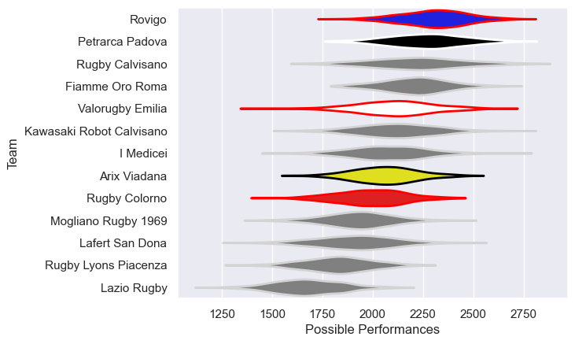

---  
title: "Peroni Top10 2020"  
date: 2025-07-29 6:00:00 -0500  
categories: model review projection  
layout: article  
aside:  
    toc: true  
---
# Current Team Rankings

# Standings

## Current Standings

| Club                     |   Played |   Wins |   Point Differential |   Losing Bonus Points | Try Bonus Points   |   Competition Points |
|:-------------------------|---------:|-------:|---------------------:|----------------------:|:-------------------|---------------------:|
| Petrarca Padova          |        9 |      8 |                   89 |                     0 |                    |                   32 |
| Rovigo                   |       10 |      7 |                  112 |                     3 |                    |                   31 |
| Valorugby Emilia         |        9 |      5 |                   31 |                     3 |                    |                   25 |
| Arix Viadana             |       10 |      4 |                  -21 |                     2 |                    |                   20 |
| Fiamme Oro Roma          |        9 |      4 |                   39 |                     1 |                    |                   19 |
| Rugby Lyons Piacenza     |       12 |      4 |                  -95 |                     3 |                    |                   19 |
| Mogliano Rugby 1969      |       10 |      4 |                  -35 |                     2 |                    |                   18 |
| I Medicei                |        5 |      4 |                   48 |                     1 |                    |                   17 |
| Rugby Calvisano          |        5 |      3 |                   75 |                     2 |                    |                   14 |
| Rugby Colorno            |        9 |      3 |                  -36 |                     2 |                    |                   14 |
| Kawasaki Robot Calvisano |        5 |      3 |                    0 |                     1 |                    |                   13 |
| Lafert San Dona          |        5 |      1 |                  -28 |                     1 |                    |                    7 |
| Lazio Rugby              |        8 |      1 |                 -179 |                     1 |                    |                    5 |

# Completed Match Review

| Model | Percent Correct Predictions | Spread Error |
| ------ | ------ | ------ |
| Club Level | 60.4% | 10.5 |
| Player Level: Lineup | nan% | nan |
| Player Level: Minutes | nan% | nan |

